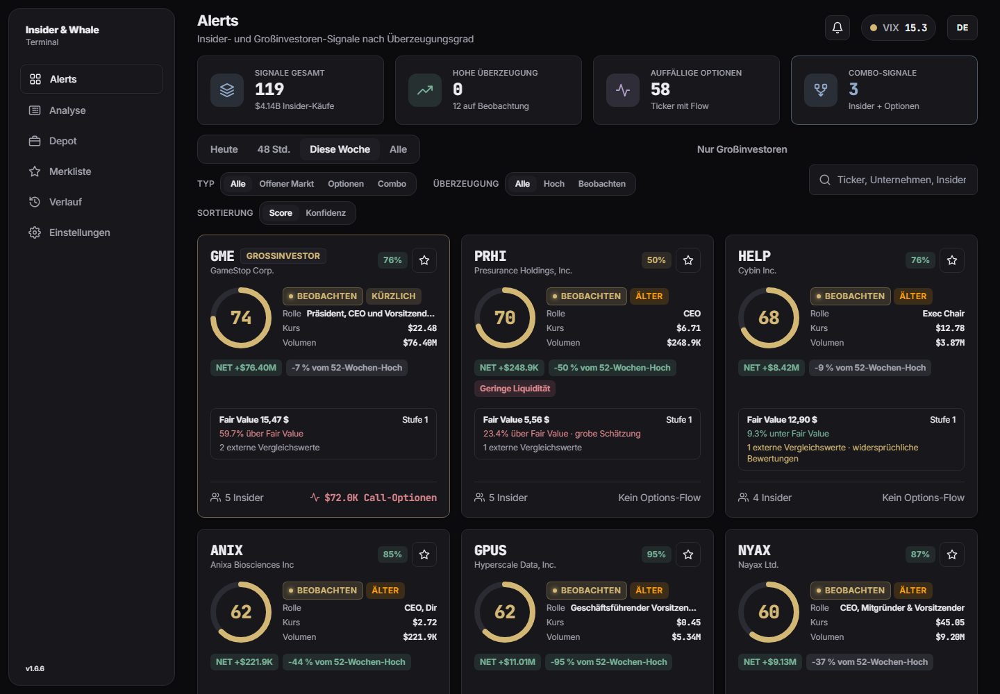
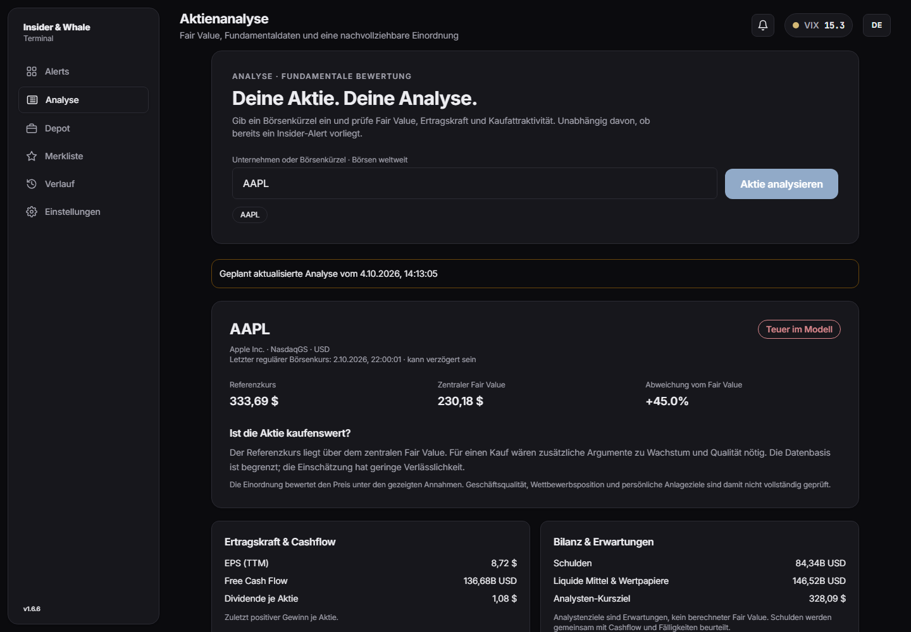
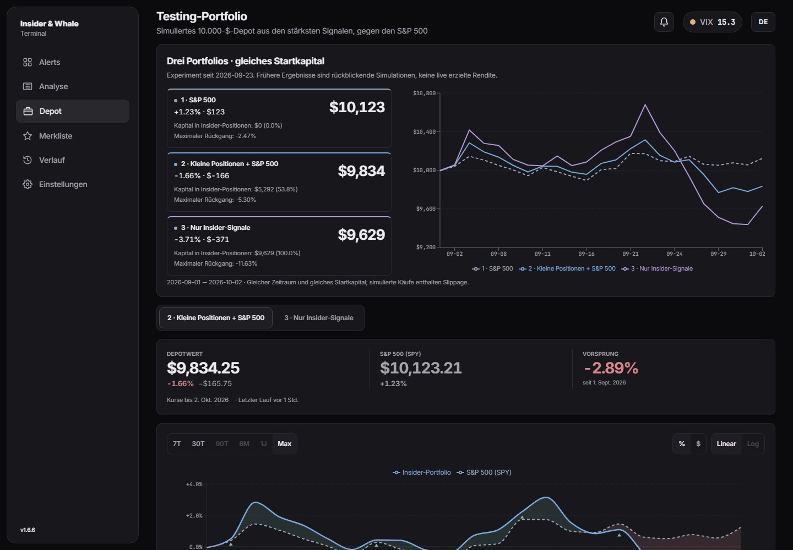
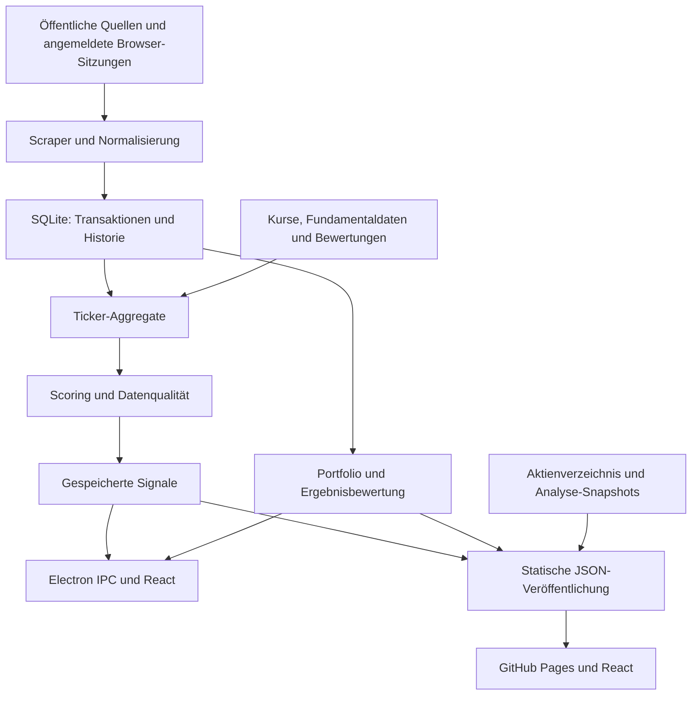

# Insider & Whale Terminal · Web

**Version 1.7.0:** Die neue Seite **Backtest** archiviert Depotentscheidungen mit unveränderlichen Kauf-Snapshots, Handelsverlauf, versionierten Abschlussanalysen und JSON-Export. Fehlende historische Daten bleiben ausdrücklich gekennzeichnet. Umsetzung, Prüfungen und Grenzen sind in [Backtest 1.7](docs/backtest-1.7.md) dokumentiert.

**Insider-Aktivität verstehen. Aktien bewerten. Strategien vergleichen.**

Insider & Whale Terminal bündelt Aktienkäufe von Unternehmensinsidern, auffällige Optionsaktivität und ergänzende Marktinformationen. Du kannst interessante Aktien finden, eine Aktie selbst analysieren, ihren geschätzten Fair Value mit dem Kurs vergleichen und drei simulierte Portfolios gegen den S&P 500 betrachten. Die Bewertungen erklären ihre Datenbasis und Annahmen; sie sind keine garantierten Kursziele oder automatischen Kaufaufträge.

[Web-Anwendung öffnen](https://roglmarcel.github.io/insider-whale-web/) · [Windows-App herunterladen](https://github.com/RoglMarcel/insider-whale-terminal/releases/latest) · [Desktop-Repository](https://github.com/RoglMarcel/insider-whale-terminal)

## Was du damit machen kannst

- **Alerts entdecken:** Insider-Käufe und Optionsaktivität durchsuchen, filtern und anhand eines nachvollziehbaren Scores vergleichen.
- **Aktien analysieren:** Name oder Börsenkürzel eingeben; Fundamentaldaten, zentralen Fair Value und modellierte Unter-/Überbewertung ansehen.
- **Strategien vergleichen:** S&P 500, kleine Signalpositionen mit S&P 500 und ein Insider-Portfolio mit gleichem Startkapital gegenüberstellen.
- **Den Überblick behalten:** Aktien merken, Signal-Details öffnen und verfügbare Aktualisierungsstände prüfen.
- **Entscheidungen nachprüfen:** Unter Backtest damalige Alert-Daten mit den Ergebnissen geschlossener Positionen vergleichen und strukturierte Daten für die spätere Auswertung exportieren.

## Schnell starten

Öffne die Web-Anwendung ohne Installation. Unter **Alerts** findest du die veröffentlichten Signale; unter **Analyse** suchst du deine Aktie. **Depot** zeigt die simulierten Strategien. Die Web-Version verwendet regelmäßig veröffentlichte Daten; Verfügbarkeit und Alter der Analyse werden angezeigt.

Die Windows-App kann selbst Daten abrufen, angemeldete Quellen verwenden und Desktop-Benachrichtigungen anzeigen. Die Web-Version funktioniert auch auf Mobilgeräten und liest die veröffentlichten Daten. Beide verwenden dieselbe grundlegende Oberfläche und dieselben Berechnungsregeln.

## Einblick in die Anwendung



<details>
<summary><strong>Aktienanalyse ansehen</strong></summary>



</details>

<details>
<summary><strong>Portfolio-Vergleich ansehen</strong></summary>



</details>

<sub>Echte Aufnahmen der gemeinsamen Web-Oberfläche vom 4. Oktober 2026. Zahlen und Ergebnisse sind zeitabhängige Beispiele. Die Desktop-App ergänzt lokale Datenläufe, Anmeldungen und native Funktionen.</sub>

---

## Bewertungs- und Updatekorrekturen in 1.6.7

Web und Desktop verwenden die korrigierten gemeinsamen Bewertungsregeln mit drei Qualitätsstufen, EV-Branchenvergleichen, erklärten Datenlücken, Quellenmetadaten und getrennten Szenarien. Alerts zeigen Börsenreferenzkurs und Bewertungsstand sowie eine abweichende historische Score-Bewertung. Caches laufen ab und Fehler können erneut abgerufen werden. Portfolio-Einstiege berücksichtigen New Yorker Börsenzeiten. Softwareupdates haben eine manuelle Prüfung, Status und Wiederholung.

[Bewertungsvertrag und Grenzen](docs/valuation-integrity.md) · [Versionshinweise 1.6.7](docs/releases/1.6.7.md) · [Veröffentlichungs- und Prüfbericht](docs/verification-1.6.7.md)

## Technische Dokumentation für KI und Entwickler

Diese Hälfte beschreibt den implementierten Stand von Version **1.6.7**, geprüft am **4. Oktober 2026**. Sie dient als Einstieg in den gesamten Programmablauf. Angaben zu Funktionen, Datenverträgen und Grenzen beziehen sich auf den Code, nicht auf frühere Produktpläne. Laufzeitdaten, Anzahl verfügbarer Aktien und Ergebnisse ändern sich mit den Quellen.

**Verbindliche Orientierung:** `package.json` definiert Version und Befehle; `src/types/` definiert Datenverträge; `electron/scoring.ts`, `electron/fairValue.ts` und `src/lib/portfolio-rules.ts` definieren Berechnungen. Die Dateiverzeichnisse und Schnittstellen weiter unten führen zu den konkreten Implementierungen. Historische Prüfberichte in `docs/` beschreiben ihren damaligen Stand und können heutigen Regeln widersprechen.

### Inhalt

1. [Produkt und Repository-Grenzen](#produkt-und-repository-grenzen)
2. [Architektur und Datenfluss](#architektur-und-datenfluss)
3. [Oberfläche und Zustandsverwaltung](#oberfläche-und-zustandsverwaltung)
4. [Datenbeschaffung und Quellen](#datenbeschaffung-und-quellen)
5. [Normalisierung und Datenqualität](#normalisierung-und-datenqualität)
6. [Signalberechnung](#signalberechnung)
7. [Aktienanalyse und Fair Value](#aktienanalyse-und-fair-value)
8. [Portfolios und Performance](#portfolios-und-performance)
9. [Speicherung und Synchronisierung](#speicherung-und-synchronisierung)
10. [Desktop-Betrieb und Sicherheit](#desktop-betrieb-und-sicherheit)
11. [Schnittstellen und Datenverträge](#schnittstellen-und-datenverträge)
12. [Entwicklung, Prüfung und Veröffentlichung](#entwicklung-prüfung-und-veröffentlichung)
13. [Fehlerdiagnose und Änderungsregeln](#fehlerdiagnose-und-änderungsregeln)
14. [Vollständiges Quellcodeverzeichnis](#vollständiges-quellcodeverzeichnis)

### Produkt und Repository-Grenzen

| Eigenschaft | Web | Desktop |
|---|---|---|
| Repository | `RoglMarcel/insider-whale-web` | `RoglMarcel/insider-whale-terminal` |
| Ausführung | Statische React-Anwendung auf GitHub Pages | Electron-Anwendung mit React-Oberfläche |
| Datenbeschaffung | GitHub Actions; optional importierte Desktop-Daten | Lokale Scraper und Browser-Sitzungen |
| Analyse | Veröffentlichtes Aktienverzeichnis und Bewertungs-Snapshots | Live-Anfrage mit begrenzter Laufzeit; Snapshot als Rückfall |
| Datenbank | SQLite auf dem Runner, nicht im Nutzerbrowser | Lokale SQLite-Datei im Electron-Benutzerverzeichnis |
| Merkliste | Browser-`localStorage`, pro Gerät | SQLite |
| Portfolio | Veröffentlichte Simulation, schreibgeschützt | Berechnen, synchronisieren und konfigurieren |
| Plattform-Logins | Keine interaktiven Logins im Browser | Manuelle Anmeldung in einem eigenen Browserfenster |
| Software-Updates | Neuer Pages-Deploy | `electron-updater` über Desktop-GitHub-Releases |

**Beide Repositories enthalten Quellcode.** Die frühere Beschreibung des Desktop-Repositories als reines Release-Archiv ist überholt. Gemeinsame Änderungen müssen in beiden Codebasen nachvollziehbar übernommen werden. Desktop-Pakete und deren Update-Feed gehören in das Desktop-Repository; ein Web-Push allein aktualisiert keine installierte EXE.

Der produktive Web-Build benötigt keinen API-Host. `src/lib/analysisApi.ts` und `scripts/analysis-server.ts` bieten einen optionalen Entwicklungs-/Serverpfad; dieser ist nicht die Datenversorgung der GitHub-Pages-Seite.

### Architektur und Datenfluss



**Desktop-Lebenszyklus:** `electron/main.ts` reserviert die einzelne App-Instanz, initialisiert SQLite, lädt Einstellungen, erstellt das Fenster, registriert geschützte IPC-Handler und startet Scheduler, VIX-Abfrage und Updater. Ein Aufruf mit `--scheduled-scrape` verarbeitet einen Hintergrundlauf und beendet sich danach. Eine zweite Instanz aktiviert das vorhandene Fenster beziehungsweise übergibt den geplanten Scrape.

**Scrape-Lebenszyklus:** `electron/scraper/index.ts` orchestriert Quellen, Sitzungen, Abbruch und Fortschritt. Transaktionen werden geprüft, vereinheitlicht und gespeichert. Ticker-Aggregate kombinieren die verfügbare Transaktionshistorie mit Optionen, Unternehmensdaten, politischen Transaktionen und Bewertungen. Scoring produziert Signale und eine erklärbare Aufschlüsselung. Persistierung, Benachrichtigungen, Portfolio-Abgleich und optionales Web-Publishing folgen im Desktop-Hauptprozess.

**Web-Lebenszyklus:** `.github/workflows/scrape.yml` stellt dauerhafte Historie wieder her, beschafft oder importiert Daten, veröffentlicht JSON, bewertet reife Ergebnisse, synchronisiert das Portfolio, sichert die Historie, aktualisiert den Analyse-Katalog und baut/deployt `dist-web/`. Teilergebnisse erhalten eigene Aktualisierungszustände; ein erfolgreicher Seitenaufbau garantiert keine fehlerfreie Einzelquelle.

### Oberfläche und Zustandsverwaltung

| Bereich | Verantwortung und zentrale Dateien |
|---|---|
| App und Navigation | `src/App.tsx`, `src/components/Layout/`: Ansichten, Einführung, Versionshinweise, Sidebar und responsive Navigation |
| Alerts | `src/components/Dashboard/`: Kennzahlen, Suche, Filter, Sortierung, Signal-Karten und Export |
| Signal-Details | `src/components/Detail/`: Aufschlüsselung, Trades, Optionen, Insider-Historie, Unternehmenskontext und Fair Value |
| Analyse | `src/components/Analysis/AnalysisView.tsx`: unabhängige Tickersuche, Vorschläge, Tastaturauswahl, Anfragen und Bewertung |
| Depot | `src/components/Portfolio/`: Strategie-Vergleich, Kurven, Positionen, abgeschlossene Trades, Regeln und Konfiguration |
| Merkliste | `src/components/Watchlist/`, `src/hooks/useWatchlist.ts`: geräte- beziehungsweise datenbankbezogene Favoriten |
| Verlauf | `src/components/History/`: gespeicherte Scrape-Läufe und zugehörige Ergebnisse |
| Live-News | `src/components/News/`: Desktop-Nachrichten; die Web-Navigation blendet diesen Bereich aus |
| Einstellungen | `src/components/Settings/`: Quellen, Anmeldung, automatische Läufe, Benachrichtigungen und weitere Desktop-Optionen |
| Gemeinsame UI | `src/components/UI/`: Karten, Icons, Dialoge, Update-Hinweis und wiederverwendbare Bedienelemente |
| Zusätzliche Bewertungsmodelle | `src/components/Valuation/`: separat validierte Fundamentaldatensätze und Modellansichten |

`src/store/useStore.ts` ist der Zustandsspeicher. Er lädt Signale, Einstellungen und Metadaten, hält Filter und ausgewählte Signale und verbindet Statusereignisse mit der Oberfläche. Initialisierung und Listener sind gegen doppelte Registrierung abgesichert. Die Sprache kommt aus `useI18n`; Übersetzungsschlüssel stehen in `src/lib/i18n.ts`. Die Oberfläche ist dunkel gestaltet. Formatierung von Preisen, Prozentwerten, Zeitstempeln und großen Zahlen wird über gemeinsame Helfer vereinheitlicht.

`src/lib/ipc.ts` wählt genau einen API-Pfad: `window.api` in Electron, `webApi` bei `VITE_TARGET=web`, ansonsten `mockApi`. Browser-Vorschauen können deshalb Beispieldaten zeigen; sie sind nicht automatisch ein Test der produktiven Datenversorgung.

Web-JSON wird mit Validierung geladen. Der Signal-Cache gilt 60 Sekunden; fehlgeschlagene Abfragen behalten die letzte verfügbare Antwort, erneuern aber deren Alter nicht. Analyse-Verzeichnis und Desktop-Live-Analyse haben jeweils eigene Caches. Merkliste, Filter, Sprache, zuletzt analysierte Aktien und Diagrammoptionen können lokal gespeichert werden.

### Datenbeschaffung und Quellen

| Modul | Daten und Rolle |
|---|---|
| `edgar.ts` | SEC-Form-4-Meldungen; Abdeckung, einzelne fehlgeschlagene Filings und Verschiebungen getrennt behandeln |
| `openinsider.ts` | Öffentliche Insider-Kauftabellen; Quellgrenzen und leere Antworten sind relevant |
| `finviz.ts` | Insider-Zeilen und Earnings-Kontext; Ticker aus verifizierten Links lesen |
| `secform4.ts` | Ergänzende Insider-Kaufmeldungen |
| `marketbeat.ts` | Ergänzende Insider-Transaktionen |
| `insidermonitor.ts` | Öffentliche Insider-Kauftabellen |
| `quiverquant.ts`, `quiverData.ts` | Quiver-Insider-Daten und deren Extraktion |
| `ceowatcher.ts` | Instagram-Captions; ungenaue Beträge und fehlende Transaktionsdaten nicht als präzise Originalmeldung behandeln |
| `barchart.ts` | Auffällige Optionsaktivität |
| `optionstrat.ts` | Optionsflow; verfügbare Daten hängen unter anderem von Anmeldung ab |
| `insiderfinance.ts` | Ergänzender Optionsflow; Anmeldung kann erforderlich sein |
| `marketbeatoptions.ts` | Auffälliges Optionsvolumen; keine Garantie für detaillierte einzelne Prints |
| `capitoltrades.ts`, `senatewatcher.ts` | Politische Transaktionen und ergänzende parlamentarische Quellen |
| `sellside.ts` | Verkäufe, Sell-side-Kontext und Form-144-Daten |
| `activist.ts` | Beteiligungsmeldungen nach 13D/13G |
| `insiderHistory.ts` | Historische Insider-Transaktionen und Track Record |
| `stockstats.ts` | Unternehmens-/Aktienkontext für Ticker-Aggregate |
| `fairValue.ts` | Fundamentale Eingaben aus StockAnalysis/Finviz und Quote-Abgleich |
| `externalFairValue.ts` | Externe Bewertung aus Fair Value Calculator und Alpha Spread |
| `twitter.ts` | Desktop-Nachrichten aus der angemeldeten X/Twitter-Sitzung |

`SCRAPER_SOURCES`, `SIDE_PIPELINE_SOURCES` und `LOGIN_PLATFORMS` in `src/types/index.ts` sind die maßgeblichen Register für aktivierbare Quellen, Nebenpipelines und Plattform-Anmeldungen. Ein vorhandenes Scraper-Modul bedeutet nicht, dass die Quelle in jedem Lauf aktiviert, angemeldet oder erreichbar ist.

**Scrapling:** `scripts/scrapling/fetch.py` ist ein begrenzter Worker für freigegebene öffentliche HTML-Domains. `electron/scraper/scrapling.ts` wählt diesen Pfad; `scraplingRuntime.ts` startet den nativen Worker. GitHub Actions installiert die Python-Abhängigkeiten und setzt `SCRAPLING_ENABLED=1`. Desktop-Releases enthalten einen eingefrorenen Scrapling-0.4.15-Worker und benötigen keine vom Nutzer installierte Python-Laufzeit.

API-Aufrufe und Quellen mit Browser-Sitzungen verwenden weiterhin HTTP beziehungsweise Playwright. Scrapling löst nicht jede IP-Sperre und garantiert keine Datenverfügbarkeit. Der Worker begrenzt Domains und Antworten; er verwendet keine Proxy-Rotation, automatisierte CAPTCHA-Lösung oder Zugangsdaten in Ausgaben. Der Installer-Build prüft den Quellcode-Fingerprint und baut den Worker bei Änderungen neu.

**Ausgeschiedene Bewertungsanbieter:** GuruFocus und ValueInvesting.io sind keine aktiven externen Vergleichsquellen. Seit 1.6.7 wird GuruFocus auch aus dem Fundamentaldaten-Abruf, dessen Cache und den akzeptierten veröffentlichten Datensätzen entfernt. Alte Typnamen und einzelne Legacy-Parser können zur Kompatibilität existieren; sie aktivieren keinen Abruf. `fairValueDisplay.ts` und das Detailpanel filtern alte Vergleichseinträge.

Externe Anbieter werden pro Provider seriell mit mindestens zwei Sekunden Abstand abgefragt. Nach HTTP 403/429 folgt eine 15-minütige Pause. `cooldown` mit `retryAt` bedeutet, dass für diese Aktie keine neue Anfrage ausgeführt wurde; es ist kein erfolgreicher Abruf mit aktuellem Zeitstempel.

### Normalisierung und Datenqualität

Die Verarbeitung unterscheidet Transaktionsdatum, Meldedatum, Beobachtungsdatum, Bewertungsstand und Abrufzeit. Diese Zeitpunkte dürfen nicht durch den Zeitpunkt des aktuellen UI-Aufrufs ersetzt werden.

- `ticker-quality.ts`, `priceSymbols.ts` und Scraper-Helfer prüfen Symbolform, Listing und bekannte Fehlinterpretationen. Quarantäne entfernt ungültige Symbole aus aktiven Ansichten, behält die ursprünglichen historischen Belege.
- `tradeEligibility.ts`, `classifyTransaction` und Scoring unterscheiden qualifizierte Käufe von Verkäufen, Optionsausübungen, Zuteilungen und unbekannten Transaktionen. Fehlende Transaktionstypen bedeuten nicht automatisch offenen Marktkauf.
- `tradeDedup.ts` vereinheitlicht quellenübergreifende Duplikate. `filingIdentity.ts`, `tradeAmendments.ts` und `tradeRevisions.ts` erhalten Meldungsidentität und berücksichtigen Korrekturen, statt denselben wirtschaftlichen Trade mehrfach zu zählen.
- `insiderMap.ts` und `optionsMap.ts` halten Feld-/Quellenzuordnungen; Namen und Rollen werden normalisiert, ohne unterschiedliche Personen blind zusammenzuführen.
- `reliability.ts` und `computeSourceHealth` unterscheiden leere, teilweise, fehlerhafte und wiederholt instabile Quellen. Eine erfolgreiche HTTP-Antwort ist kein Qualitätsnachweis für die geparsten Zeilen.
- Abbruch und Zeitbudgets laufen über `cancellation.ts`; globales Scraping und unabhängige Analyse dürfen sich nicht gegenseitig unkontrolliert vervielfachen.
- Preisreihen werden auf positive endliche Werte und ungewöhnliche Sprünge geprüft. Ein auffälliger Sprung kann ein echtes Unternehmensereignis sein; eine Quarantäne ist keine automatische Kurskorrektur.

Transaktionshistorie wird persistiert, weil Quellseiten rollierende Ausschnitte liefern. Der aktive Scoring-Kontext verwendet insbesondere Käufe der letzten 30 Tage. Neue Quellen dürfen fehlende Felder nicht mit erfundenen präzisen Beträgen, Daten oder Rollen auffüllen.

### Signalberechnung

`electron/scoring.ts` berechnet einen endlichen Score zwischen 0 und 100 aus normalisierten Ticker-Aggregaten. Das Ergebnis enthält Signal-Typ, Conviction-Stufe, Konfidenz, Faktoren und erläuternde Hinweise. **Score und Konfidenz sind unterschiedliche Größen; keine davon ist eine statistisch kalibrierte Gewinnwahrscheinlichkeit.**

```text
insiderRaw = rankWeight × dollarVolumePoints × transactionTypeModifier
             × clusterMultiplier × insiderEarningsMultiplier × vixMultiplier
optionsRaw = detailedOptionsScore × optionsEarningsMultiplier
legSum = insiderRaw × insiderFreshness + optionsRaw × optionsFreshness
core = legSum > 0 ? legSum × trackRecordMultiplier × valuationMultiplier : legSum
combined = core + politicianScore
positive = max(finite(combined, fallback=0), 0)
normalized = 100 × positive / (positive + scoreHalfSaturation)
finalScore = clamp(corroboration applies ? normalized × softMult : normalized, 0, 100)
```

| Faktor | Implementierte Bedeutung |
|---|---|
| Rolle | Höherer Rang für relevante Unternehmensverantwortliche; unbekannte Rolle wird ausdrücklich behandelt |
| Kaufgröße | Durchschnittlicher qualifizierter Kaufwert pro Insider im relevanten Fenster; marktwertrelativ, wenn Marktkapitalisierung vorliegt, ansonsten absolute Klassen |
| Transaktionstyp | Wertgewichtete Qualität der berücksichtigten Kaufarten |
| Cluster | Verstärkung durch mehrere unterschiedliche kaufende Insider |
| Earnings | Zeitabhängiger Kontext für Insider beziehungsweise Optionen; nicht jeder Insider erhält denselben Timing-Bonus |
| VIX | Begrenzte graduelle Kontextverstärkung; fehlender VIX bleibt neutral |
| Aktualität | Getrennte Alterung von Insider- und Optionsbelegen; zukünftige/fehlende Daten nicht als frische Beobachtung behandeln |
| Optionen | Bullische minus bearische Prints; geometrisch abnehmende Zusatzwirkung verhindert beliebige Verstärkung durch Zeilenanzahl |
| Track Record | Begrenzte Verstärkung/Abschwächung bei geeigneter historischer Abdeckung |
| Bewertung | Aktueller `fairValue.multiplier`; alter `upsidePct`-Pfad ist eine Kompatibilitätsnaht |
| Politik und Bestätigung | Eigener politischer Beitrag; Combo-Stufen verwenden das Maximum der passenden Soft-Multiplikatoren, nicht deren Produkt |

Standardwerte: Halbsättigung 105; Bestätigungsbonus erst ab normalisiertem Score 50. `HIGH` beginnt bei 80, `WATCH` bei 50, darunter `LOW`. Eine Classic-Combo kann ×1,20 beitragen; politische Combo-Stufen sind begrenzt und separat definiert. Shadow-Konfigurationen dienen zum Vergleich mit älteren/alternativen Regeln und ersetzen nicht unbemerkt den Live-Score.

Ein negativer `legSum` wird nicht durch Kontext-Multiplikatoren verstärkt. Ausgabewerte müssen endlich bleiben; Scoring darf Eingabeaggregate nicht mutieren. `tests/invariants.test.ts`, Golden-Dateien und `verify:scoring` prüfen diese Verträge. Historische IC-/Backtest-Ergebnisse sind Stichprobenbefunde und kein Nachweis zukünftiger Überrendite.

### Aktienanalyse und Fair Value

**Suche:** `analysisCatalogue.ts` lädt/verarbeitet das Aktienverzeichnis und gewichtet Suchtreffer nach Symbol, Name und Listing. `AnalysisView` wartet 250 ms auf weitere Eingaben, verwirft veraltete Antworten und ermöglicht die Analyse unabhängig von einem Alert. Symbole werden über `normalizeAnalysisTicker` begrenzt und normalisiert; verschiedene Börsenplätze und Währungen sind nicht beliebig austauschbar.

**Desktop-Anfrage:** `analysis.ts` dedupliziert gleichzeitige Anfragen je Ticker, erlaubt maximal vier laufende Analysen und begrenzt den Abruf auf 20 Sekunden. Erfolgreiche Antworten bleiben fünf Minuten, unbrauchbare Antworten eine Minute im Cache. Der Cache ist auf 200 Einträge begrenzt. Bei geeigneten Ausfällen wird der veröffentlichte Snapshot verwendet, ohne dessen Beobachtungsdatum zu verjüngen.

**Web-Anfrage:** `analysisCatalogueApi.ts` liest `analysis-index.json` und `analysis/<TICKER>.json`. Das Index-Cachefenster beträgt fünf Minuten, Requests haben ein 12-Sekunden-Budget. Eine im Suchverzeichnis vorhandene Aktie muss noch keinen veröffentlichten Bewertungs-Snapshot besitzen. Die Oberfläche darf diese Lücke nicht als ausgeführte Live-Analyse ausgeben.

**Eingaben:** `electron/scraper/fairValue.ts` beschafft Quote, Währung und ausgewählte Statistikfelder. Jede Fundamentaleingabe führt `value`, `source` und `fetchedAt`. Der Rechner akzeptiert geeignete endliche, datierte Eingaben; veraltete oder unplausible Werte sollen keinen aktuellen Scorebonus erzeugen. Das vorhandene Statistik-Scraping umfasst noch nicht automatisch sämtliche historischen Finanzberichte und Cashflow-Reihen.

**Zwei Bewertungswege:** `electron/fairValue.ts` erzeugt den zentralen Fair Value für Alerts und Analyse. `src/lib/valuation/{validate,calculate,merge}.ts` verarbeitet zusätzlich `valuations.json` mit periodisierten Fundamentaldatensätzen für die erweiterte Modellansicht. `scripts/publish-valuations.ts` hält diesen zweiten Weg ausdrücklich von rückwirkenden Signal-/Portfolioänderungen getrennt. Beide Ausgaben dürfen nicht als identische Berechnung behandelt werden.

| Stufe | Regel des zentralen Rechners | Sicherheitsabschlag | Basisgewicht im Alert |
|---|---|---:|---:|
| 1 | Begrenztes Modell oder überwiegend angenommene entscheidende Eingaben | 40 % | 15 % |
| 2 | Absolutes Modell mit vorhandener Wachstumsprognose und mindestens fünf Eingaben **oder** mindestens zwei unterstützte relative Modelle und fünf Eingaben | 30 % | 40 % |
| 3 | Berechenbares absolutes Modell, passende beobachtete Diskontierungseingabe und mindestens zehn Eingaben | 20 % | 75 % |

Stufe 4 ist nicht aktiv. Viele vorhandene Zahlen bedeuten nicht automatisch Stufe 3: aktuelle KGV/KUV-Werte sind keine unabhängigen fairen Multiplikatoren; WACC ist kein Ersatz für Eigenkapitalkosten. Externe Fair-Value-Ergebnisse erhöhen die Datenstufe nicht. `fallback` halbiert das Bewertungsgewicht; fehlender Preis beziehungsweise unbrauchbare Basis setzt es auf null.

Der Cashflow-Ansatz verwendet eine Wachstumsphase und einen Übergang zum Terminalwachstum. Fehlendes Wachstum kann mit 2 % angenähert werden; Diskontierung und Terminalwachstum werden auf mathematisch zulässige Kombinationen begrenzt. Für USD-Aktien kann das CAPM-Szenario 4,25 % risikofreien Zins, adjustiertes Beta und 5 % Aktienrisikoprämie mit einer 7-%-Untergrenze annehmen. Diese Parameter sind **Modellannahmen**, keine automatisch live beschafften Zinssätze.

DCF-FCFF bewertet Unternehmens-Cashflows und benötigt insbesondere passenden FCFF, WACC, Aktienzahl, Barmittel und Schulden. DCF-FCFE bewertet Eigenkapital-Cashflows je Aktie und verwendet Eigenkapitalkosten. Standard-FCF, unverschuldeter FCF und FCF nach Finanzierung dürfen nicht ohne Definitionsabgleich ersetzt werden. Cash wird im FCFE-Proxy nicht nochmals addiert; aktuelle Nettokreditaufnahme wird nicht unbegrenzt fortgeschrieben.

Relative Modelle benötigen unabhängig beschaffte historische oder Peer-Benchmarks. Der Katalog kann Medianwerte derselben Branche ergänzen, wenn mindestens fünf andere aktuelle, positive und hinreichend plausible Beobachtungen vorliegen. Ein Median aktueller Marktpreise ist ein relativer Vergleich, kein unabhängiger Beweis für den inneren Wert.

Der zentrale Wert gruppiert unterstützte Cashflow- und Gewinnmodelle, damit korrelierte Modelle nicht beliebig viele Stimmen erhalten. Dividendenmodelle dienen als Gegenprüfung, wenn derselbe Eigenkapital-Cashflow bereits die Ausschüttungen abbildet. Vorsichtig/Basis/optimistisch beschreiben Sensitivität; die äußersten Szenarien sind kein statistisches Konfidenzintervall und keine empfohlene Kaufspanne.

```text
mispricingPct = (Referenzkurs / FairValue - 1) × 100
upsidePct = (FairValue / Referenzkurs - 1) × 100
entryPrice = FairValue × (1 - marginOfSafety)
safetyMarginMet = Referenzkurs <= entryPrice
recommendation = kein Gewicht ? insufficient-data
                 : mispricingPct < -5 ? undervalued
                 : mispricingPct > 5 ? overvalued : watch
multiplier = 1 + weight × (unterbewertet UND Sicherheitsmarge erfüllt ? 0.15
                          : überbewertet ? -0.10 : 0)
```

Unter-/Überbewertung und Potenzial verwenden unterschiedliche Nenner und sind nicht einfach Vorzeichenumkehrungen. Die zusätzliche Einstiegsschwelle ist ein konservatives Modellziel, keine Prognose, dass der Kurs dort ankommen wird. Ohne tragfähige numerische Grundlage ist `unavailable` mit fehlendem Preis ehrlicher als ein erfundener garantierter Fair Value.

**26 Modellnamen, nicht 26 Datenpunkte:** DCF-FCFF, DCF-FCFE, Gordon-DDM, zweistufiges DDM, APV, Residualeinkommen, EVA, historisches KGV, Branchen-KGV, Forward-KGV, PEG, Shiller-KGV, EV/EBIT, EV/EBITDA, KUV, EV/Sales, KBV, KCV, PTBV, Dividendenrendite, NAV, Liquidation, Reproduktion, Stuttgarter Verfahren, Realoptionen und SOTP. Jedes Modell benötigt eigene geeignete Eingaben. Ohne Dividende ist DDM nicht anwendbar; Realoptionen benötigen Projektdaten; SOTP benötigt Segmentwerte. Fehlende Modelle dürfen nicht durch erfundene Daten aktiviert werden.

`analysisSnapshot.ts` übernimmt geeignete gespeicherte Bewertungen als Rückfall. Nach 24 Stunden werden deren Bewertungsgewicht auf null, Multiplikator auf eins und Empfehlung auf unzureichende Daten gesetzt. Der ursprüngliche Zeitstempel bleibt erhalten. `useAlertFairValue` verbindet die Bewertung mit Alerts; `fairValueDisplay.ts` normalisiert ältere Versionen und entfernt ausgeschiedene Vergleichsanbieter.

### Portfolios und Performance

Die Depotansicht vergleicht drei Strategien mit gleichem Startkapital: SPY als S&P-500-Näherung, kleine Signalpositionen mit SPY für freie Mittel und ein unabhängiges Insider-Portfolio. Es handelt sich um **Simulationen**, nicht um ein verbundenes Brokerkonto oder tatsächlich ausgeführte Käufe.

`src/lib/portfolio-rules.ts` ist die reine Engine. Sie bekommt Konfiguration, sortierte Handelstage, SPY-Kurse, Ticker-Kurse und Kandidaten. Sie berechnet Kauf-/Verkaufsevents, Positionen, Bargeld, tägliche Equity und Statistik. `electron/portfolio.ts` erledigt Datenbeschaffung, Persistierung und Wiedergabe; UI-Komponenten berechnen keine Ersatzstrategie.

| Standardparameter | Kleine Position + S&P 500 |
|---|---:|
| Startkapital / erster zulässiger Tag | 10.000 USD / 2026-09-01 |
| Einstiegsscore | 70 |
| Gewicht: Basis / Minimum / Maximum | 5 % / 3 % / 10 % |
| Maximale offene Positionen / Mindestticket | 20 / 100 USD |
| Reentry-Sperre | 10 Kalendertage |
| Stop-Loss / maximale Haltedauer | 25 % / 90 Kalendertage |
| Take-Profit | deaktiviert (`null`) |
| Trailing: Aktivierung / Abstand | 25 % / 20 % |
| Slippage | 5 Basispunkte je modellierter Transaktionsseite |
| Freie Mittel | SPY |

Benutzerkonfiguration kann diese Standardwerte überschreiben. `positionSize` nutzt Score, Eigenkapital und Gewichtsgrenzen; begrenzte Mittel müssen die Mindestfinanzierung erfüllen. Bruchteile von Aktien sind zulässig. Ausstiege verwenden die jeweils aktivierten Barrieren und Haltedauer. Optional konfigurierbare Sigma-Barrieren sind standardmäßig deaktiviert.

**Insider-Portfolio:** `insider-only.ts` erzeugt eine eigene Konfiguration mit 10.000 USD, 20-%-Zielgewicht, maximal fünf Aktien und Cash statt SPY für freie Mittel. Seit 1.6.5 ist die Gewichtsuntergrenze null: Restkasse darf ein kleineres Ticket ab dem Mindestticket finanzieren. Es gibt keine automatische Umschichtung auf 20 % und keinen Nachkauf nur wegen eines wiederholten Alerts. Gemeinsame Kursreihen und Kandidaten liefern gleiche Preise bei gleichem tatsächlichem Einstiegsdatum; unterschiedliche Kapazität, Mittel oder Sperren können weiterhin unterschiedliche Trades verursachen.

Gespeicherte Experiment-Kandidaten überleben die Bereinigung rollierender Signalquellen. Tatsächlich beobachtete Einstiege des Vergleichsportfolios können frühere Kandidaten wiederherstellen. Die Kennzeichnung des Experiments ab 2026-09-23 bleibt erhalten; davor dargestellte Werte sind rückblickende Simulation. Ein geänderter Einstieg muss Stückzahl, Kostenbasis, Rendite, Events und gesamte Kurve gemeinsam neu berechnen.

Kurse kommen aus `price_history` als adjustierte Schlusskurse. SPY liefert den Kalender und ist obligatorisch; ohne Benchmark wird kein neuer Lauf geschrieben. Fehlende Kurse erzeugen keinen synthetischen Verkauf. Die letzte gültige historische Notierung wird mit `priceAsOf` und `priceStale` weitergeführt; zukünftige Kurse sind ausgeschlossen. Ein High-Water-Mark ist kein Ersatz für einen aktuellen Kurs.

Kandidaten aus Signalen verwenden den ersten legitim handelbaren Schlusskurs nach der Beobachtung. Historische Outcome-Zeilen ohne genaue Uhrzeit werden konservativ auf den nächsten Kalendertag verschoben. Handelstage werden aus der SPY-Reihe gewählt. Eine später beobachtete Information darf nicht rückwirkend einen früheren Handel auslösen.

Bei geänderter Konfiguration oder veralteter Curve-Builder-Version wird die zusammengehörige Simulation neu erstellt; historische Kurven dürfen nicht mit Positionen einer anderen Regelversion kombiniert werden. Abweichungen nach Kurs-Neudarstellungen werden gezählt. `portfolio_revisions` bewahrt bestimmte frühere Bücher bei Migrationen. Statistiken begrenzen CAGR-/Sharpe-Ausgaben bei zu kurzen Beobachtungsfenstern; aus wenigen Trades darf keine belastbare Erfolgsquote abgeleitet werden.

`performance.ts`, `scripts/label-outcomes.ts` und die Backtest-/Analyse-Skripte bewerten gereifte Signale gegen SPY. Preispaare müssen vergleichbare Zeitpunkte besitzen; Ergebnisfenster, fehlende Kurse, wiederholte Ticker und überlappende Perioden beeinflussen die Aussage. Shadow-/Backtest-Ergebnisse ändern nicht selbstständig Live-Regeln.

### Speicherung und Synchronisierung

`electron/database.ts` enthält Schema, Migrationen und Datenzugriffe. Die Anwendung verwendet `better-sqlite3`; WAL-Dateien können aktuelle Daten enthalten. Konsistente Snapshots werden über SQLite erstellt, nicht durch unkoordiniertes Kopieren einer geöffneten Hauptdatei.

| Tabellenfamilie | Zweck |
|---|---|
| `signals`, `scrape_log` | Beobachtete Signale, Aufschlüsselungen, Läufe und Quellenqualität |
| `insider_trades`, `insider_track_records`, `ticker_meta` | Persistierte Käufe, Historie und Unternehmenskontext |
| `insider_flow`, `insider_flow_snapshots` | Net-Flow und historische Sell-side-Kontexte |
| `politician_trades`, `filing_events` | Politische Transaktionen und Beteiligungsmeldungen |
| `watchlist`, `app_settings`, `alert_rules` | Nutzerbezogene lokale Konfiguration |
| `price_history`, `signal_outcomes`, `backtest_runs` | Historische Kurse und Ergebnisbewertung |
| `portfolio_positions`, `portfolio_equity`, `portfolio_events` | Zusammengehöriges Simulationsbuch |
| `portfolio_experiments`, `portfolio_experiment_candidates`, `portfolio_revisions` | Vergleichsexperiment, dauerhafte Kandidaten und archivierte Bücher |
| `ticker_quarantine`, `live_news` | Quarantänebelege beziehungsweise Desktop-News |

**Cloud-Historie:** `scripts/history-snapshot.py` sichert komprimierte SQLite-Snapshots als unveränderliche Assets der `history-data`-Release. Download, Hash und Integrität werden geprüft. Ein fehlgeschlagener neuer Upload darf die letzte gute Historie nicht ersetzen. Nur ein expliziter nicht vorhandener Ausgangsstand erlaubt Bootstrap; Netzwerkfehler sind keine Aufforderung, leer neu zu beginnen.

**Desktop → Web:** `webPublish.ts` exportiert nur vorgesehene öffentliche Signal-/Trade-Tabellen. `desktopSnapshot.ts` zerlegt den Export in begrenzte, gehashte Dateien unter `data/desktop-publish/`. Der Runner validiert und vereinigt die Daten über die definierten Identitäten; die Desktop-Datei ersetzt nicht die gesamte Cloud-Datenbank. Git-Publishing ist auf die Snapshot-Pfade begrenzt und nutzt vorhandene Git-Anmeldung. Sitzungen, lokale Anmeldedaten und vollständige Nutzereinstellungen gehören nicht in diesen Export.

| Veröffentlichtes Artefakt | Verbraucher |
|---|---|
| `public/data/signals.json` | Dashboard, Suche, Detailansicht |
| `meta.json` | Version, Datenstand, VIX und veröffentlichte Laufmetadaten |
| `portfolio.json` | Depotansicht einschließlich Insider-Experiment |
| `update-health.json` | Kontrollierte Status-/Ursachencodes je Aktualisierungsschritt |
| `valuations.json` | Validierte periodisierte Fundamentaldatensätze |
| `analysis-index.json` | Aktien-Suchvorschläge und Snapshot-Verfügbarkeit |
| `analysis/<TICKER>.json` | Einzelanalyse |
| `analysis-summary.json` | Kompakte Bewertungsanreicherung für Alerts |
| `analysis-cache.json.gz` | Komprimierter Analysebestand für Veröffentlichung und Rückfall |

`public/data/` und viele `tmp/`-/Build-Dateien sind erzeugte Artefakte. Ein fehlendes lokales JSON bedeutet nicht automatisch fehlende produktive Daten. Private Laufzeitdaten, Zugangssitzungen, Logdateien und Datenbankkopien nicht ungeprüft committen.

### Desktop-Betrieb und Sicherheit

- Electron besitzt die privilegierten Aufgaben; der React-Renderer erhält nur die typisierte Preload-Brücke. `securityBoundary.ts` prüft aufrufendes Hauptfenster, URLs, Plattformen und Werte an kritischen Grenzen.
- `auth.ts` öffnet manuelle Plattform-Anmeldungen und speichert Sitzungszustände verschlüsselt über `safeStorage`. `sessionCodec.ts` behandelt Kodierung und Migration; fehlende geeignete Verschlüsselung darf nicht still in Klartextspeicherung umschlagen. Sitzungen können Cookies, Local Storage und erforderlichen IndexedDB-Zustand enthalten, aber keine selbst verwaltete Passwortdatenbank.
- `browser.ts` verwaltet Playwright-Kontexte, Browserinstallation und Sitzungswiederherstellung. Eine Login-Sitzung garantiert keine vollständigen Daten und kann ablaufen.
- `scheduler.ts` plant Marktöffnung, Mittag und Schluss in `America/New_York`. `marketSchedule.ts` berechnet Zeitpunkte und Sommerzeit; Windows-Aufgaben übernehmen begrenzte Hintergrundläufe. Benutzersystemzeit und Börsenzeit nicht als feste UTC-Verschiebung gleichsetzen.
- `notifications.ts` behandelt native Hinweise und Alert-Regeln. Quellenmeldungen sind keine Nutzerbenachrichtigungen an beliebige Dritte; externe Kanäle brauchen konfigurierte Ziel-/Zugangswerte.
- `vix.ts` lädt den Markt-Kontext; Main pollt regelmäßig. Fehlende Werte sollen neutral bleiben.
- `main.ts` initialisiert `electron-updater` nur im gepackten Betrieb. Die Prüfung läuft beim Start und danach alle vier Stunden; die erneute Aktivierung einer zweiten Instanz kann ebenfalls prüfen. „Aktualisieren“ im Dashboard startet die Datenaktualisierung und ist keine manuelle Software-Update-Suche.
- Updatezustände werden als verfügbar/heruntergeladen über IPC gemeldet und beim Mount abgefragt. `updater.log` im App-Benutzerverzeichnis hilft bei Diagnose. „Neu starten & aktualisieren“ verwendet `quitAndInstall`.
- `electron-builder.json` bestimmt GitHub-Provider, Installer-Namen und Ressourcen. Ein Windows-Release benötigt zusammenpassende EXE, `.exe.blockmap` und `latest.yml`; SHA-512 und Größe müssen zur EXE passen. Die Standard-Signatur-/Integritätsprüfung des Updaters wird nicht pauschal deaktiviert. Vorhandene Dateien allein belegen weder eine Signatur noch eine erfolgreiche Installation.

### Schnittstellen und Datenverträge

Die vollständige Renderer-API heißt `InsiderTrackerAPI` in `src/types/index.ts`. `electron/ipc-channels.ts` definiert Kanalnamen; `preload.ts` definiert die zulässigen Aufrufe und Listener; Main registriert die Handler. Rückgabewerte und Events dürfen nicht unabhängig voneinander umbenannt werden.

| API-Familie | Aufgaben |
|---|---|
| `analysis` | Aktie analysieren; Suchvorschläge |
| `scraper`, `signals` | Lauf starten/status; aktuelle, gefilterte und historische Signale; Ticker-/Performance-Abfragen; CSV |
| `auth` | Loginstatus, Anmeldung beginnen/speichern/abbrechen, Logout |
| `watchlist`, `settings` | Persistierte Favoriten und Konfiguration |
| `portfolio`, `performance`, `shadow` | Simulationszustand, Sync/Rebuild, Konfiguration, Ergebnisberichte und Modellvergleich |
| `alerts`, `history`, `news`, `vix`, `insider` | Alert-Regeln, Läufe, News, Markt-Kontext und Insider-Historie |
| `app` und Updateevents | Version, Autostart, letzter Lauf, Aktualisierungs-/Publish-Ereignisse und Updateinstallation |

Zentrale Modelle: `RawInsiderTrade` (Original-/normalisierte Transaktion), `OptionsActivity` (Optionsbeleg), `TickerAggregate` (Scoring-Eingabe), `Signal`/`ScoreBreakdown` (persistiertes Ergebnis), `AppSettings`/`ScoringConfig` (Konfiguration), `FairValueResult` (Bewertung), `StockAnalysis` (Analyse mit Herkunft), `PortfolioConfig`/`PortfolioState` (Simulation). Unbekannte Werte bleiben nullable/optional gemäß Typ und dürfen nicht mit nullgleichen gültigen Werten verwechselt werden.

`FairValueResult` enthält Version, Zeit/Währung, Stufe/Status, Referenzpreis, zentralen Wert, Szenarien, Potenzial, Abweichung, Sicherheitsmarge, Einstiegsschwelle, Gewicht, Multiplikator, Empfehlung, Eingaben, Annahmen, Warnungen, Modelle und externe Vergleiche. Externe Werte enthalten zusätzlich Anbieter, Methode, URL, Abrufdatum, gegebenenfalls Bewertungsdatum, Währung, Status und Wiederholungszeit. Analysten-Kursziel und berechneter Fair Value sind separate Felder.

### Entwicklung, Prüfung und Veröffentlichung

Benötigt werden Node/npm, die projektgebundenen Abhängigkeiten und für Scraper-Prüfungen die passenden Browser beziehungsweise der Scrapling-Worker. Python wird für den Worker-Build und CI-Scraper verwendet; es ist keine Endnutzer-Voraussetzung des Windows-Installers. CI verwendet die in den Workflows festgelegten Runtime-Versionen.

```bash
npm ci
npm run dev                 # Electron-Entwicklung
npm run dev:web             # Browser-Entwicklung des Web-Pfads
npm run typecheck
npm test
npm run verify:scoring
npm run build               # Desktop-Renderer + Main + Preload
npm run build:web           # Statische Seite nach dist-web/
npm run dist:win -- --x64 --publish never
```

| Befehlsfamilie | Zweck und Seiteneffekt |
|---|---|
| `scrape:web`, `publish:data` | Daten sammeln beziehungsweise aus SQLite veröffentlichen; schreibt Laufzeit-/Ausgabedaten |
| `analysis:catalogue` | Aktienverzeichnis, aktuelle Analysen und komprimierten Cache erstellen |
| `analysis:serve` | Optionalen lokalen Analyse-Server starten |
| `portfolio:sync` | Preise ergänzen, Simulation abgleichen und JSON schreiben |
| `portfolio:sync -- --rebuild` | Portfolio neu simulieren; vorhandene Buch-/Kurvendaten können ersetzt werden |
| `label:outcomes`, `analyze:score` | Gereifte Ergebnisse beschriften und Scoring-Statistik auswerten |
| `backtest*`, `portfolio:sweep` | Historische Variantenvergleiche; keine automatische Änderung der Live-Konfiguration |
| `verify:*` | Bereichsspezifische Validierung; je nach Skript Datenbank/Quellen erforderlich |
| `golden:update` | Erwartete Golden-Ergebnisse neu erzeugen; keine Lösung für unerklärte Regressionen |
| `publish:web` | Desktop-Datenübertragung, sofern korrekt konfiguriert |
| `dist:*`, `rebuild` | Installer beziehungsweise native Abhängigkeiten für Zielruntime erzeugen |

`scripts/run-node-or-electron.cjs` erkennt, welche Runtime das installierte native SQLite-Modul laden kann. `npm ci`/Postinstall können das Modul für Electron bauen; CI-Web-Skripte benötigen den Node-ABI. Ein ABI-Fehler ist kein Beweis für eine defekte Datenbank.

**CI:** `ci.yml` prüft Typen, Unit-Tests, Scoring, Persistierung, Snapshot-Integration, Scraper-Adapter und Builds; Browserprüfungen testen Desktop-/Tablet-/Telefonlayouts mit isolierten Daten. `windows-desktop.yml` baut und validiert Installer und Update-Metadaten und lädt sie als Workflow-Artefakt hoch. **Dieses Artefakt ist noch keine veröffentlichte GitHub-Release.**

**Web-Workflow:** zeitgesteuerte Läufe werden auf Datenalter geprüft; Push/Dispatch führen einen Lauf aus. Cron-Zustellung auf GitHub ist nicht garantiert. Der Analyse-Katalog begrenzt Refreshmenge und Laufzeit; ein Code-Push kann bereits gespeicherte Analysen mit einer Teilaktualisierung veröffentlichen. `[desktop-publish]` aktiviert den vorgesehenen Importpfad. Die Reihenfolge Restore → Verarbeitung → Persistierung → Build → Deploy darf Historie bei Buildfehlern nicht verwerfen.

**Desktop-Release:** Version in `package.json` und `package-lock.json` abgleichen, Quellcode prüfen, nativen Worker erstellen, gepackte App bauen, EXE/Blockmap/Manifest prüfen und im Desktop-Repository veröffentlichen. Erst danach den öffentlichen Feed und Downloadpfad prüfen. Versionen nicht durch bloßes Ändern der `latest.yml` vortäuschen und veröffentlichte Installer nicht nachträglich mit unpassenden Blockmaps überschreiben.

**Dokumentationsänderungen** benötigen keinen neuen Installer, wenn keine Runtime-Datei verändert wird. Screenshots liegen unter `docs/images/`; es sind echte gemeinsame Web-Oberflächenansichten vom dokumentierten Stand, keine dauerhaft aktuellen Marktdaten oder Abbildungen von Windows-Fensterrahmen.

### Fehlerdiagnose und Änderungsregeln

| Symptom | Zuerst prüfen |
|---|---|
| Keine Alerts | UI-Zeit-/Conviction-/Typfilter; geladene Daten; letzter erfolgreicher Lauf; Quelle leer vs. fehlerhaft |
| Aktueller Scrape, alte Zahlen | Quellen-/Preiszeitstempel getrennt prüfen; Import-/Cachepfad und Teilergebnisstatus |
| Aktie in Suche, keine Analyse | Index-Verfügbarkeit und tatsächlicher Einzel-Snapshot; GitHub Pages besitzt keinen Live-Scraper |
| Stufe 1 trotz vieler Felder | Berechenbare Modelle, unabhängige Benchmarks, Prognosen und passende Diskontierung statt bloßer Feldanzahl |
| Unplausibler Fair Value | Währung, Split, Aktienzahl, Millionen-/Milliardeneinheiten, Per-share vs. Gesamtwert, Perioden und Cashflow-Definition |
| Anbieter „Abruf pausiert“ | Providerweite 403/429-Pause; kein neuer erfolgreicher Abruf für diesen Ticker |
| Falscher Portfolio-Einstieg | Beobachtung/Handelstag, Kandidatenarchiv, freie Kasse, Mindestticket, Cap und Sperre; Events lesen |
| Gleiche Position, verschiedene Einstiegspreise | Zunächst Einstiegstage vergleichen; bei gleichem Tag gemeinsame Kursreihe und Slippage prüfen |
| Portfolio-Kurve widerspricht Tabelle | Konfiguration/Builder-Version, gemeinsam simulierte Positionen und Equity, fehlende Kurse |
| Update wird nicht angeboten | Gepackte Version, `updater.log`, Feed, Release/Assets und Prüfrhythmus; Datenrefresh nicht mit Softwareupdate verwechseln |
| SQLite-Load schlägt fehl | Node/Electron-ABI, Runner, Native-Modul; nicht vorschnell Daten löschen |
| Login verloren | Verschlüsselte Sitzung, Ablauf, Plattformzuordnung, Browserkontext; keine Passwörter oder Cookies in Logs veröffentlichen |

Bei Änderungen: aktive Datenpfade verfolgen, gemeinsame Typen berücksichtigen, Normalisierung vor Berechnung prüfen, zeitliche Kausalität erhalten und betroffene sinnvolle Regressionen ausführen. Signale/Portfolios nicht durch handgeänderte Anzeigezahlen „reparieren“. Historische Migrationen und öffentlich gespeicherte Snapshots müssen die neue Anzeige ebenfalls durchlaufen. Die getrennten Repositories und Release-/Deploy-Ziele ausdrücklich prüfen.

Prüfberichte: [Historien-Persistierung](docs/history-persistence.md), [Bewertungsmodelle](docs/valuation-models.md), [Fair Value](docs/FAIR-VALUE.md), [Ticker-Bereinigung](docs/ticker-cleanup.md). Die README beschreibt den aktuellen Einstieg; für exakte Bedingungen, SQL, Validierungen und sämtliche Komponenten folgt das vollständige Quellcodeverzeichnis.


### Vollständiges Quellcodeverzeichnis

Das folgende Verzeichnis ist aus dem geprüften Quellstand abgeleitet. Es nennt alle Runtime-, Komponenten-, Hilfs-, Skript-, Test- und Workflow-Dateien in den aufgeführten Verzeichnissen. TypeScript-Einträge unterscheiden exportierte Verträge und interne Funktionen/Zustände. Zeilenlinks führen zur tatsächlichen Implementierung; die Übersichten ersetzen keine Prüfung von Funktionskörpern vor einer Änderung.

<details>
<summary><strong>electron — Dateien und Implementierungsindex</strong></summary>

#### [electron/analysis.ts](electron/analysis.ts)

- [L8](electron/analysis.ts#L8) · intern · `cache`
- [L9](electron/analysis.ts#L9) · intern · `pending`
- [L12](electron/analysis.ts#L12) · export · `analyzeStock(input: unknown): Promise<StockAnalysis>`

#### [electron/analysisCatalogue.ts](electron/analysisCatalogue.ts)

- [L3](electron/analysisCatalogue.ts#L3) · export · `CatalogueStock`
- [L5](electron/analysisCatalogue.ts#L5) · export · `parseStockDirectory(html: string, suffix = '', exchange = 'US'): CatalogueStock[]`
- [L32](electron/analysisCatalogue.ts#L32) · export · `searchCatalogue(stocks: StockSuggestion[], query: string): StockSuggestion[]`

#### [electron/analysisSnapshot.ts](electron/analysisSnapshot.ts)

- [L7](electron/analysisSnapshot.ts#L7) · intern · `cached`
- [L9](electron/analysisSnapshot.ts#L9) · export · `getAnalysisSnapshot(ticker: string): StockAnalysis | undefined`

#### [electron/auth.ts](electron/auth.ts)

- [L17](electron/auth.ts#L17) · intern · `StorageState`
- [L19](electron/auth.ts#L19) · intern · `activeLogins`
- [L21](electron/auth.ts#L21) · intern · `sessionsDir(): string`
- [L27](electron/auth.ts#L27) · intern · `sessionFile(key: string): string`
- [L32](electron/auth.ts#L32) · intern · `saveEncrypted(file: string, bytes: Buffer): void`
- [L42](electron/auth.ts#L42) · intern · `stateCache`
- [L44](electron/auth.ts#L44) · intern · `loadState(key: string): StorageState | undefined`
- [L81](electron/auth.ts#L81) · export · `isLoggedIn(key: string): boolean`
- [L85](electron/auth.ts#L85) · export · `authStatus(): AuthStatus`
- [L105](electron/auth.ts#L105) · export · `sourceUnlocked(sourceKey: ScraperSource): boolean`
- [L110](electron/auth.ts#L110) · export · `loadMergedStorageState(keys?: string[]): StorageState | undefined`
- [L130](electron/auth.ts#L130) · export · `startLogin(key: string): Promise<{ ok: boolean; message?: string }>`
- [L162](electron/auth.ts#L162) · export · `saveLogin(key: string): Promise<{ ok: boolean; message?: string }>`
- [L191](electron/auth.ts#L191) · export · `cancelLogin(key: string): Promise<void>`
- [L200](electron/auth.ts#L200) · export · `logout(key: string): Promise<AuthStatus>`
- [L212](electron/auth.ts#L212) · export · `closeAllLogins(): Promise<void>`

#### [electron/database.ts](electron/database.ts)

- [L45](electron/database.ts#L45) · intern · `db`
- [L48](electron/database.ts#L48) · intern · `MAX_DB_BACKUPS`
- [L55](electron/database.ts#L55) · intern · `backupDatabaseBeforeMigration(dbPath: string): void`
- [L99](electron/database.ts#L99) · export · `PORTFOLIO_SCHEMA`
- [L164](electron/database.ts#L164) · export · `SCHEMA`
- [L402](electron/database.ts#L402) · intern · `columnExists(database: Database.Database, table: string, column: string): boolean`
- [L407](electron/database.ts#L407) · intern · `addColumn(database: Database.Database, table: string, column: string, def: string): void`
- [L413](electron/database.ts#L413) · export · `runMigrations(database: Database.Database): void`
- [L524](electron/database.ts#L524) · export · `initDatabase(dbPath: string, opts?: { readonly?: boolean }): Database.Database`
- [L562](electron/database.ts#L562) · intern · `getDb(): Database.Database`
- [L574](electron/database.ts#L574) · export · `snapshotDatabase(destPath: string): Promise<void>`
- [L578](electron/database.ts#L578) · export · `closeDatabase(): void`
- [L588](electron/database.ts#L588) · intern · `SignalRow`
- [L620](electron/database.ts#L620) · intern · `safeParse(json: string | null, fallback: T): T`
- [L629](electron/database.ts#L629) · intern · `EMPTY_BREAKDOWN`
- [L650](electron/database.ts#L650) · intern · `rowToSignal(row: SignalRow): Signal`
- [L691](electron/database.ts#L691) · intern · `insertSignalStmt`
- [L693](electron/database.ts#L693) · export · `insertSignal(signal: Signal): number`
- [L746](electron/database.ts#L746) · export · `insertSignals(signals: Signal[]): void`
- [L755](electron/database.ts#L755) · intern · `ACTIVE_SIGNAL_WINDOW_MS`
- [L762](electron/database.ts#L762) · export · `getLatestSignals(): Signal[]`
- [L791](electron/database.ts#L791) · export · `getFilteredSignals(filter: SignalFilter): Signal[]`
- [L796](electron/database.ts#L796) · export · `getSignalByTicker(ticker: string): Signal | null`
- [L804](electron/database.ts#L804) · export · `getSignalHistory(ticker: string): Signal[]`
- [L812](electron/database.ts#L812) · export · `getMostRecentSessionSignals(): Signal[]`
- [L827](electron/database.ts#L827) · export · `getWatchlist(): WatchlistItem[]`
- [L840](electron/database.ts#L840) · export · `addToWatchlist(ticker: string, notes?: string): WatchlistItem[]`
- [L851](electron/database.ts#L851) · export · `removeFromWatchlist(ticker: string): WatchlistItem[]`
- [L860](electron/database.ts#L860) · export · `startScrapeLog(sources: string[]): number`
- [L870](electron/database.ts#L870) · export · `finishScrapeLog(id: number, data: { signalsFound: number; status: ScrapeLogEntry['status']; sourcesScraped: string[]; vixAtScrape?: number | null; sourceBreakdown?: Record<string, number> | null; dataQuality?: DataQualityReport | null; }): void`
- [L900](electron/database.ts#L900) · export · `getScrapeLogs(limit = 50): ScrapeLogEntry[]`
- [L928](electron/database.ts#L928) · export · `getRecentSourceBreakdowns(limit = 20): Record<string, number>[]`
- [L937](electron/database.ts#L937) · export · `getLastScrapeTime(): string | null`
- [L948](electron/database.ts#L948) · intern · `TrackRecordRow`
- [L963](electron/database.ts#L963) · intern · `rowToTrackRecord(row: TrackRecordRow): InsiderTrackRecord`
- [L980](electron/database.ts#L980) · export · `getTrackRecord(name: string): InsiderTrackRecord | null`
- [L987](electron/database.ts#L987) · export · `upsertTrackRecord(record: InsiderTrackRecord): void`
- [L1033](electron/database.ts#L1033) · export · `getSettings(): AppSettings`
- [L1047](electron/database.ts#L1047) · export · `setSettings(partial: Partial<AppSettings>): AppSettings`
- [L1069](electron/database.ts#L1069) · export · `getShadowScoringConfig(): Partial<ScoringConfig> | null`
- [L1078](electron/database.ts#L1078) · export · `setShadowScoringConfig(config: Partial<ScoringConfig> | null): Partial<ScoringConfig> | null`
- [L1097](electron/database.ts#L1097) · export · `clearDatabase(): void`
- [L1107](electron/database.ts#L1107) · export · `insertNewsItem(news: { tweetId: string; text: string; timestamp: string; url: string }): boolean`
- [L1118](electron/database.ts#L1118) · export · `getNewsItems(): NewsItem[]`
- [L1149](electron/database.ts#L1149) · export · `getNewsForTicker(ticker: string): NewsItem[]`
- [L1183](electron/database.ts#L1183) · export · `upsertPoliticianTrades(trades: PoliticianTrade[]): number`
- [L1233](electron/database.ts#L1233) · intern · `PoliticianTradeRow`
- [L1248](electron/database.ts#L1248) · intern · `rowToPoliticianTrade(r: PoliticianTradeRow): PoliticianTrade`
- [L1266](electron/database.ts#L1266) · export · `getPoliticianTradesForTicker(ticker: string, days = 90): PoliticianTrade[]`
- [L1277](electron/database.ts#L1277) · export · `getPoliticianTradeTickers(days = 90): string[]`
- [L1290](electron/database.ts#L1290) · export · `upsertFilingEvents(events: FilingEvent[]): FilingEvent[]`
- [L1309](electron/database.ts#L1309) · export · `getRecentFilingEvents(ticker: string, days = 90): FilingEvent[]`
- [L1330](electron/database.ts#L1330) · export · `insertBacktestRun(report: PerformanceReport): void`
- [L1336](electron/database.ts#L1336) · export · `getLatestBacktestRun(): PerformanceReport | null`
- [L1344](electron/database.ts#L1344) · export · `BacktestSignalRow`
- [L1357](electron/database.ts#L1357) · export · `OutcomeCandidate`
- [L1375](electron/database.ts#L1375) · export · `getOutcomeCandidates(): OutcomeCandidate[]`
- [L1452](electron/database.ts#L1452) · export · `getOutcomeBackfillCandidates(): OutcomeCandidate[]`
- [L1470](electron/database.ts#L1470) · export · `getLabeledKeys(): Set<string>`
- [L1477](electron/database.ts#L1477) · export · `SignalOutcome`
- [L1491](electron/database.ts#L1491) · export · `upsertSignalOutcomes(rows: SignalOutcome[]): number`
- [L1509](electron/database.ts#L1509) · export · `getOutcomeCoverage(): { perHorizon: { horizon: number; n: number }[]; components: { name: string; varying: number; total: number }[]; }`
- [L1556](electron/database.ts#L1556) · export · `getScoreOutcomeRows(horizon: number): { score: number; alpha: number; entryDate: string; ticker: string; breakdown: string | null }[]`
- [L1574](electron/database.ts#L1574) · export · `getFactorActivity(): { name: string; active: number; total: number }[]`
- [L1609](electron/database.ts#L1609) · export · `getSignalRowsForBacktest(): BacktestSignalRow[]`
- [L1621](electron/database.ts#L1621) · intern · `AlertRuleRow`
- [L1631](electron/database.ts#L1631) · intern · `rowToAlertRule(row: AlertRuleRow): AlertRule`
- [L1643](electron/database.ts#L1643) · export · `getAlertRules(): AlertRule[]`
- [L1648](electron/database.ts#L1648) · export · `addAlertRule(rule: AlertRule): void`
- [L1664](electron/database.ts#L1664) · export · `deleteAlertRule(id: number): void`
- [L1668](electron/database.ts#L1668) · export · `setAlertRuleEnabled(id: number, enabled: boolean): void`
- [L1673](electron/database.ts#L1673) · export · `getWatchlistTickers(): string[]`
- [L1684](electron/database.ts#L1684) · export · `InsiderFlowInput`
- [L1693](electron/database.ts#L1693) · export · `upsertInsiderFlow(rows: InsiderFlowInput[]): void`
- [L1723](electron/database.ts#L1723) · export · `replaceInsiderSalesSnapshot(snapshot: { rows: InsiderFlowInput[]; complete: boolean; from: string; through: string; startedAt: string; }): boolean`
- [L1754](electron/database.ts#L1754) · export · `InsiderFlowSummary`
- [L1767](electron/database.ts#L1767) · export · `getNetInsiderFlow(ticker: string, days = 90): InsiderFlowSummary`
- [L1802](electron/database.ts#L1802) · intern · `TRADE_SOURCE_RANK`
- [L1810](electron/database.ts#L1810) · intern · `DEFAULT_TRADE_SOURCE_RANK`
- [L1812](electron/database.ts#L1812) · intern · `tradeSourceRank(source: string): number`
- [L1822](electron/database.ts#L1822) · export · `upsertInsiderTrades(trades: RawInsiderTrade[]): number`
- [L1845](electron/database.ts#L1845) · intern · `isStoredTrade(value: unknown): value is RawInsiderTrade`
- [L1855](electron/database.ts#L1855) · intern · `readCanonicalInsiderTrades(ticker?: string): RawInsiderTrade[]`
- [L1870](electron/database.ts#L1870) · export · `getUnresolvedInsiderTrades(ticker?: string): RawInsiderTrade[]`
- [L1874](electron/database.ts#L1874) · export · `getRecentInsiderTrades(days = 30, ticker?: string): RawInsiderTrade[]`
- [L1885](electron/database.ts#L1885) · export · `backfillInsiderTradesFromSignals(days = 30): number`
- [L1917](electron/database.ts#L1917) · export · `TickerMeta`
- [L1930](electron/database.ts#L1930) · export · `getTickerMeta(ticker: string, maxAgeMs: number): TickerMeta | null`
- [L1964](electron/database.ts#L1964) · export · `upsertTickerMeta(meta: { ticker: string; marketCap?: number; sector?: string; earningsDate?: string; earningsTiming?: string; shortPctFloat?: number; floatShares?: number; avgDollarVolume?: number; pctFrom52wHigh?: number; }): void`
- [L2004](electron/database.ts#L2004) · export · `updateEarnings(ticker: string, earningsDate: string, earningsTiming: string | null, daysToEarnings: number | null): void`
- [L2026](electron/database.ts#L2026) · export · `pruneOldData(retentionDays = 365): void`
- [L2046](electron/database.ts#L2046) · export · `PriceRow`
- [L2061](electron/database.ts#L2061) · export · `upsertPriceRows(rows: readonly PriceRow[]): number`
- [L2077](electron/database.ts#L2077) · export · `getPriceBook(tickers: readonly string[], fromYmd: string): Record<string, Record<string, number>>`
- [L2094](electron/database.ts#L2094) · export · `getPriceCoverage(): Record<string, { last: string; n: number; fetchedAt: string | null }>`
- [L2107](electron/database.ts#L2107) · export · `getPriceAsOf(): string | null`
- [L2112](electron/database.ts#L2112) · export · `PortfolioCandidateRow`
- [L2126](electron/database.ts#L2126) · export · `getPortfolioSignalCandidates(minScore: number): PortfolioCandidateRow[]`
- [L2146](electron/database.ts#L2146) · export · `getPortfolioOutcomeCandidates(minScore: number): PortfolioCandidateRow[]`
- [L2159](electron/database.ts#L2159) · export · `getPortfolioUniverse(minScore: number): string[]`
- [L2171](electron/database.ts#L2171) · export · `getPortfolioHistoryStart(minScore: number): string | null`
- [L2185](electron/database.ts#L2185) · export · `getPortfolioLiveStart(): string | null`
- [L2194](electron/database.ts#L2194) · intern · `EquityRow`
- [L2205](electron/database.ts#L2205) · intern · `toEquityPoint`
- [L2216](electron/database.ts#L2216) · export · `getPortfolioEquity(): PortfolioEquityPoint[]`
- [L2226](electron/database.ts#L2226) · export · `insertPortfolioEquity(points: readonly PortfolioEquityPoint[]): number`
- [L2252](electron/database.ts#L2252) · intern · `PositionRow`
- [L2281](electron/database.ts#L2281) · export · `clearPortfolioEquity(): void`
- [L2289](electron/database.ts#L2289) · export · `deletePortfolioEquityDay(date: string): void`
- [L2293](electron/database.ts#L2293) · export · `getPortfolioPositions(): PortfolioPosition[]`
- [L2322](electron/database.ts#L2322) · export · `replacePortfolioPositions(positions: readonly PortfolioPosition[]): void`
- [L2355](electron/database.ts#L2355) · export · `getPortfolioEvents(limit = 500): PortfolioEvent[]`
- [L2375](electron/database.ts#L2375) · export · `replacePortfolioEvents(events: readonly PortfolioEvent[]): void`
- [L2388](electron/database.ts#L2388) · export · `insertPortfolioSuspectEvents(events: readonly PortfolioEvent[]): number`
- [L2420](electron/database.ts#L2420) · export · `clearPortfolio(): void`
- [L2432](electron/database.ts#L2432) · intern · `PORTFOLIO_CONFIG_KEY`
- [L2433](electron/database.ts#L2433) · intern · `PORTFOLIO_META_KEY`
- [L2435](electron/database.ts#L2435) · export · `getPortfolioConfig(): PortfolioConfig`
- [L2442](electron/database.ts#L2442) · intern · `PORTFOLIO_CONFIG_VERSION_KEY`
- [L2462](electron/database.ts#L2462) · export · `migratePortfolioConfig(): { migrated: string[]; kept: string[] } | null`
- [L2509](electron/database.ts#L2509) · export · `setPortfolioConfig(partial: Partial<PortfolioConfig>): PortfolioConfig`
- [L2525](electron/database.ts#L2525) · export · `PortfolioRunMeta`
- [L2544](electron/database.ts#L2544) · export · `getPortfolioRunMeta(): PortfolioRunMeta | null`
- [L2553](electron/database.ts#L2553) · export · `setPortfolioRunMeta(meta: PortfolioRunMeta): void`
- [L2564](electron/database.ts#L2564) · export · `getPortfolioExperiment(id: string): PortfolioExperiment | null`
- [L2569](electron/database.ts#L2569) · export · `setPortfolioExperiment(experiment: PortfolioExperiment): void`
- [L2575](electron/database.ts#L2575) · export · `archiveExperimentCandidates(id: string, candidates: PortfolioCandidate[]): PortfolioCandidate[]`
- [L2588](electron/database.ts#L2588) · export · `recordTickerQuality(ticker: string): void`
- [L2596](electron/database.ts#L2596) · intern · `quarantineLegacyTickers(): void`
- [L2601](electron/database.ts#L2601) · export · `archivePortfolioRevision(reason: string, state: unknown): void`

#### [electron/desktopSnapshot.ts](electron/desktopSnapshot.ts)

- [L8](electron/desktopSnapshot.ts#L8) · export · `DESKTOP_SNAPSHOT_PATH`
- [L9](electron/desktopSnapshot.ts#L9) · export · `SNAPSHOT_CHUNK_BYTES`
- [L12](electron/desktopSnapshot.ts#L12) · export · `packageDesktopSnapshot(source: string, directory: string, chunkBytes = SNAPSHOT_CHUNK_BYTES): Promise<void>`

#### [electron/fairValue.ts](electron/fairValue.ts)

- [L3](electron/fairValue.ts#L3) · export · `VALUATION_MODELS`
- [L11](electron/fairValue.ts#L11) · export · `discountedCashFlow(cash: number, growth: number, discount: number, terminal: number): number`
- [L19](electron/fairValue.ts#L19) · export · `fadingCashFlow(cash: number, growth: number, discount: number, terminal: number): number`
- [L31](electron/fairValue.ts#L31) · export · `realOptionCall(asset: number, exercise: number, years: number, rate: number, volatility: number): number`
- [L43](electron/fairValue.ts#L43) · export · `calculateFairValue(raw: Record<string, FundamentalDatum>, now = Date.now(), warnings: string[] = []): FairValueResult`

#### [electron/filingIdentity.ts](electron/filingIdentity.ts)

- [L2](electron/filingIdentity.ts#L2) · export · `filingAccession(t: RawInsiderTrade): string | undefined`

#### [electron/ipc-channels.ts](electron/ipc-channels.ts)

- [L2](electron/ipc-channels.ts#L2) · export · `IPC`

#### [electron/main.ts](electron/main.ts)

- [L80](electron/main.ts#L80) · intern · `TRACK_RECORD_TTL_MS`
- [L82](electron/main.ts#L82) · intern · `isDev`
- [L83](electron/main.ts#L83) · intern · `rendererEntry`
- [L84](electron/main.ts#L84) · intern · `mainWindow`
- [L90](electron/main.ts#L90) · intern · `createWindow(): void`
- [L138](electron/main.ts#L138) · intern · `broadcast(channel: string, payload: unknown): void`
- [L150](electron/main.ts#L150) · intern · `MAX_CONCURRENT_BROWSERS`
- [L151](electron/main.ts#L151) · intern · `activeBrowserOps`
- [L152](electron/main.ts#L152) · intern · `browserWaiters`
- [L154](electron/main.ts#L154) · intern · `acquireBrowserSlot(): Promise<void>`
- [L163](electron/main.ts#L163) · intern · `releaseBrowserSlot(): void`
- [L170](electron/main.ts#L170) · intern · `withPooledBrowser(fn: (browser: Browser) => Promise<T>): Promise<T>`
- [L186](electron/main.ts#L186) · intern · `triggerScrape(): Promise<ScrapeResult>`
- [L251](electron/main.ts#L251) · intern · `fetchTrackRecord(name: string, role?: string, url?: string): Promise<InsiderTrackRecord | null>`
- [L291](electron/main.ts#L291) · intern · `fetchEarningsForTicker(ticker: string): Promise<{ earningsDate?: string; daysToEarnings?: number; earningsTiming?: string }>`
- [L326](electron/main.ts#L326) · intern · `YF_UA`
- [L328](electron/main.ts#L328) · intern · `yahooAdjMap(symbol: string): Promise<Record<string, number>>`
- [L350](electron/main.ts#L350) · intern · `priceOnOrAfter(map: Record<string, number>, dateStr: string): number | undefined`
- [L363](electron/main.ts#L363) · intern · `latestPrice(map: Record<string, number>): number | undefined`
- [L368](electron/main.ts#L368) · intern · `getSignalPerformance(ticker: string): Promise<SignalPerformance | null>`
- [L400](electron/main.ts#L400) · intern · `exportSignalsCsv(): Promise<{ ok: boolean; path?: string; canceled?: boolean; error?: string }>`
- [L436](electron/main.ts#L436) · intern · `updateStatus`
- [L437](electron/main.ts#L437) · intern · `updateVersion`
- [L439](electron/main.ts#L439) · intern · `initAutoUpdater(): void`
- [L522](electron/main.ts#L522) · intern · `setAutoStart(enabled: boolean): void`
- [L530](electron/main.ts#L530) · intern · `getAutoStart(): boolean`
- [L538](electron/main.ts#L538) · intern · `triggerNewsScrape(): Promise<void>`
- [L543](electron/main.ts#L543) · intern · `cleanupTestTask(): void`
- [L558](electron/main.ts#L558) · intern · `registerIpc(): void`
- [L727](electron/main.ts#L727) · intern · `singleInstance`

#### [electron/marketData.ts](electron/marketData.ts)

- [L5](electron/marketData.ts#L5) · intern · `headers`
- [L6](electron/marketData.ts#L6) · export · `yahooSymbol(ticker: string): string`
- [L11](electron/marketData.ts#L11) · export · `MarketQuote`
- [L14](electron/marketData.ts#L14) · export · `fetchMarketQuote(ticker: string): Promise<MarketQuote | null>`
- [L34](electron/marketData.ts#L34) · intern · `searches`
- [L35](electron/marketData.ts#L35) · export · `searchStocks(input: unknown): Promise<StockSuggestion[]>`
- [L55](electron/marketData.ts#L55) · intern · `exchanges`
- [L56](electron/marketData.ts#L56) · export · `fundamentalsLocation(ticker: string): { url: string; symbol: string; us: boolean } | null`

#### [electron/marketSchedule.ts](electron/marketSchedule.ts)

- [L2](electron/marketSchedule.ts#L2) · intern · `formatter`
- [L3](electron/marketSchedule.ts#L3) · intern · `parts(time: number): Record<string,string>`
- [L4](electron/marketSchedule.ts#L4) · export · `marketInstant(day: string, time: string): Date`
- [L14](electron/marketSchedule.ts#L14) · export · `upcomingMarketRuns(settings: AppSettings, now=Date.now()): Date[]`
- [L26](electron/marketSchedule.ts#L26) · export · `scheduleRegistration(exe: string, dates: Date[]): string`

#### [electron/notifications.ts](electron/notifications.ts)

- [L9](electron/notifications.ts#L9) · intern · `notified`
- [L11](electron/notifications.ts#L11) · export · `seedNotified(tickers: string[]): void`
- [L15](electron/notifications.ts#L15) · intern · `formatUSD(value: number): string`
- [L21](electron/notifications.ts#L21) · intern · `focusWindow(win?: BrowserWindow | null): void`
- [L28](electron/notifications.ts#L28) · intern · `showSingle(signal: Signal, win?: BrowserWindow | null): void`
- [L47](electron/notifications.ts#L47) · intern · `fairValueSummary(signal: Signal): string`
- [L54](electron/notifications.ts#L54) · intern · `showSummary(tickers: string[], win?: BrowserWindow | null): void`
- [L68](electron/notifications.ts#L68) · intern · `MAX_INDIVIDUAL_NOTIFICATIONS`
- [L70](electron/notifications.ts#L70) · export · `notifyCombos(tickers: string[], signals: Signal[], win?: BrowserWindow | null): void`
- [L120](electron/notifications.ts#L120) · export · `notifyScoreSurges(surges: { ticker: string; from: number; to: number }[], win?: BrowserWindow | null): void`
- [L153](electron/notifications.ts#L153) · export · `notifyFilingEvents(events: FilingEvent[] | undefined, win?: BrowserWindow | null): void`
- [L190](electron/notifications.ts#L190) · export · `notifyAlertHits(hits: AlertHit[] | undefined, win?: BrowserWindow | null): void`
- [L217](electron/notifications.ts#L217) · intern · `healthNotified`
- [L219](electron/notifications.ts#L219) · export · `notifySourceHealth(issues: SourceHealthIssue[] | undefined): void`
- [L255](electron/notifications.ts#L255) · export · `notifyForSignals(signals: Signal[], threshold: number, win?: BrowserWindow | null): string[]`

#### [electron/performance.ts](electron/performance.ts)

- [L13](electron/performance.ts#L13) · intern · `HORIZONS`
- [L14](electron/performance.ts#L14) · intern · `RIPENESS_DAYS`
- [L15](electron/performance.ts#L15) · intern · `MIN_GAP_DAYS`
- [L16](electron/performance.ts#L16) · intern · `MAX_OBSERVATIONS`
- [L17](electron/performance.ts#L17) · intern · `ENTRY_SEARCH_DAYS`
- [L18](electron/performance.ts#L18) · intern · `EXIT_SEARCH_DAYS`
- [L20](electron/performance.ts#L20) · intern · `recomputeInFlight`
- [L24](electron/performance.ts#L24) · intern · `ymdUtcMs(s: string): number`
- [L29](electron/performance.ts#L29) · intern · `addDaysYmd(s: string, days: number): string`
- [L34](electron/performance.ts#L34) · intern · `diffDaysYmd(a: string, b: string): number`
- [L38](electron/performance.ts#L38) · intern · `Series`
- [L44](electron/performance.ts#L44) · intern · `fetchSeries(symbol: string, fromYmd: string): Promise<Series | null>`
- [L52](electron/performance.ts#L52) · intern · `firstOnOrAfter(series: Series, target: string, maxDays: number): string | null`
- [L67](electron/performance.ts#L67) · intern · `tieRanks(xs: readonly number[]): number[]`
- [L81](electron/performance.ts#L81) · intern · `spearman(xs: readonly number[], ys: readonly number[]): number`
- [L101](electron/performance.ts#L101) · intern · `mean`
- [L105](electron/performance.ts#L105) · intern · `Observation`
- [L114](electron/performance.ts#L114) · export · `computePerformanceReport(): Promise<PerformanceReport>`
- [L124](electron/performance.ts#L124) · intern · `computeInner(): Promise<PerformanceReport>`

#### [electron/portfolio.ts](electron/portfolio.ts)

- [L72](electron/portfolio.ts#L72) · intern · `BENCHMARK`
- [L75](electron/portfolio.ts#L75) · intern · `todayYmd`
- [L93](electron/portfolio.ts#L93) · intern · `CURVE_BUILDER_VERSION`
- [L95](electron/portfolio.ts#L95) · intern · `runInFlight`
- [L97](electron/portfolio.ts#L97) · export · `PortfolioSyncReport`
- [L115](electron/portfolio.ts#L115) · intern · `sameConfig(a: PortfolioConfig, b: PortfolioConfig): boolean`
- [L139](electron/portfolio.ts#L139) · export · `buildCandidates(config: PortfolioConfig): PortfolioCandidate[]`
- [L164](electron/portfolio.ts#L164) · intern · `PriceSyncResult`
- [L177](electron/portfolio.ts#L177) · export · `syncPrices(tickers: readonly string[], fromYmd: string): Promise<PriceSyncResult>`
- [L225](electron/portfolio.ts#L225) · export · `syncPortfolio(): Promise<PortfolioSyncReport>`
- [L235](electron/portfolio.ts#L235) · intern · `runSync(): Promise<PortfolioSyncReport>`
- [L405](electron/portfolio.ts#L405) · intern · `liveBoundary(firstDay: string | null): string | null`
- [L411](electron/portfolio.ts#L411) · intern · `countEvents(events: readonly PortfolioEvent[]): { skippedNoCash: number; skippedCap: number; dataMissing: number; }`
- [L432](electron/portfolio.ts#L432) · export · `rebuildPortfolio(): Promise<PortfolioSyncReport>`
- [L437](electron/portfolio.ts#L437) · export · `updatePortfolioConfig(partial: Partial<PortfolioConfig>): Promise<PortfolioSyncReport>`
- [L455](electron/portfolio.ts#L455) · export · `writePortfolioJson(outDir: string): number`
- [L472](electron/portfolio.ts#L472) · export · `getPortfolioState(): PortfolioState`

#### [electron/preload.ts](electron/preload.ts)

- [L14](electron/preload.ts#L14) · intern · `api`

#### [electron/priceSymbols.ts](electron/priceSymbols.ts)

- [L3](electron/priceSymbols.ts#L3) · export · `PRICE_RENAMES`
- [L12](electron/priceSymbols.ts#L12) · export · `PriceIdentity`
- [L21](electron/priceSymbols.ts#L21) · export · `DISCLOSURE_PRICE_CORRECTIONS`
- [L29](electron/priceSymbols.ts#L29) · export · `PRICE_CORRECTIONS`
- [L34](electron/priceSymbols.ts#L34) · export · `priceTicker(symbol: string, asOf: string, identity?: PriceIdentity): string`

#### [electron/prices.ts](electron/prices.ts)

- [L18](electron/prices.ts#L18) · intern · `YF_UA`
- [L21](electron/prices.ts#L21) · export · `PRICE_REQUEST_GAP_MS`
- [L22](electron/prices.ts#L22) · intern · `REQUEST_TIMEOUT_MS`
- [L30](electron/prices.ts#L30) · export · `PRICE_MAX_DAILY_MOVE`
- [L32](electron/prices.ts#L32) · export · `PricePoint`
- [L37](electron/prices.ts#L37) · intern · `YahooChart`
- [L46](electron/prices.ts#L46) · export · `FetchSeriesOptions`
- [L55](electron/prices.ts#L55) · intern · `ymdUtcMs(s: string): number`
- [L64](electron/prices.ts#L64) · export · `fetchAdjCloseSeries(symbol: string, opts: FetchSeriesOptions = {}): Promise<PricePoint[] | null>`
- [L136](electron/prices.ts#L136) · export · `outcomeCutoff(points: readonly PricePoint[], today: string): string | null`
- [L141](electron/prices.ts#L141) · export · `ScreenedSeries`
- [L154](electron/prices.ts#L154) · export · `screenSeries(points: readonly PricePoint[], maxMove = PRICE_MAX_DAILY_MOVE): ScreenedSeries`
- [L177](electron/prices.ts#L177) · export · `priceOnOrAfter(series: readonly PricePoint[], date: string): PricePoint | null`
- [L184](electron/prices.ts#L184) · export · `outcomePricePair(series: readonly PricePoint[], benchmark: readonly PricePoint[], date: string): { equity: PricePoint; benchmark: PricePoint } | null`
- [L191](electron/prices.ts#L191) · export · `sleep`

#### [electron/scheduler.ts](electron/scheduler.ts)

- [L8](electron/scheduler.ts#L8) · intern · `execFileAsync`
- [L14](electron/scheduler.ts#L14) · intern · `TIMEZONE`
- [L16](electron/scheduler.ts#L16) · intern · `CRON_TIMES`
- [L22](electron/scheduler.ts#L22) · intern · `tasks`
- [L24](electron/scheduler.ts#L24) · export · `stopScheduler(): void`
- [L39](electron/scheduler.ts#L39) · export · `getLocalTimeForET(etTimeStr: string): string`
- [L45](electron/scheduler.ts#L45) · intern · `taskSync`
- [L46](electron/scheduler.ts#L46) · export · `syncTaskScheduler(settings: AppSettings): Promise<void>`
- [L65](electron/scheduler.ts#L65) · export · `configureScheduler(settings: AppSettings, triggerMain: () => void, triggerNews: () => void): void`
- [L100](electron/scheduler.ts#L100) · export · `describeSchedule(settings: AppSettings): string[]`

#### [electron/scoring.ts](electron/scoring.ts)

- [L38](electron/scoring.ts#L38) · intern · `MAX_RANK_WEIGHT`
- [L39](electron/scoring.ts#L39) · intern · `MAX_DOLLAR_VOLUME_POINTS`
- [L40](electron/scoring.ts#L40) · intern · `MAX_TYPE_MODIFIER`
- [L41](electron/scoring.ts#L41) · intern · `MAX_CLUSTER_MULTIPLIER`
- [L42](electron/scoring.ts#L42) · intern · `MAX_INSIDER_TIMING`
- [L43](electron/scoring.ts#L43) · intern · `MAX_OPTIONS_TIMING`
- [L47](electron/scoring.ts#L47) · intern · `MAX_VIX_MULTIPLIER`
- [L48](electron/scoring.ts#L48) · intern · `MAX_TRACK_RECORD`
- [L49](electron/scoring.ts#L49) · intern · `MAX_VALUATION`
- [L50](electron/scoring.ts#L50) · intern · `MAX_OPTIONS_SCORE`
- [L52](electron/scoring.ts#L52) · intern · `MAX_INSIDER_RAW`
- [L60](electron/scoring.ts#L60) · intern · `MAX_OPTIONS_RAW`
- [L74](electron/scoring.ts#L74) · export · `MAX_POSSIBLE_RAW`
- [L91](electron/scoring.ts#L91) · intern · `STRONG_SIGNAL_RAW`
- [L92](electron/scoring.ts#L92) · export · `SCORE_HALF_SATURATION`
- [L95](electron/scoring.ts#L95) · export · `COMBO_BONUS`
- [L118](electron/scoring.ts#L118) · intern · `clamp(v: number, min: number, max: number): number`
- [L130](electron/scoring.ts#L130) · intern · `finiteOr(v: number, fallback: number): number`
- [L139](electron/scoring.ts#L139) · export · `isBuyTrade(t: RawInsiderTrade): boolean`
- [L146](electron/scoring.ts#L146) · export · `isScoringEligible(t: RawInsiderTrade, asOf = Date.now()): boolean`
- [L160](electron/scoring.ts#L160) · export · `getRankWeight(roleRaw: string): { weight: number; category: string }`
- [L215](electron/scoring.ts#L215) · export · `UNKNOWN_ROLE_WEIGHT`
- [L228](electron/scoring.ts#L228) · export · `earnsFinanceTimingBonus(role: string): boolean`
- [L232](electron/scoring.ts#L232) · export · `isFinanceInsider(role: string): boolean`
- [L263](electron/scoring.ts#L263) · export · `getDollarVolumePoints(buyValue: number, marketCap?: number): number`
- [L289](electron/scoring.ts#L289) · export · `getClusterMultiplier(distinctInsiders: number): number`
- [L301](electron/scoring.ts#L301) · export · `getInsiderTimingMultiplier(daysToEarnings: number | undefined, hasFinanceInsiderBuying: boolean): { multiplier: number; notes: string[] }`
- [L326](electron/scoring.ts#L326) · export · `getOptionsTimingMultiplier(daysToEarnings: number | undefined): number`
- [L338](electron/scoring.ts#L338) · intern · `optionPremium(o: OptionsActivity): number`
- [L351](electron/scoring.ts#L351) · intern · `baseOptionPoints(premium: number): number`
- [L366](electron/scoring.ts#L366) · export · `optionTiming(o: OptionsActivity, asOf = Date.now()): { eligible: boolean; dte?: number; age: number | null }`
- [L383](electron/scoring.ts#L383) · export · `scoreOneOption(o: OptionsActivity, asOf = Date.now()): number`
- [L415](electron/scoring.ts#L415) · export · `scoreOptionsDetailed(options: readonly OptionsActivity[], asOf = Date.now()): { score: number; notes: string[] }`
- [L439](electron/scoring.ts#L439) · export · `getVixMultiplier(vix: number | undefined, cap = DEFAULT_SCORING_CONFIG.vixCap): number`
- [L450](electron/scoring.ts#L450) · export · `getTrackRecordMultiplier(bestAccuracy3m: number | undefined, slope = DEFAULT_SCORING_CONFIG.trackRecordSlope): number`
- [L472](electron/scoring.ts#L472) · export · `getValuationMultiplier(upsidePct: number | undefined): number`
- [L484](electron/scoring.ts#L484) · export · `getConvictionLevel(score: number): ConvictionLevel`
- [L490](electron/scoring.ts#L490) · export · `ScoredTicker`
- [L515](electron/scoring.ts#L515) · export · `detectCombo(trades: RawInsiderTrade[], options: OptionsActivity[], asOf = Date.now()): boolean`
- [L535](electron/scoring.ts#L535) · export · `POLITICIAN_COMBO_BONUS`
- [L538](electron/scoring.ts#L538) · intern · `politicianAmountPoints(midpoint: number): number`
- [L548](electron/scoring.ts#L548) · intern · `committeeMultiplier(committee: string | undefined): number`
- [L558](electron/scoring.ts#L558) · intern · `fmtUSDShort(v: number): string`
- [L562](electron/scoring.ts#L562) · export · `PoliticianScoreMode`
- [L572](electron/scoring.ts#L572) · export · `getPoliticianScore(trades: PoliticianTrade[], opts?: { mode?: PoliticianScoreMode; insiderTrades?: RawInsiderTrade[]; asOf?: number }): { score: number; notes: string[] }`
- [L641](electron/scoring.ts#L641) · export · `corroborationSoftMult(classicCombo: boolean, politicianComboTier: PoliticianComboTier | null): number`
- [L661](electron/scoring.ts#L661) · export · `detectPoliticianCombo(politicianTrades: PoliticianTrade[], insiderTrades: RawInsiderTrade[], options: OptionsActivity[], asOf = Date.now()): PoliticianComboTier | null`
- [L697](electron/scoring.ts#L697) · export · `computeConfidence(agg: TickerAggregate, eligible: RawInsiderTrade[]): number`
- [L718](electron/scoring.ts#L718) · export · `normalizeAggregateTrades(agg: TickerAggregate): void`
- [L745](electron/scoring.ts#L745) · export · `scoreTicker(agg: TickerAggregate, config: ScoringConfig = DEFAULT_SCORING_CONFIG, asOf = Date.now()): ScoredTicker`

#### [electron/scraper/activist.ts](electron/scraper/activist.ts)

- [L16](electron/scraper/activist.ts#L16) · intern · `SEC_UA`
- [L17](electron/scraper/activist.ts#L17) · intern · `FEEDS`
- [L22](electron/scraper/activist.ts#L22) · intern · `xml`
- [L24](electron/scraper/activist.ts#L24) · intern · `asArray(v: T | T[] | undefined | null): T[]`
- [L29](electron/scraper/activist.ts#L29) · intern · `AtomEntry`
- [L36](electron/scraper/activist.ts#L36) · export · `parseActivistAtom(atomText: string, cikMap: ReadonlyMap<number, string>): FilingEvent[]`
- [L84](electron/scraper/activist.ts#L84) · export · `fetchActivistFilings(reportIssue: (message: string) => void = console.warn): Promise<FilingEvent[]>`

#### [electron/scraper/barchart.ts](electron/scraper/barchart.ts)

- [L14](electron/scraper/barchart.ts#L14) · intern · `URL`
- [L16](electron/scraper/barchart.ts#L16) · intern · `num(v: unknown): number | undefined`
- [L23](electron/scraper/barchart.ts#L23) · export · `mapCoreApiRows(rows: any[]): OptionsActivity[]`
- [L108](electron/scraper/barchart.ts#L108) · export · `scrapeBarchart(context: BrowserContext): Promise<OptionsActivity[]>`

#### [electron/scraper/browser.ts](electron/scraper/browser.ts)

- [L9](electron/scraper/browser.ts#L9) · export · `getPlaywrightCliPath(): string`
- [L29](electron/scraper/browser.ts#L29) · export · `installChromium(): Promise<void>`
- [L68](electron/scraper/browser.ts#L68) · export · `USER_AGENT`
- [L71](electron/scraper/browser.ts#L71) · export · `InsiderScraper`
- [L72](electron/scraper/browser.ts#L72) · export · `OptionsScraper`
- [L74](electron/scraper/browser.ts#L74) · export · `launchBrowser(headless: boolean): Promise<Browser>`
- [L86](electron/scraper/browser.ts#L86) · export · `createContext(browser: Browser, storageState?: BrowserContextOptions['storageState']): Promise<BrowserContext>`
- [L109](electron/scraper/browser.ts#L109) · export · `exportIndexedDBString`
- [L167](electron/scraper/browser.ts#L167) · export · `restoreIndexedDBScript`
- [L328](electron/scraper/browser.ts#L328) · export · `randomDelay(min = 1500, max = 3000): Promise<void>`
- [L333](electron/scraper/browser.ts#L333) · export · `NavOptions`
- [L342](electron/scraper/browser.ts#L342) · export · `withPage(context: BrowserContext, url: string, parse: (page: Page) => Promise<T>, options: NavOptions = {}): Promise<T>`

#### [electron/scraper/cancellation.ts](electron/scraper/cancellation.ts)

- [L3](electron/scraper/cancellation.ts#L3) · intern · `scopes`
- [L4](electron/scraper/cancellation.ts#L4) · export · `cancellationSignal`
- [L5](electron/scraper/cancellation.ts#L5) · export · `checkCancelled(): void`
- [L8](electron/scraper/cancellation.ts#L8) · export · `scopedFetch(input: Parameters<typeof fetch>[0], init: RequestInit = {}): Promise<Response>`
- [L15](electron/scraper/cancellation.ts#L15) · export · `cancellableDelay(ms: number): Promise<void>`
- [L27](electron/scraper/cancellation.ts#L27) · export · `withTimeout(run: () => Promise<T>, ms: number, fallback: T): Promise<T>`

#### [electron/scraper/capitoltrades.ts](electron/scraper/capitoltrades.ts)

- [L19](electron/scraper/capitoltrades.ts#L19) · intern · `BFF_URL`
- [L20](electron/scraper/capitoltrades.ts#L20) · intern · `PAGE_URL`
- [L21](electron/scraper/capitoltrades.ts#L21) · intern · `UA`
- [L23](electron/scraper/capitoltrades.ts#L23) · intern · `PAGE_SIZE`
- [L24](electron/scraper/capitoltrades.ts#L24) · intern · `MAX_PAGES`
- [L25](electron/scraper/capitoltrades.ts#L25) · intern · `REQUEST_GAP_MS`
- [L26](electron/scraper/capitoltrades.ts#L26) · intern · `MAX_RETRIES`
- [L28](electron/scraper/capitoltrades.ts#L28) · intern · `sleep`
- [L32](electron/scraper/capitoltrades.ts#L32) · intern · `RANGE_MIDPOINTS`
- [L40](electron/scraper/capitoltrades.ts#L40) · intern · `OVER_MILLION_MID`
- [L43](electron/scraper/capitoltrades.ts#L43) · export · `amountToMidpoint(low?: number, high?: number, label?: string): number`
- [L64](electron/scraper/capitoltrades.ts#L64) · export · `normalizeChamber(raw: unknown): 'House' | 'Senate' | null`
- [L71](electron/scraper/capitoltrades.ts#L71) · export · `normalizeParty(raw: unknown): string`
- [L79](electron/scraper/capitoltrades.ts#L79) · export · `normalizeTxType(raw: unknown): 'buy' | 'sell' | null`
- [L86](electron/scraper/capitoltrades.ts#L86) · export · `toYmd(raw: unknown): string`
- [L103](electron/scraper/capitoltrades.ts#L103) · export · `cleanTicker(raw: unknown): string`
- [L108](electron/scraper/capitoltrades.ts#L108) · intern · `daysBetweenYmd(from: string, to: string): number | null`
- [L117](electron/scraper/capitoltrades.ts#L117) · intern · `BffPolitician`
- [L125](electron/scraper/capitoltrades.ts#L125) · intern · `BffTrade`
- [L146](electron/scraper/capitoltrades.ts#L146) · intern · `BffResponse`
- [L151](electron/scraper/capitoltrades.ts#L151) · export · `mapBffTrade(t: BffTrade, scrapedAt: string): PoliticianTrade | null`
- [L198](electron/scraper/capitoltrades.ts#L198) · intern · `dedupeTrades(trades: PoliticianTrade[]): PoliticianTrade[]`
- [L210](electron/scraper/capitoltrades.ts#L210) · intern · `fetchPage(page: number, lookbackDays: number): Promise<BffResponse | null>`
- [L239](electron/scraper/capitoltrades.ts#L239) · export · `scrapeCapitolTradesApi(lookbackDays = 90, reportIssue: (message: string) => void = console.warn): Promise<PoliticianTrade[]>`
- [L294](electron/scraper/capitoltrades.ts#L294) · export · `scrapeCapitolTrades(lookbackDays = 90): Promise<PoliticianTrade[]>`
- [L306](electron/scraper/capitoltrades.ts#L306) · export · `scrapeCapitolTradesPlaywright(context: BrowserContext, lookbackDays = 90): Promise<PoliticianTrade[]>`
- [L407](electron/scraper/capitoltrades.ts#L407) · export · `scrapeQuiverCongressEmbed(lookbackDays = 90): Promise<PoliticianTrade[]>`

#### [electron/scraper/ceowatcher.ts](electron/scraper/ceowatcher.ts)

- [L25](electron/scraper/ceowatcher.ts#L25) · intern · `PROFILE_URL`
- [L27](electron/scraper/ceowatcher.ts#L27) · intern · `MAX_POSTS`
- [L30](electron/scraper/ceowatcher.ts#L30) · intern · `unwrapOgCaption(og: string): string`
- [L35](electron/scraper/ceowatcher.ts#L35) · intern · `MONTHS`
- [L49](electron/scraper/ceowatcher.ts#L49) · intern · `parseOgPostDate(og: string): string | null`
- [L67](electron/scraper/ceowatcher.ts#L67) · intern · `DIGEST_RE`
- [L77](electron/scraper/ceowatcher.ts#L77) · intern · `ALERT_HEADER_RE`
- [L78](electron/scraper/ceowatcher.ts#L78) · intern · `ALERT_BODY_RE`
- [L81](electron/scraper/ceowatcher.ts#L81) · intern · `buildTrade(input: { ticker: string; companyName?: string; insiderName: string; role: string; verb: string; shares: number; price?: number; value: number; postDate: string; postUrl: string; }): RawInsiderTrade | null`
- [L123](electron/scraper/ceowatcher.ts#L123) · export · `parseCeoWatcherCaption(captionRaw: string, postDate: string, postUrl: string): RawInsiderTrade[]`
- [L179](electron/scraper/ceowatcher.ts#L179) · intern · `collectPostUrls(context: BrowserContext): Promise<string[]>`
- [L208](electron/scraper/ceowatcher.ts#L208) · intern · `readPost(context: BrowserContext, url: string): Promise<{ caption: string; date: string } | null>`
- [L241](electron/scraper/ceowatcher.ts#L241) · export · `scrapeCeoWatcher(context: BrowserContext): Promise<RawInsiderTrade[]>`

#### [electron/scraper/edgar.ts](electron/scraper/edgar.ts)

- [L20](electron/scraper/edgar.ts#L20) · intern · `ATOM_URL`
- [L22](electron/scraper/edgar.ts#L22) · intern · `SEC_UA`
- [L23](electron/scraper/edgar.ts#L23) · intern · `FILING_LIMIT`
- [L24](electron/scraper/edgar.ts#L24) · intern · `CONCURRENCY`
- [L25](electron/scraper/edgar.ts#L25) · intern · `TOTAL_BUDGET_MS`
- [L26](electron/scraper/edgar.ts#L26) · intern · `FETCH_TIMEOUT_MS`
- [L27](electron/scraper/edgar.ts#L27) · intern · `pace`
- [L28](electron/scraper/edgar.ts#L28) · intern · `xml`
- [L30](electron/scraper/edgar.ts#L30) · intern · `ReadSec`
- [L31](electron/scraper/edgar.ts#L31) · intern · `createSecReader(deadline: number): ReadSec`
- [L54](electron/scraper/edgar.ts#L54) · intern · `asArray(v: T | T[] | undefined | null): T[]`
- [L59](electron/scraper/edgar.ts#L59) · intern · `isTrue(v: unknown): boolean`
- [L64](electron/scraper/edgar.ts#L64) · intern · `numVal(node: any): number | undefined`
- [L71](electron/scraper/edgar.ts#L71) · intern · `strVal(node: any): string`
- [L76](electron/scraper/edgar.ts#L76) · intern · `FilingRef`
- [L85](electron/scraper/edgar.ts#L85) · export · `parseAtomFilings(atomText: string): FilingRef[]`
- [L123](electron/scraper/edgar.ts#L123) · export · `mapOwnershipDocument(doc: any, ref: FilingRef): RawInsiderTrade[]`
- [L185](electron/scraper/edgar.ts#L185) · intern · `fetchFiling(ref: FilingRef, read: ReadSec): Promise<RawInsiderTrade[]>`
- [L197](electron/scraper/edgar.ts#L197) · export · `scrapeEdgar(_context: BrowserContext, reportIssue: (message: string) => void = (message) => console.warn([edgar] ${message})): Promise<RawInsiderTrade[]>`

#### [electron/scraper/externalFairValue.ts](electron/scraper/externalFairValue.ts)

- [L6](electron/scraper/externalFairValue.ts#L6) · intern · `cache`
- [L7](electron/scraper/externalFairValue.ts#L7) · intern · `blockedUntil`
- [L8](electron/scraper/externalFairValue.ts#L8) · intern · `providerQueues`
- [L9](electron/scraper/externalFairValue.ts#L9) · intern · `nextRequest`
- [L10](electron/scraper/externalFairValue.ts#L10) · export · `EXTERNAL_PROVIDERS`
- [L11](electron/scraper/externalFairValue.ts#L11) · export · `activeExternalComparisons(comparisons: ExternalFairValue[]): ExternalFairValue[]`
- [L15](electron/scraper/externalFairValue.ts#L15) · intern · `paced(provider: string, work: () => Promise<T>): Promise<T>`
- [L28](electron/scraper/externalFairValue.ts#L28) · intern · `visible(html: string)`
- [L33](electron/scraper/externalFairValue.ts#L33) · export · `parseExternalFairValue(html: string, ticker: string, provider: ExternalFairValue['provider']): {value:number; currency:string; asOf?:string} | null`
- [L59](electron/scraper/externalFairValue.ts#L59) · export · `fetchExternalFairValues(ticker: string, quote: MarketQuote | null): Promise<ExternalFairValue[]>`
- [L105](electron/scraper/externalFairValue.ts#L105) · export · `compareExternalFairValues(result: FairValueResult, comparisons: ExternalFairValue[]): ExternalFairValue[]`

#### [electron/scraper/fairValue.ts](electron/scraper/fairValue.ts)

- [L8](electron/scraper/fairValue.ts#L8) · intern · `UA`
- [L9](electron/scraper/fairValue.ts#L9) · intern · `text`
- [L10](electron/scraper/fairValue.ts#L10) · export · `parseFundamentalNumber(raw: string): number | undefined`
- [L19](electron/scraper/fairValue.ts#L19) · export · `parseFundamentals(html: string, source: string, fetchedAt: string, provider: 'stockanalysis' | 'finviz'): Record<string, FundamentalDatum>`
- [L56](electron/scraper/fairValue.ts#L56) · export · `fetchFairValue(ticker: string, industry?: string): Promise<FairValueResult>`

#### [electron/scraper/finviz.ts](electron/scraper/finviz.ts)

- [L11](electron/scraper/finviz.ts#L11) · intern · `URL`
- [L13](electron/scraper/finviz.ts#L13) · intern · `TABLE_SELECTORS`
- [L21](electron/scraper/finviz.ts#L21) · export · `scrapeFinviz(context: BrowserContext): Promise<RawInsiderTrade[]>`
- [L75](electron/scraper/finviz.ts#L75) · export · `EarningsInfo`
- [L83](electron/scraper/finviz.ts#L83) · export · `parseFinvizEarnings(raw: string): Omit<EarningsInfo, 'ticker'> | null`
- [L115](electron/scraper/finviz.ts#L115) · export · `scrapeFinvizEarnings(context: BrowserContext, tickers: string[], limit = 25, maxDurationMs = 80_000): Promise<Map<string, EarningsInfo>>`

#### [electron/scraper/index.ts](electron/scraper/index.ts)

- [L92](electron/scraper/index.ts#L92) · intern · `SIDE_KEYS`
- [L100](electron/scraper/index.ts#L100) · intern · `scrapeCongressChain(context: BrowserContext, reportIssue: (message: string) => void): Promise<{ trades: PoliticianTrade[]; layer: string }>`
- [L141](electron/scraper/index.ts#L141) · intern · `INSIDER_SCRAPERS`
- [L152](electron/scraper/index.ts#L152) · intern · `OPTIONS_SCRAPERS`
- [L159](electron/scraper/index.ts#L159) · intern · `PER_SCRAPER_TIMEOUT_MS`
- [L160](electron/scraper/index.ts#L160) · intern · `EARNINGS_TICKER_LIMIT`
- [L162](electron/scraper/index.ts#L162) · intern · `PREWARM_INSIDER_LIMIT`
- [L163](electron/scraper/index.ts#L163) · intern · `PREWARM_PER_INSIDER_MS`
- [L164](electron/scraper/index.ts#L164) · intern · `PREWARM_TOTAL_BUDGET_MS`
- [L165](electron/scraper/index.ts#L165) · intern · `TRACK_RECORD_TTL_MS`
- [L171](electron/scraper/index.ts#L171) · intern · `CACHEABLE_TRACK_RECORD_ERRORS`
- [L176](electron/scraper/index.ts#L176) · intern · `SCORE_SURGE_DELTA`
- [L183](electron/scraper/index.ts#L183) · intern · `MIN_OPTIONS_PREMIUM`
- [L191](electron/scraper/index.ts#L191) · intern · `TRADE_WINDOW_DAYS`
- [L199](electron/scraper/index.ts#L199) · intern · `recordTradeQuality(stat: DataQualityStat, rows: readonly RawInsiderTrade[], badTickers: number): void`
- [L214](electron/scraper/index.ts#L214) · intern · `currentStatus`
- [L221](electron/scraper/index.ts#L221) · intern · `scrapeInFlight`
- [L223](electron/scraper/index.ts#L223) · export · `getScrapeStatus(): ScrapeStatus`
- [L228](electron/scraper/index.ts#L228) · intern · `mergeOptionsActivity(current: OptionsActivity[], previous: OptionsActivity[]): OptionsActivity[]`
- [L281](electron/scraper/index.ts#L281) · intern · `mapLimit(items: T[], limit: number, fn: (item: T) => Promise<void>): Promise<void>`
- [L298](electron/scraper/index.ts#L298) · intern · `buildAggregates(trades: RawInsiderTrade[], options: OptionsActivity[], minDollarVolume: number): TickerAggregate[]`
- [L382](electron/scraper/index.ts#L382) · intern · `lookupBestAccuracy(agg: TickerAggregate): number | undefined`
- [L406](electron/scraper/index.ts#L406) · intern · `prewarmTrackRecords(context: BrowserContext, aggregates: TickerAggregate[]): Promise<void>`
- [L453](electron/scraper/index.ts#L453) · export · `StockAnalysisData`
- [L469](electron/scraper/index.ts#L469) · intern · `TICKER_META_TTL_MS`
- [L487](electron/scraper/index.ts#L487) · intern · `rankedForEnrichment(aggregates: TickerAggregate[]): TickerAggregate[]`
- [L497](electron/scraper/index.ts#L497) · intern · `daysUntil(dateIso: string): number | null`
- [L507](electron/scraper/index.ts#L507) · intern · `parseMarketCap(raw: string): number | undefined`
- [L518](electron/scraper/index.ts#L518) · export · `fetchStockAnalysisEarnings(ticker: string): Promise<StockAnalysisData | null>`
- [L574](electron/scraper/index.ts#L574) · export · `RunScrapeOptions`
- [L581](electron/scraper/index.ts#L581) · export · `runScrape(opts: RunScrapeOptions): Promise<ScrapeResult>`
- [L609](electron/scraper/index.ts#L609) · intern · `runScrapeInner(opts: RunScrapeOptions, startedAt: string): Promise<ScrapeResult>`

#### [electron/scraper/insiderHistory.ts](electron/scraper/insiderHistory.ts)

- [L21](electron/scraper/insiderHistory.ts#L21) · intern · `YF_UA`
- [L25](electron/scraper/insiderHistory.ts#L25) · intern · `pctChange(later: number | undefined, basis: number | undefined): number | undefined`
- [L31](electron/scraper/insiderHistory.ts#L31) · export · `buildAdjCloseMap(result: any): Record<string, number>`
- [L45](electron/scraper/insiderHistory.ts#L45) · intern · `tickerHistoryCache`
- [L46](electron/scraper/insiderHistory.ts#L46) · intern · `TICKER_HISTORY_TTL_MS`
- [L47](electron/scraper/insiderHistory.ts#L47) · intern · `TICKER_HISTORY_CACHE_MAX`
- [L51](electron/scraper/insiderHistory.ts#L51) · intern · `benchmarkCache`
- [L52](electron/scraper/insiderHistory.ts#L52) · export · `getBenchmarkMap(): Promise<Record<string, number>>`
- [L70](electron/scraper/insiderHistory.ts#L70) · intern · `emptyRecord(name: string, role?: string): InsiderTrackRecord`
- [L86](electron/scraper/insiderHistory.ts#L86) · export · `fetchInsiderTrackRecord(context: BrowserContext, name: string, insiderUrl?: string, role?: string): Promise<InsiderTrackRecord>`

#### [electron/scraper/insiderMap.ts](electron/scraper/insiderMap.ts)

- [L17](electron/scraper/insiderMap.ts#L17) · export · `extractTickerFromText(text: string): string`
- [L31](electron/scraper/insiderMap.ts#L31) · export · `mapInsiderTable(table: ExtractedTable, source: ScraperSource, url: string): RawInsiderTrade[]`

#### [electron/scraper/insiderfinance.ts](electron/scraper/insiderfinance.ts)

- [L12](electron/scraper/insiderfinance.ts#L12) · intern · `URL`
- [L14](electron/scraper/insiderfinance.ts#L14) · export · `scrapeInsiderFinance(context: BrowserContext): Promise<OptionsActivity[]>`

#### [electron/scraper/insidermonitor.ts](electron/scraper/insidermonitor.ts)

- [L18](electron/scraper/insidermonitor.ts#L18) · intern · `URL`
- [L20](electron/scraper/insidermonitor.ts#L20) · intern · `mapTradeType(code: string): string`
- [L33](electron/scraper/insidermonitor.ts#L33) · export · `scrapeInsiderMonitor(context: BrowserContext): Promise<RawInsiderTrade[]>`
- [L50](electron/scraper/insidermonitor.ts#L50) · export · `parseInsiderMonitorTable(table: ExtractedTable): RawInsiderTrade[]`

#### [electron/scraper/marketbeat.ts](electron/scraper/marketbeat.ts)

- [L11](electron/scraper/marketbeat.ts#L11) · intern · `URL`
- [L13](electron/scraper/marketbeat.ts#L13) · intern · `TABLE_SELECTORS`
- [L20](electron/scraper/marketbeat.ts#L20) · export · `scrapeMarketBeat(context: BrowserContext): Promise<RawInsiderTrade[]>`

#### [electron/scraper/marketbeatoptions.ts](electron/scraper/marketbeatoptions.ts)

- [L15](electron/scraper/marketbeatoptions.ts#L15) · intern · `PAGES`
- [L20](electron/scraper/marketbeatoptions.ts#L20) · intern · `TABLE_SELECTORS`
- [L22](electron/scraper/marketbeatoptions.ts#L22) · export · `scrapeMarketBeatOptions(context: BrowserContext): Promise<OptionsActivity[]>`

#### [electron/scraper/openinsider.ts](electron/scraper/openinsider.ts)

- [L33](electron/scraper/openinsider.ts#L33) · intern · `ROW_LIMIT`
- [L34](electron/scraper/openinsider.ts#L34) · intern · `URLS`
- [L38](electron/scraper/openinsider.ts#L38) · intern · `RawRow`
- [L44](electron/scraper/openinsider.ts#L44) · intern · `mapRows(headers: string[], rows: RawRow[], url: string): RawInsiderTrade[]`
- [L105](electron/scraper/openinsider.ts#L105) · intern · `withRetry(url: string, run: () => Promise<T>): Promise<T>`
- [L117](electron/scraper/openinsider.ts#L117) · export · `scrapeOpenInsider(context: BrowserContext, reportIssue: (message: string) => void = console.warn): Promise<RawInsiderTrade[]>`

#### [electron/scraper/optionsMap.ts](electron/scraper/optionsMap.ts)

- [L21](electron/scraper/optionsMap.ts#L21) · export · `parseStrategy(strategyText: string): { type?: 'call' | 'put'; strike?: number; action?: 'buy' | 'sell'; sentiment?: 'bullish' | 'bearish'; }`
- [L68](electron/scraper/optionsMap.ts#L68) · export · `mapOptionsTable(table: ExtractedTable, source: ScraperSource, url: string): OptionsActivity[]`

#### [electron/scraper/optionstrat.ts](electron/scraper/optionstrat.ts)

- [L12](electron/scraper/optionstrat.ts#L12) · intern · `URL`
- [L14](electron/scraper/optionstrat.ts#L14) · export · `scrapeOptionStrat(context: BrowserContext): Promise<OptionsActivity[]>`

#### [electron/scraper/quiverData.ts](electron/scraper/quiverData.ts)

- [L1](electron/scraper/quiverData.ts#L1) · intern · `Literal`
- [L4](electron/scraper/quiverData.ts#L4) · export · `parseQuiverData(html: string): Literal[]`

#### [electron/scraper/quiverquant.ts](electron/scraper/quiverquant.ts)

- [L11](electron/scraper/quiverquant.ts#L11) · intern · `TITLE_BOUNDARY`
- [L18](electron/scraper/quiverquant.ts#L18) · export · `splitNameTitle(raw: string, dash = raw.lastIndexOf('-')): { insiderName: string; role: string }`
- [L44](electron/scraper/quiverquant.ts#L44) · intern · `URL`
- [L46](electron/scraper/quiverquant.ts#L46) · export · `scrapeQuiverQuant(context: BrowserContext): Promise<RawInsiderTrade[]>`

#### [electron/scraper/reliability.ts](electron/scraper/reliability.ts)

- [L3](electron/scraper/reliability.ts#L3) · export · `SourceHttpError`
- [L9](electron/scraper/reliability.ts#L9) · export · `pause`
- [L11](electron/scraper/reliability.ts#L11) · export · `retryTransient(run: () => Promise<T>): Promise<T>`
- [L36](electron/scraper/reliability.ts#L36) · export · `createRequestPacer(gapMs: number): () => Promise<void>`

#### [electron/scraper/scrapling.ts](electron/scraper/scrapling.ts)

- [L2](electron/scraper/scrapling.ts#L2) · export · `ScraplingTable`
- [L3](electron/scraper/scrapling.ts#L3) · export · `useScrapling`
- [L4](electron/scraper/scrapling.ts#L4) · export · `scraplingTable(url: string, selectors: string[]): Promise<ScraplingTable>`
- [L9](electron/scraper/scrapling.ts#L9) · export · `scraplingHtml(url: string): Promise<string>`

#### [electron/scraper/scraplingRuntime.ts](electron/scraper/scraplingRuntime.ts)

- [L6](electron/scraper/scraplingRuntime.ts#L6) · export · `scraplingCommand(resources = (process as NodeJS.Process & {resourcesPath?:string}).resourcesPath): {binary:string; args:string[]}`
- [L14](electron/scraper/scraplingRuntime.ts#L14) · export · `scraplingEnabled(): boolean`
- [L18](electron/scraper/scraplingRuntime.ts#L18) · export · `runScrapling(request: object, timeout = 8000): Promise<T>`

#### [electron/scraper/secform4.ts](electron/scraper/secform4.ts)

- [L12](electron/scraper/secform4.ts#L12) · intern · `URL`
- [L14](electron/scraper/secform4.ts#L14) · intern · `TABLE_SELECTORS`
- [L16](electron/scraper/secform4.ts#L16) · export · `scrapeSecForm4(context: BrowserContext): Promise<RawInsiderTrade[]>`

#### [electron/scraper/sellside.ts](electron/scraper/sellside.ts)

- [L21](electron/scraper/sellside.ts#L21) · export · `InsiderFlowRow`
- [L30](electron/scraper/sellside.ts#L30) · export · `SalesSnapshot`
- [L39](electron/scraper/sellside.ts#L39) · export · `scrapeOpenInsiderSales(context: BrowserContext, reportIssue: (message: string) => void = console.warn): Promise<SalesSnapshot>`
- [L83](electron/scraper/sellside.ts#L83) · intern · `scrapeSalesPage(context: BrowserContext, url: string): Promise<{ rows: InsiderFlowRow[]; count: number; signature: string; rawRows: string[][] }>`
- [L128](electron/scraper/sellside.ts#L128) · intern · `FORM144_ATOM`
- [L130](electron/scraper/sellside.ts#L130) · intern · `TICKER_MAP_URL`
- [L131](electron/scraper/sellside.ts#L131) · intern · `SEC_UA`
- [L133](electron/scraper/sellside.ts#L133) · intern · `xml`
- [L139](electron/scraper/sellside.ts#L139) · intern · `cikTickerCache`
- [L140](electron/scraper/sellside.ts#L140) · intern · `CIK_MAP_TTL_MS`
- [L142](electron/scraper/sellside.ts#L142) · intern · `loadSecTickerFile(): Promise<{ map: Map<number, string>; names: Map<string, string> }>`
- [L179](electron/scraper/sellside.ts#L179) · export · `getCikTickerMap(): Promise<Map<number, string>>`
- [L184](electron/scraper/sellside.ts#L184) · export · `getTickerNameMap(): Promise<Map<string, string>>`
- [L193](electron/scraper/sellside.ts#L193) · export · `getRegisteredTickers(): Promise<Set<string>>`
- [L200](electron/scraper/sellside.ts#L200) · intern · `asArray(v: T | T[] | undefined | null): T[]`
- [L205](electron/scraper/sellside.ts#L205) · export · `fetchEdgarForm144(reportIssue: (message: string) => void = console.warn): Promise<InsiderFlowRow[]>`

#### [electron/scraper/senatewatcher.ts](electron/scraper/senatewatcher.ts)

- [L21](electron/scraper/senatewatcher.ts#L21) · intern · `UA`
- [L23](electron/scraper/senatewatcher.ts#L23) · intern · `MAX_RETRIES`
- [L24](electron/scraper/senatewatcher.ts#L24) · intern · `RECENT_DAYS`
- [L26](electron/scraper/senatewatcher.ts#L26) · intern · `SENATE_URLS`
- [L32](electron/scraper/senatewatcher.ts#L32) · intern · `HOUSE_URLS`
- [L38](electron/scraper/senatewatcher.ts#L38) · intern · `sleep`
- [L40](electron/scraper/senatewatcher.ts#L40) · intern · `WatcherTxn`
- [L53](electron/scraper/senatewatcher.ts#L53) · intern · `daysBetweenYmd(from: string, to: string): number | null`
- [L60](electron/scraper/senatewatcher.ts#L60) · intern · `fetchJsonArray(urls: string[]): Promise<WatcherTxn[]>`
- [L86](electron/scraper/senatewatcher.ts#L86) · intern · `mapWatcherRows(rows: WatcherTxn[], chamber: 'House' | 'Senate', scrapedAt: string, cutoff: string): PoliticianTrade[]`
- [L137](electron/scraper/senatewatcher.ts#L137) · export · `scrapeCongressWatchers(reportIssue: (message: string) => void = console.warn): Promise<PoliticianTrade[]>`
- [L166](electron/scraper/senatewatcher.ts#L166) · export · `scrapeSenateWatcher(): Promise<PoliticianTrade[]>`

#### [electron/scraper/stockstats.ts](electron/scraper/stockstats.ts)

- [L13](electron/scraper/stockstats.ts#L13) · export · `EquityStats`
- [L23](electron/scraper/stockstats.ts#L23) · intern · `UA`
- [L26](electron/scraper/stockstats.ts#L26) · intern · `escapeRegExp(s: string): string`
- [L31](electron/scraper/stockstats.ts#L31) · intern · `statValue(clean: string, label: string): string | undefined`
- [L39](electron/scraper/stockstats.ts#L39) · intern · `num(text: string | undefined): number | undefined`
- [L45](electron/scraper/stockstats.ts#L45) · export · `parseStatsHtml(html: string): EquityStats`
- [L55](electron/scraper/stockstats.ts#L55) · export · `fetchStockAnalysisStats(ticker: string): Promise<EquityStats | null>`
- [L77](electron/scraper/stockstats.ts#L77) · export · `fetchDrawdown52w(ticker: string, asOfYmd?: string): Promise<number | undefined>`

#### [electron/scraper/twitter.ts](electron/scraper/twitter.ts)

- [L7](electron/scraper/twitter.ts#L7) · intern · `TWITTER_URL`
- [L8](electron/scraper/twitter.ts#L8) · intern · `NEWS_WINDOW_MS`
- [L12](electron/scraper/twitter.ts#L12) · intern · `twitterScrapeInFlight`
- [L14](electron/scraper/twitter.ts#L14) · export · `runTwitterScrape(opts: { headless: boolean }): Promise<void>`

#### [electron/scraper/util.ts](electron/scraper/util.ts)

- [L9](electron/scraper/util.ts#L9) · export · `parseMoney(raw?: string | null): number`
- [L32](electron/scraper/util.ts#L32) · export · `parseShares(raw?: string | null): number`
- [L37](electron/scraper/util.ts#L37) · export · `MAX_SANE_TRADE_VALUE`
- [L39](electron/scraper/util.ts#L39) · export · `MAX_SANE_SHARE_PRICE`
- [L41](electron/scraper/util.ts#L41) · export · `MAX_SANE_SHARES`
- [L43](electron/scraper/util.ts#L43) · export · `SanitizedAmounts`
- [L54](electron/scraper/util.ts#L54) · export · `sanitizeTradeAmounts(shares: number, price: number | undefined, value: number): SanitizedAmounts | null`
- [L118](electron/scraper/util.ts#L118) · intern · `TICKER_SHAPE`
- [L128](electron/scraper/util.ts#L128) · intern · `TICKER_SENTINEL`
- [L131](electron/scraper/util.ts#L131) · export · `isValidTicker(raw?: string | null): boolean`
- [L148](electron/scraper/util.ts#L148) · export · `canonicalTicker(raw?: string | null): string`
- [L153](electron/scraper/util.ts#L153) · export · `yahooTicker(raw?: string | null): string`
- [L172](electron/scraper/util.ts#L172) · export · `repairDoubledTicker(ticker: string, isRegistered: (t: string) => boolean): string`
- [L187](electron/scraper/util.ts#L187) · export · `sanitizeTickerRows(rows: readonly T[], isRegistered?: (t: string) => boolean): { kept: T[]; rejected: string[]; repaired: number }`
- [L213](electron/scraper/util.ts#L213) · export · `parseDate(raw?: string | null): string`
- [L275](electron/scraper/util.ts#L275) · export · `cleanTicker(raw?: string | null): string`
- [L280](electron/scraper/util.ts#L280) · export · `cleanText(raw?: string | null): string`
- [L288](electron/scraper/util.ts#L288) · export · `ExtractedTable`
- [L302](electron/scraper/util.ts#L302) · export · `extractTable(page: Page, selector: string): Promise<ExtractedTable>`
- [L412](electron/scraper/util.ts#L412) · export · `extractFirstTable(page: Page, selectors: string[]): Promise<ExtractedTable>`
- [L438](electron/scraper/util.ts#L438) · export · `extractRowAttribute(page: Page, selector: string, pattern: string): Promise<(string | null)[]>`
- [L470](electron/scraper/util.ts#L470) · export · `colIndex(headers: string[], aliases: string[]): number`
- [L481](electron/scraper/util.ts#L481) · export · `cell(row: string[], idx: number): string`
- [L485](electron/scraper/util.ts#L485) · export · `StockPageVerdict`
- [L506](electron/scraper/util.ts#L506) · export · `classifyStockPageResponse(status: number, redirected: boolean): StockPageVerdict`

#### [electron/securityBoundary.ts](electron/securityBoundary.ts)

- [L3](electron/securityBoundary.ts#L3) · export · `requirePlatform(key: unknown): asserts key is string`
- [L7](electron/securityBoundary.ts#L7) · export · `externalWebUrl(value: unknown): string | null`
- [L15](electron/securityBoundary.ts#L15) · export · `requireHistoryUrl(value: string): string`
- [L25](electron/securityBoundary.ts#L25) · export · `trustedRenderer(event: { sender: unknown; senderFrame: unknown }, owner: { mainFrame: unknown } | null, entry: string): boolean`

#### [electron/sessionCodec.ts](electron/sessionCodec.ts)

- [L2](electron/sessionCodec.ts#L2) · intern · `State`
- [L3](electron/sessionCodec.ts#L3) · export · `EncryptionProvider`
- [L9](electron/sessionCodec.ts#L9) · intern · `requireEncryption(provider: EncryptionProvider, platform: string): void`
- [L14](electron/sessionCodec.ts#L14) · export · `parseSession(json: string): State`
- [L30](electron/sessionCodec.ts#L30) · export · `encodeSession(state: State, provider: EncryptionProvider, platform = process.platform): Buffer`
- [L36](electron/sessionCodec.ts#L36) · export · `decodeSession(bytes: Buffer, provider: EncryptionProvider, platform = process.platform): { state: State; migration?: Buffer }`

#### [electron/tradeAmendments.ts](electron/tradeAmendments.ts)

- [L5](electron/tradeAmendments.ts#L5) · intern · `owners`
- [L9](electron/tradeAmendments.ts#L9) · intern · `slot`
- [L12](electron/tradeAmendments.ts#L12) · export · `linkAmendments(input: RawInsiderTrade[]): RawInsiderTrade[]`

#### [electron/tradeDedup.ts](electron/tradeDedup.ts)

- [L5](electron/tradeDedup.ts#L5) · intern · `rank`
- [L6](electron/tradeDedup.ts#L6) · intern · `close`
- [L7](electron/tradeDedup.ts#L7) · intern · `person`
- [L8](electron/tradeDedup.ts#L8) · intern · `sameKind`
- [L11](electron/tradeDedup.ts#L11) · export · `dedupTrades(trades: RawInsiderTrade[]): RawInsiderTrade[]`

#### [electron/tradeRevisions.ts](electron/tradeRevisions.ts)

- [L9](electron/tradeRevisions.ts#L9) · export · `tradeFingerprint(t: RawInsiderTrade): string`
- [L14](electron/tradeRevisions.ts#L14) · export · `revisionIdentity(t: RawInsiderTrade): string`
- [L25](electron/tradeRevisions.ts#L25) · export · `selectTradeRevisions(trades: RawInsiderTrade[]): RawInsiderTrade[]`

#### [electron/vix.ts](electron/vix.ts)

- [L9](electron/vix.ts#L9) · intern · `CBOE_URL`
- [L10](electron/vix.ts#L10) · intern · `YAHOO_URL`
- [L11](electron/vix.ts#L11) · intern · `UA`
- [L14](electron/vix.ts#L14) · intern · `VIX_MAX_AGE_MS`
- [L16](electron/vix.ts#L16) · intern · `cached`
- [L17](electron/vix.ts#L17) · intern · `timer`
- [L19](electron/vix.ts#L19) · export · `getCachedVix(): VixQuote | null`
- [L26](electron/vix.ts#L26) · export · `vixLevel(value: number): VixQuote['level']`
- [L34](electron/vix.ts#L34) · intern · `fetchJson(url: string): Promise<any | null>`
- [L44](electron/vix.ts#L44) · export · `fetchVix(): Promise<VixQuote | null>`
- [L67](electron/vix.ts#L67) · export · `startVixPolling(onUpdate?: (quote: VixQuote) => void): void`
- [L76](electron/vix.ts#L76) · export · `stopVixPolling(): void`

#### [electron/webPublish.ts](electron/webPublish.ts)

- [L16](electron/webPublish.ts#L16) · export · `DESKTOP_PUBLISH_MARKER`
- [L19](electron/webPublish.ts#L19) · intern · `COPIED_TABLES`
- [L29](electron/webPublish.ts#L29) · intern · `GIT_TIMEOUT_MS`
- [L31](electron/webPublish.ts#L31) · intern · `DEFAULT_SINCE_MS`
- [L33](electron/webPublish.ts#L33) · export · `WebPublishResult`
- [L44](electron/webPublish.ts#L44) · intern · `publishInFlight`
- [L46](electron/webPublish.ts#L46) · intern · `git(repo: string, args: string[]): string`
- [L64](electron/webPublish.ts#L64) · export · `resolveRepoPath(configured?: string): { path: string } | { error: string }`
- [L91](electron/webPublish.ts#L91) · intern · `columnsOf(db: Database.Database, schema: string, table: string): string[]`
- [L105](electron/webPublish.ts#L105) · intern · `copyTable(target: Database.Database, table: string, identity: string[], sinceIso: string): number`
- [L140](electron/webPublish.ts#L140) · export · `PublishOptions`
- [L154](electron/webPublish.ts#L154) · export · `publishToWeb(opts: PublishOptions = {}): Promise<WebPublishResult>`

</details>

<details>
<summary><strong>src — Dateien und Implementierungsindex</strong></summary>

#### [src/App.tsx](src/App.tsx)

- [L16](src/App.tsx#L16) · export · `App()`

#### [src/components/Analysis/AnalysisView.tsx](src/components/Analysis/AnalysisView.tsx)

- [L10](src/components/Analysis/AnalysisView.tsx#L10) · export · `AnalysisView()`

#### [src/components/Dashboard/Dashboard.tsx](src/components/Dashboard/Dashboard.tsx)

- [L11](src/components/Dashboard/Dashboard.tsx#L11) · export · `Dashboard()`

#### [src/components/Dashboard/FilterBar.tsx](src/components/Dashboard/FilterBar.tsx)

- [L6](src/components/Dashboard/FilterBar.tsx#L6) · intern · `TIME`
- [L13](src/components/Dashboard/FilterBar.tsx#L13) · intern · `TYPE`
- [L20](src/components/Dashboard/FilterBar.tsx#L20) · intern · `CONVICTION`
- [L26](src/components/Dashboard/FilterBar.tsx#L26) · intern · `SORT`
- [L31](src/components/Dashboard/FilterBar.tsx#L31) · intern · `Segmented({ options, value, onChange, size = 'md', }: { options: { key: T; label: string }[]; value: T; onChange: (v: T) => void; size?: 'md' | 'sm'; })`
- [L69](src/components/Dashboard/FilterBar.tsx#L69) · export · `ActiveFilterChips()`
- [L118](src/components/Dashboard/FilterBar.tsx#L118) · export · `FilterBar()`

#### [src/components/Dashboard/FilterSheet.tsx](src/components/Dashboard/FilterSheet.tsx)

- [L7](src/components/Dashboard/FilterSheet.tsx#L7) · intern · `TIME`
- [L14](src/components/Dashboard/FilterSheet.tsx#L14) · intern · `TYPE`
- [L21](src/components/Dashboard/FilterSheet.tsx#L21) · intern · `CONVICTION`
- [L27](src/components/Dashboard/FilterSheet.tsx#L27) · intern · `SORT`
- [L33](src/components/Dashboard/FilterSheet.tsx#L33) · intern · `Group({ title, options, value, onChange, }: { title: string; options: { key: T; label: string }[]; value: T; onChange: (v: T) => void; })`
- [L76](src/components/Dashboard/FilterSheet.tsx#L76) · export · `FilterSheet({ open, onClose }: { open: boolean; onClose: () => void })`

#### [src/components/Dashboard/SignalCard.tsx](src/components/Dashboard/SignalCard.tsx)

- [L19](src/components/Dashboard/SignalCard.tsx#L19) · intern · `MAX_SANE_TRADE_VALUE`
- [L20](src/components/Dashboard/SignalCard.tsx#L20) · intern · `MAX_SANE_SHARE_PRICE`
- [L22](src/components/Dashboard/SignalCard.tsx#L22) · intern · `DetailRow({ label, value, isMono = false }: { label: string; value: string; isMono?: boolean })`
- [L34](src/components/Dashboard/SignalCard.tsx#L34) · intern · `Pill({ text, color, title }: { text: string; color: string; title?: string })`
- [L46](src/components/Dashboard/SignalCard.tsx#L46) · export · `SignalCard({ signal }: { signal: Signal })`

#### [src/components/Dashboard/SignalGrid.tsx](src/components/Dashboard/SignalGrid.tsx)

- [L10](src/components/Dashboard/SignalGrid.tsx#L10) · export · `SignalGrid({ signals, hasSearchQuery }: { signals: Signal[]; hasSearchQuery?: boolean })`

#### [src/components/Dashboard/StatCards.tsx](src/components/Dashboard/StatCards.tsx)

- [L9](src/components/Dashboard/StatCards.tsx#L9) · intern · `StatCard({ icon, label, value, accent, sub, highlight = false, }: { icon: ReactNode; label: string; value: string | number; accent: string; sub?: string; highlight?: boolean; })`
- [L54](src/components/Dashboard/StatCards.tsx#L54) · export · `StatCards()`

#### [src/components/Detail/FairValuePanel.tsx](src/components/Detail/FairValuePanel.tsx)

- [L6](src/components/Detail/FairValuePanel.tsx#L6) · export · `FairValuePanel({ value, loading = false }: { value?: FairValueResult; loading?: boolean })`

#### [src/components/Detail/InsiderAccuracyPanel.tsx](src/components/Detail/InsiderAccuracyPanel.tsx)

- [L6](src/components/Detail/InsiderAccuracyPanel.tsx#L6) · export · `PanelInsider`
- [L12](src/components/Detail/InsiderAccuracyPanel.tsx#L12) · intern · `Sparkline({ trades }: { trades: InsiderHistoricalTrade[] })`
- [L29](src/components/Detail/InsiderAccuracyPanel.tsx#L29) · intern · `SkeletonRow()`
- [L39](src/components/Detail/InsiderAccuracyPanel.tsx#L39) · export · `InsiderAccuracyPanel({ insiders, records, loading, }: { insiders: PanelInsider[]; records: Record<string, InsiderTrackRecord>; loading: boolean; })`

#### [src/components/Detail/InsiderTable.tsx](src/components/Detail/InsiderTable.tsx)

- [L9](src/components/Detail/InsiderTable.tsx#L9) · intern · `tierColor(tier: 'strong' | 'reduced' | 'excluded'): string`
- [L15](src/components/Detail/InsiderTable.tsx#L15) · intern · `TrackRecordModal({ record, onClose }: { record: InsiderTrackRecord; onClose: () => void })`
- [L99](src/components/Detail/InsiderTable.tsx#L99) · intern · `TrackRecordCell({ record, loading, open, onToggle, }: { record?: InsiderTrackRecord; loading: boolean; open: boolean; onToggle: () => void; })`
- [L133](src/components/Detail/InsiderTable.tsx#L133) · export · `InsiderTable({ trades, trackRecords = {}, loading = false, }: { trades: RawInsiderTrade[]; trackRecords?: Record<string, InsiderTrackRecord>; loading?: boolean; })`

#### [src/components/Detail/OptionsFlow.tsx](src/components/Detail/OptionsFlow.tsx)

- [L5](src/components/Detail/OptionsFlow.tsx#L5) · intern · `dteColor(dte: number): string`
- [L11](src/components/Detail/OptionsFlow.tsx#L11) · intern · `VolVsOi({ volume, oi }: { volume?: number; oi?: number })`
- [L32](src/components/Detail/OptionsFlow.tsx#L32) · export · `OptionsFlow({ options }: { options: OptionsActivity[] })`

#### [src/components/Detail/ScoreBreakdown.tsx](src/components/Detail/ScoreBreakdown.tsx)

- [L20](src/components/Detail/ScoreBreakdown.tsx#L20) · intern · `TIER_COLOR`
- [L26](src/components/Detail/ScoreBreakdown.tsx#L26) · intern · `FactorRow`
- [L34](src/components/Detail/ScoreBreakdown.tsx#L34) · intern · `KV({ label, value, color }: { label: string; value: string; color?: string })`
- [L46](src/components/Detail/ScoreBreakdown.tsx#L46) · intern · `PoliticianRow({ t }: { t: PoliticianTrade })`
- [L83](src/components/Detail/ScoreBreakdown.tsx#L83) · export · `ScoreBreakdown({ breakdown, insiderFlow, stats, politicianTrades, rawTrades, }: { breakdown: Breakdown; insiderFlow?: InsiderFlowSummary | null; stats?: EquityStatsSummary | null; politicianTrades?: PoliticianTrade[] | null; rawTrades?: RawInsiderTrade[] | null; })`

#### [src/components/Detail/SignalModal.tsx](src/components/Detail/SignalModal.tsx)

- [L24](src/components/Detail/SignalModal.tsx#L24) · intern · `getTradingViewSymbol(ticker: string): string`
- [L43](src/components/Detail/SignalModal.tsx#L43) · intern · `TradingViewChart({ ticker, theme }: { ticker: string; theme: string })`
- [L65](src/components/Detail/SignalModal.tsx#L65) · intern · `InfoCell({ label, children }: { label: string; children: ReactNode })`
- [L74](src/components/Detail/SignalModal.tsx#L74) · export · `SignalModal()`

#### [src/components/History/HistoryView.tsx](src/components/History/HistoryView.tsx)

- [L11](src/components/History/HistoryView.tsx#L11) · export · `HistoryView()`

#### [src/components/History/PerformancePanel.tsx](src/components/History/PerformancePanel.tsx)

- [L13](src/components/History/PerformancePanel.tsx#L13) · intern · `pct`
- [L14](src/components/History/PerformancePanel.tsx#L14) · intern · `alphaColor`
- [L16](src/components/History/PerformancePanel.tsx#L16) · export · `PerformancePanel()`

#### [src/components/Layout/BottomTabBar.tsx](src/components/Layout/BottomTabBar.tsx)

- [L7](src/components/Layout/BottomTabBar.tsx#L7) · intern · `Tab`
- [L15](src/components/Layout/BottomTabBar.tsx#L15) · intern · `TABS`
- [L31](src/components/Layout/BottomTabBar.tsx#L31) · intern · `VISIBLE_TABS`
- [L44](src/components/Layout/BottomTabBar.tsx#L44) · export · `BottomTabBar()`

#### [src/components/Layout/Header.tsx](src/components/Layout/Header.tsx)

- [L13](src/components/Layout/Header.tsx#L13) · intern · `VIEW_META`
- [L23](src/components/Layout/Header.tsx#L23) · export · `Header({ onMenuClick }: { onMenuClick?: () => void })`

#### [src/components/Layout/Layout.tsx](src/components/Layout/Layout.tsx)

- [L11](src/components/Layout/Layout.tsx#L11) · export · `Layout({ children }: { children: ReactNode })`

#### [src/components/Layout/Sidebar.tsx](src/components/Layout/Sidebar.tsx)

- [L9](src/components/Layout/Sidebar.tsx#L9) · intern · `NavItem`
- [L17](src/components/Layout/Sidebar.tsx#L17) · intern · `NAV`
- [L32](src/components/Layout/Sidebar.tsx#L32) · export · `VISIBLE_NAV`
- [L34](src/components/Layout/Sidebar.tsx#L34) · export · `Sidebar({ open = false, onClose }: { open?: boolean; onClose?: () => void })`

#### [src/components/News/NewsView.tsx](src/components/News/NewsView.tsx)

- [L11](src/components/News/NewsView.tsx#L11) · export · `NewsView()`

#### [src/components/Portfolio/EquityChart.tsx](src/components/Portfolio/EquityChart.tsx)

- [L25](src/components/Portfolio/EquityChart.tsx#L25) · intern · `BLUE`
- [L26](src/components/Portfolio/EquityChart.tsx#L26) · intern · `GREY`
- [L27](src/components/Portfolio/EquityChart.tsx#L27) · intern · `GRID`
- [L28](src/components/Portfolio/EquityChart.tsx#L28) · intern · `GREEN`
- [L29](src/components/Portfolio/EquityChart.tsx#L29) · intern · `RED`
- [L32](src/components/Portfolio/EquityChart.tsx#L32) · intern · `MAX_TOOLTIP_TRADES`
- [L50](src/components/Portfolio/EquityChart.tsx#L50) · intern · `niceScale(lo: number, hi: number, targetTicks = 5): { domain: [number, number]; ticks: number[] }`
- [L65](src/components/Portfolio/EquityChart.tsx#L65) · export · `EquityChartPoint`
- [L77](src/components/Portfolio/EquityChart.tsx#L77) · export · `TradeMarker`
- [L85](src/components/Portfolio/EquityChart.tsx#L85) · intern · `BandPoint`
- [L90](src/components/Portfolio/EquityChart.tsx#L90) · export · `EquityChartProps`
- [L117](src/components/Portfolio/EquityChart.tsx#L117) · intern · `Row({ color, name, value, faded }: { color: string; name: string; value: string; faded?: boolean })`
- [L135](src/components/Portfolio/EquityChart.tsx#L135) · intern · `TradeMark({ kind, title, cx, cy }: { kind: 'buy' | 'sell'; title: string; cx?: number; cy?: number })`
- [L154](src/components/Portfolio/EquityChart.tsx#L154) · export · `EquityChart({ data, unit, logScale, showIdle, portfolioColor = BLUE, markers, liveFrom, compact, labels, formatValue, formatTick, formatDate, }: EquityChartProps)`

#### [src/components/Portfolio/PortfolioComparison.tsx](src/components/Portfolio/PortfolioComparison.tsx)

- [L6](src/components/Portfolio/PortfolioComparison.tsx#L6) · intern · `money`
- [L7](src/components/Portfolio/PortfolioComparison.tsx#L7) · intern · `pct`
- [L9](src/components/Portfolio/PortfolioComparison.tsx#L9) · export · `PortfolioComparison({ portfolio }: { portfolio: PortfolioState })`

#### [src/components/Portfolio/PortfolioConfigForm.tsx](src/components/Portfolio/PortfolioConfigForm.tsx)

- [L18](src/components/Portfolio/PortfolioConfigForm.tsx#L18) · intern · `Unit`
- [L20](src/components/Portfolio/PortfolioConfigForm.tsx#L20) · intern · `Field`
- [L37](src/components/Portfolio/PortfolioConfigForm.tsx#L37) · intern · `BARRIER_FALLBACK`
- [L39](src/components/Portfolio/PortfolioConfigForm.tsx#L39) · intern · `FIELDS`
- [L57](src/components/Portfolio/PortfolioConfigForm.tsx#L57) · intern · `toDisplay`
- [L59](src/components/Portfolio/PortfolioConfigForm.tsx#L59) · intern · `toStored`
- [L61](src/components/Portfolio/PortfolioConfigForm.tsx#L61) · intern · `UNIT_SUFFIX`
- [L63](src/components/Portfolio/PortfolioConfigForm.tsx#L63) · export · `PortfolioConfigForm({ config, busy, onApply, onCancel, }: { config: PortfolioConfig; busy: boolean; onApply: (partial: Partial<PortfolioConfig>) => void; onCancel: () => void; })`

#### [src/components/Portfolio/PortfolioPositions.tsx](src/components/Portfolio/PortfolioPositions.tsx)

- [L17](src/components/Portfolio/PortfolioPositions.tsx#L17) · intern · `PAGE`
- [L19](src/components/Portfolio/PortfolioPositions.tsx#L19) · intern · `pct`
- [L22](src/components/Portfolio/PortfolioPositions.tsx#L22) · intern · `sign`
- [L25](src/components/Portfolio/PortfolioPositions.tsx#L25) · intern · `EXIT_LABELS`
- [L33](src/components/Portfolio/PortfolioPositions.tsx#L33) · intern · `EXIT_COLORS`
- [L41](src/components/Portfolio/PortfolioPositions.tsx#L41) · intern · `ExitBadge({ reason }: { reason: PortfolioExitReason })`
- [L54](src/components/Portfolio/PortfolioPositions.tsx#L54) · intern · `TickerButton({ ticker }: { ticker: string })`
- [L67](src/components/Portfolio/PortfolioPositions.tsx#L67) · intern · `MoreButton({ total, expanded, onToggle }: { total: number; expanded: boolean; onToggle: () => void })`
- [L77](src/components/Portfolio/PortfolioPositions.tsx#L77) · export · `OpenPositionsTable({ positions }: { positions: PortfolioOpenPosition[] })`
- [L146](src/components/Portfolio/PortfolioPositions.tsx#L146) · export · `ClosedTradesTable({ trades }: { trades: PortfolioClosedPosition[] })`

#### [src/components/Portfolio/PortfolioStats.tsx](src/components/Portfolio/PortfolioStats.tsx)

- [L21](src/components/Portfolio/PortfolioStats.tsx#L21) · intern · `pct`
- [L24](src/components/Portfolio/PortfolioStats.tsx#L24) · intern · `num`
- [L26](src/components/Portfolio/PortfolioStats.tsx#L26) · intern · `sign`
- [L29](src/components/Portfolio/PortfolioStats.tsx#L29) · intern · `WINDOW_LABELS`
- [L37](src/components/Portfolio/PortfolioStats.tsx#L37) · intern · `Row({ label, metric, format, pendingLabel, hint, strong = false, colorDiff = true, }: { label: string; metric: PortfolioMetric; format: (v: number | null) => string; /** What to render instead of numbers when the history is too short. */ pendingLabel: (days: number | null) => string; hint?: string; strong?: boolean; colorDiff?: boolean; })`
- [L82](src/components/Portfolio/PortfolioStats.tsx#L82) · export · `PortfolioStatsPanel({ stats }: { stats: Stats })`
- [L196](src/components/Portfolio/PortfolioStats.tsx#L196) · intern · `Kv({ label, value, note }: { label: string; value: string; note?: string })`

#### [src/components/Portfolio/PortfolioView.tsx](src/components/Portfolio/PortfolioView.tsx)

- [L17](src/components/Portfolio/PortfolioView.tsx#L17) · intern · `PortfolioComparison`
- [L18](src/components/Portfolio/PortfolioView.tsx#L18) · intern · `EquityChart`
- [L20](src/components/Portfolio/PortfolioView.tsx#L20) · intern · `RangeKey`
- [L22](src/components/Portfolio/PortfolioView.tsx#L22) · intern · `RANGES`
- [L31](src/components/Portfolio/PortfolioView.tsx#L31) · intern · `LS`
- [L38](src/components/Portfolio/PortfolioView.tsx#L38) · intern · `readLs(key: string, fallback: T): T`
- [L47](src/components/Portfolio/PortfolioView.tsx#L47) · intern · `readLsFlag(key: string, fallback: boolean): boolean`
- [L51](src/components/Portfolio/PortfolioView.tsx#L51) · intern · `writeLs(key: string, value: string): void`
- [L59](src/components/Portfolio/PortfolioView.tsx#L59) · intern · `money`
- [L62](src/components/Portfolio/PortfolioView.tsx#L62) · intern · `moneyShort`
- [L64](src/components/Portfolio/PortfolioView.tsx#L64) · intern · `pct`
- [L69](src/components/Portfolio/PortfolioView.tsx#L69) · intern · `sign`
- [L72](src/components/Portfolio/PortfolioView.tsx#L72) · intern · `Toggle({ options, value, onChange, }: { options: { key: string; label: string; disabled?: boolean; title?: string }[]; value: string; onChange: (v: string) => void; })`
- [L106](src/components/Portfolio/PortfolioView.tsx#L106) · export · `PortfolioView()`

#### [src/components/Portfolio/RulesCard.tsx](src/components/Portfolio/RulesCard.tsx)

- [L20](src/components/Portfolio/RulesCard.tsx#L20) · intern · `p1`
- [L21](src/components/Portfolio/RulesCard.tsx#L21) · intern · `p2`
- [L23](src/components/Portfolio/RulesCard.tsx#L23) · intern · `Line({ label, value }: { label: string; value: string })`
- [L32](src/components/Portfolio/RulesCard.tsx#L32) · export · `RulesCard({ config, meta, description, busy = false, onApplyConfig, }: { description?: string; config: PortfolioConfig; meta: PortfolioMeta; busy?: boolean; /** Absent on the hosted build, where a browser cannot recompute the curve. */ onApplyConfig?: (partial: Partial<PortfolioConfig>) => void; })`

#### [src/components/Settings/AlertRules.tsx](src/components/Settings/AlertRules.tsx)

- [L19](src/components/Settings/AlertRules.tsx#L19) · intern · `SCOPE_LABELS`
- [L27](src/components/Settings/AlertRules.tsx#L27) · intern · `CONDITION_KEYS`
- [L34](src/components/Settings/AlertRules.tsx#L34) · intern · `NEEDS_THRESHOLD`
- [L41](src/components/Settings/AlertRules.tsx#L41) · intern · `DEFAULT_THRESHOLD`
- [L48](src/components/Settings/AlertRules.tsx#L48) · intern · `describeRule(rule: AlertRule, t: (k: TKey, v?: Record<string, string | number>) => string): string`
- [L60](src/components/Settings/AlertRules.tsx#L60) · export · `AlertRules()`

#### [src/components/Settings/AlertSources.tsx](src/components/Settings/AlertSources.tsx)

- [L7](src/components/Settings/AlertSources.tsx#L7) · export · `AlertSources()`

#### [src/components/Settings/PlatformLogins.tsx](src/components/Settings/PlatformLogins.tsx)

- [L11](src/components/Settings/PlatformLogins.tsx#L11) · intern · `CATEGORY_KEYS`
- [L17](src/components/Settings/PlatformLogins.tsx#L17) · intern · `PlatformRow({ platform }: { platform: LoginPlatform })`
- [L121](src/components/Settings/PlatformLogins.tsx#L121) · export · `PlatformLogins()`

#### [src/components/Settings/SettingsPanel.tsx](src/components/Settings/SettingsPanel.tsx)

- [L15](src/components/Settings/SettingsPanel.tsx#L15) · intern · `Toggle({ checked, onChange, disabled }: { checked: boolean; onChange: (v: boolean) => void; disabled?: boolean })`
- [L37](src/components/Settings/SettingsPanel.tsx#L37) · intern · `Row({ label, hint, children }: { label: string; hint?: string; children: ReactNode })`
- [L49](src/components/Settings/SettingsPanel.tsx#L49) · intern · `SectionCard({ title, children }: { title: string; children: ReactNode })`
- [L60](src/components/Settings/SettingsPanel.tsx#L60) · export · `SettingsPanel()`

#### [src/components/Settings/ShadowScoring.tsx](src/components/Settings/ShadowScoring.tsx)

- [L12](src/components/Settings/ShadowScoring.tsx#L12) · intern · `KNOB_KEYS`
- [L14](src/components/Settings/ShadowScoring.tsx#L14) · export · `ShadowScoring()`

#### [src/components/UI/AlertFairValue.tsx](src/components/UI/AlertFairValue.tsx)

- [L7](src/components/UI/AlertFairValue.tsx#L7) · export · `AlertFairValue({ticker, recorded}: {ticker: string; recorded?: FairValueResult})`

#### [src/components/UI/ComboBadge.tsx](src/components/UI/ComboBadge.tsx)

- [L4](src/components/UI/ComboBadge.tsx#L4) · export · `ComboBadge({ className = '', pulse = true }: { className?: string; pulse?: boolean })`

#### [src/components/UI/ConvictionBadge.tsx](src/components/UI/ConvictionBadge.tsx)

- [L5](src/components/UI/ConvictionBadge.tsx#L5) · intern · `ConvictionBadgeProps`
- [L10](src/components/UI/ConvictionBadge.tsx#L10) · export · `ConvictionBadge({ level, className = '' }: ConvictionBadgeProps)`

#### [src/components/UI/EarningsChip.tsx](src/components/UI/EarningsChip.tsx)

- [L5](src/components/UI/EarningsChip.tsx#L5) · export · `EarningsChip({ days, timing, className = '', }: { days: number | null | undefined; timing?: string | null; className?: string; })`

#### [src/components/UI/FreshnessBadge.tsx](src/components/UI/FreshnessBadge.tsx)

- [L5](src/components/UI/FreshnessBadge.tsx#L5) · export · `FreshnessBadge({ ageDays, className = '' }: { ageDays: number | null | undefined; className?: string })`

#### [src/components/UI/GlassCard.tsx](src/components/UI/GlassCard.tsx)

- [L3](src/components/UI/GlassCard.tsx#L3) · intern · `GlassCardProps`
- [L8](src/components/UI/GlassCard.tsx#L8) · export · `GlassCard`

#### [src/components/UI/LanguageToggle.tsx](src/components/UI/LanguageToggle.tsx)

- [L11](src/components/UI/LanguageToggle.tsx#L11) · export · `LanguageToggle()`

#### [src/components/UI/PoliticianBadges.tsx](src/components/UI/PoliticianBadges.tsx)

- [L11](src/components/UI/PoliticianBadges.tsx#L11) · intern · `TIER_STYLE`
- [L33](src/components/UI/PoliticianBadges.tsx#L33) · export · `PoliticianComboBadge({ tier, className = '' }: { tier: PoliticianComboTier; className?: string })`
- [L48](src/components/UI/PoliticianBadges.tsx#L48) · export · `MegaSignalBanner({ className = '' }: { className?: string })`
- [L67](src/components/UI/PoliticianBadges.tsx#L67) · export · `PoliticianCountBadge({ count, className = '' }: { count: number; className?: string })`

#### [src/components/UI/ScoreGauge.tsx](src/components/UI/ScoreGauge.tsx)

- [L4](src/components/UI/ScoreGauge.tsx#L4) · intern · `ScoreGaugeProps`
- [L13](src/components/UI/ScoreGauge.tsx#L13) · export · `ScoreGauge({ score, size = 120, stroke = 10, showLabel = true, sublabel, }: ScoreGaugeProps)`

#### [src/components/UI/Sheet.tsx](src/components/UI/Sheet.tsx)

- [L16](src/components/UI/Sheet.tsx#L16) · export · `Sheet({ open, onClose, title, children, footer, maxHeight = '92svh', }: { open: boolean; onClose: () => void; title?: ReactNode; children: ReactNode; footer?: ReactNode; maxHeight?: string; })`

#### [src/components/UI/SourceHealth.tsx](src/components/UI/SourceHealth.tsx)

- [L6](src/components/UI/SourceHealth.tsx#L6) · intern · `STATUS_META`
- [L15](src/components/UI/SourceHealth.tsx#L15) · export · `SourceHealthBanner()`
- [L33](src/components/UI/SourceHealth.tsx#L33) · export · `SourceHealthPanel()`

#### [src/components/UI/UpdateHealth.tsx](src/components/UI/UpdateHealth.tsx)

- [L5](src/components/UI/UpdateHealth.tsx#L5) · intern · `Stage`
- [L6](src/components/UI/UpdateHealth.tsx#L6) · intern · `Health`
- [L7](src/components/UI/UpdateHealth.tsx#L7) · intern · `names`
- [L9](src/components/UI/UpdateHealth.tsx#L9) · export · `UpdateHealth()`

#### [src/components/UI/UpdateNotification.tsx](src/components/UI/UpdateNotification.tsx)

- [L5](src/components/UI/UpdateNotification.tsx#L5) · export · `UpdateNotification()`

#### [src/components/UI/VixIndicator.tsx](src/components/UI/VixIndicator.tsx)

- [L5](src/components/UI/VixIndicator.tsx#L5) · export · `VixIndicator()`

#### [src/components/UI/icons.tsx](src/components/UI/icons.tsx)

- [L3](src/components/UI/icons.tsx#L3) · intern · `IconProps`
- [L7](src/components/UI/icons.tsx#L7) · intern · `base({ size = 20, strokeWidth = 2, ...rest }: IconProps)`
- [L21](src/components/UI/icons.tsx#L21) · export · `RefreshIcon`
- [L28](src/components/UI/icons.tsx#L28) · export · `BellIcon`
- [L35](src/components/UI/icons.tsx#L35) · export · `SunIcon`
- [L42](src/components/UI/icons.tsx#L42) · export · `MoonIcon`
- [L48](src/components/UI/icons.tsx#L48) · export · `GridIcon`
- [L58](src/components/UI/icons.tsx#L58) · export · `BriefcaseIcon`
- [L66](src/components/UI/icons.tsx#L66) · export · `StarIcon`
- [L72](src/components/UI/icons.tsx#L72) · export · `HistoryIcon`
- [L80](src/components/UI/icons.tsx#L80) · export · `SettingsIcon`
- [L87](src/components/UI/icons.tsx#L87) · export · `XIcon`
- [L93](src/components/UI/icons.tsx#L93) · export · `TrendingUpIcon`
- [L100](src/components/UI/icons.tsx#L100) · export · `PlusIcon`
- [L106](src/components/UI/icons.tsx#L106) · export · `TrashIcon`
- [L112](src/components/UI/icons.tsx#L112) · export · `ExternalLinkIcon`
- [L119](src/components/UI/icons.tsx#L119) · export · `ActivityIcon`
- [L125](src/components/UI/icons.tsx#L125) · export · `LayersIcon`
- [L132](src/components/UI/icons.tsx#L132) · export · `UsersIcon`
- [L140](src/components/UI/icons.tsx#L140) · export · `SearchIcon`
- [L147](src/components/UI/icons.tsx#L147) · export · `CheckIcon`
- [L153](src/components/UI/icons.tsx#L153) · export · `AlertIcon`
- [L160](src/components/UI/icons.tsx#L160) · export · `NewsIcon`
- [L168](src/components/UI/icons.tsx#L168) · export · `CombineIcon`

#### [src/components/Valuation/FairValuePanel.tsx](src/components/Valuation/FairValuePanel.tsx)

- [L9](src/components/Valuation/FairValuePanel.tsx#L9) · intern · `request`
- [L10](src/components/Valuation/FairValuePanel.tsx#L10) · intern · `load()`
- [L11](src/components/Valuation/FairValuePanel.tsx#L11) · export · `FairValuePanel({ticker,fallback}:{ticker:string;fallback?:FairValueResult})`

#### [src/components/Watchlist/ScoreTrendChart.tsx](src/components/Watchlist/ScoreTrendChart.tsx)

- [L12](src/components/Watchlist/ScoreTrendChart.tsx#L12) · intern · `ACCENT_BLUE`
- [L13](src/components/Watchlist/ScoreTrendChart.tsx#L13) · intern · `GRID`
- [L15](src/components/Watchlist/ScoreTrendChart.tsx#L15) · export · `ScoreTrendPoint`
- [L28](src/components/Watchlist/ScoreTrendChart.tsx#L28) · export · `ScoreTrendChart({ data, compact }: { data: ScoreTrendPoint[]; compact: boolean })`

#### [src/components/Watchlist/WatchlistView.tsx](src/components/Watchlist/WatchlistView.tsx)

- [L14](src/components/Watchlist/WatchlistView.tsx#L14) · intern · `ScoreTrendChart`
- [L17](src/components/Watchlist/WatchlistView.tsx#L17) · intern · `ACCENT_BLUE`
- [L18](src/components/Watchlist/WatchlistView.tsx#L18) · intern · `GRID`
- [L20](src/components/Watchlist/WatchlistView.tsx#L20) · export · `WatchlistView()`

#### [src/components/Welcome/WelcomeModal.tsx](src/components/Welcome/WelcomeModal.tsx)

- [L5](src/components/Welcome/WelcomeModal.tsx#L5) · intern · `SlideData`
- [L12](src/components/Welcome/WelcomeModal.tsx#L12) · intern · `slides`
- [L135](src/components/Welcome/WelcomeModal.tsx#L135) · intern · `parseVersionNum(v: string): number`
- [L142](src/components/Welcome/WelcomeModal.tsx#L142) · export · `WelcomeModal({ version, lastSeenVersion, onClose, }: { version: string; lastSeenVersion: string | null; onClose: () => void; })`
- [L282](src/components/Welcome/WelcomeModal.tsx#L282) · export · `ReleaseNotes()`

#### [src/hooks/useAlertFairValue.ts](src/hooks/useAlertFairValue.ts)

- [L6](src/hooks/useAlertFairValue.ts#L6) · intern · `full`
- [L7](src/hooks/useAlertFairValue.ts#L7) · intern · `requests`
- [L8](src/hooks/useAlertFairValue.ts#L8) · intern · `summaries`
- [L9](src/hooks/useAlertFairValue.ts#L9) · intern · `running`
- [L10](src/hooks/useAlertFairValue.ts#L10) · intern · `queue`
- [L11](src/hooks/useAlertFairValue.ts#L11) · intern · `summary()`
- [L15](src/hooks/useAlertFairValue.ts#L15) · intern · `retrieve(ticker: string)`
- [L34](src/hooks/useAlertFairValue.ts#L34) · export · `useAlertFairValue(ticker: string, recorded?: FairValueResult, details = false)`

#### [src/hooks/useI18n.ts](src/hooks/useI18n.ts)

- [L10](src/hooks/useI18n.ts#L10) · export · `useI18n(): { t: (key: TKey, vars?: Record<string, string | number>) => string; language: Lang; setLanguage: (lang: Lang) => void; }`

#### [src/hooks/useSignals.ts](src/hooks/useSignals.ts)

- [L5](src/hooks/useSignals.ts#L5) · export · `SignalStats`
- [L14](src/hooks/useSignals.ts#L14) · export · `useSignals()`

#### [src/hooks/useSourceHealth.ts](src/hooks/useSourceHealth.ts)

- [L5](src/hooks/useSourceHealth.ts#L5) · export · `SourceHealthEntry`
- [L34](src/hooks/useSourceHealth.ts#L34) · export · `useSourceHealth(): { entries: SourceHealthEntry[]; dead: SourceHealthEntry[]; flapping: SourceHealthEntry[]; issues: SourceHealthIssue[]; }`

#### [src/hooks/useSwipeToDismiss.ts](src/hooks/useSwipeToDismiss.ts)

- [L12](src/hooks/useSwipeToDismiss.ts#L12) · export · `useSwipeToDismiss(onDismiss: () => void, threshold = 120)`

#### [src/hooks/useWatchlist.ts](src/hooks/useWatchlist.ts)

- [L4](src/hooks/useWatchlist.ts#L4) · export · `useWatchlist()`

#### [src/lib/alert-sources.ts](src/lib/alert-sources.ts)

- [L3](src/lib/alert-sources.ts#L3) · export · `AlertSourceSummary`
- [L11](src/lib/alert-sources.ts#L11) · export · `summarizeAlertSources(signals: Signal[]): AlertSourceSummary[]`

#### [src/lib/analysisApi.ts](src/lib/analysisApi.ts)

- [L4](src/lib/analysisApi.ts#L4) · export · `requestStockAnalysis(input: string): Promise<StockAnalysis>`

#### [src/lib/analysisCatalogueApi.ts](src/lib/analysisCatalogueApi.ts)

- [L3](src/lib/analysisCatalogueApi.ts#L3) · intern · `base`
- [L4](src/lib/analysisCatalogueApi.ts#L4) · intern · `index`
- [L5](src/lib/analysisCatalogueApi.ts#L5) · intern · `pending`
- [L6](src/lib/analysisCatalogueApi.ts#L6) · intern · `loadIndex(): Promise<StockSuggestion[]>`
- [L20](src/lib/analysisCatalogueApi.ts#L20) · export · `catalogueAnalysis`

#### [src/lib/analysisFormat.ts](src/lib/analysisFormat.ts)

- [L2](src/lib/analysisFormat.ts#L2) · export · `compactNumber(value: number | null | undefined, locale = 'en-US'): string`
- [L8](src/lib/analysisFormat.ts#L8) · export · `analysisMoney(value: number | null | undefined, currency: string, locale = 'en-US', compact = false): string`

#### [src/lib/display-text.ts](src/lib/display-text.ts)

- [L2](src/lib/display-text.ts#L2) · export · `displayText(value: string): string`

#### [src/lib/fairValueDisplay.ts](src/lib/fairValueDisplay.ts)

- [L4](src/lib/fairValueDisplay.ts#L4) · export · `upgradeFairValue(value: FairValueResult): FairValueResult`
- [L14](src/lib/fairValueDisplay.ts#L14) · export · `valuationComparison(value?: FairValueResult)`

#### [src/lib/format.ts](src/lib/format.ts)

- [L5](src/lib/format.ts#L5) · export · `formatUSD(value: number | null | undefined): string`
- [L15](src/lib/format.ts#L15) · export · `formatPrice(value: number | null | undefined): string`
- [L22](src/lib/format.ts#L22) · export · `formatNumber(value: number | null | undefined): string`
- [L28](src/lib/format.ts#L28) · export · `formatCompact(value: number | null | undefined): string`
- [L39](src/lib/format.ts#L39) · export · `confidenceColor(confidence: number | null | undefined): string`
- [L46](src/lib/format.ts#L46) · export · `formatPercent(value: number | null | undefined): string`
- [L53](src/lib/format.ts#L53) · export · `partyMeta(party: string | null | undefined): { initial: string; colorClass: string; color: string }`
- [L61](src/lib/format.ts#L61) · export · `formatDate(iso: string | null | undefined, lang: Lang = 'en'): string`
- [L68](src/lib/format.ts#L68) · export · `formatDateTime(iso: string | null | undefined, lang: Lang = 'en'): string`
- [L87](src/lib/format.ts#L87) · export · `timeAgo(iso: string | null | undefined, lang: Lang = 'en'): string`
- [L102](src/lib/format.ts#L102) · export · `convictionColor(level: ConvictionLevel): string`
- [L113](src/lib/format.ts#L113) · export · `scoreColor(score: number): string`
- [L119](src/lib/format.ts#L119) · export · `convictionLabelKey(level: ConvictionLevel): TKey`
- [L131](src/lib/format.ts#L131) · export · `FreshnessMeta`
- [L137](src/lib/format.ts#L137) · export · `freshnessMeta(ageDays: number | null | undefined): FreshnessMeta`
- [L151](src/lib/format.ts#L151) · export · `ageLabel(ageDays: number | null | undefined, lang: Lang = 'en'): string`
- [L159](src/lib/format.ts#L159) · export · `earningsChipColor(days: number | null | undefined): string`
- [L167](src/lib/format.ts#L167) · export · `accuracyColor(accuracy: number): string`

#### [src/lib/i18n.ts](src/lib/i18n.ts)

- [L11](src/lib/i18n.ts#L11) · export · `Lang`
- [L13](src/lib/i18n.ts#L13) · export · `LANGUAGES`
- [L18](src/lib/i18n.ts#L18) · intern · `en`
- [L648](src/lib/i18n.ts#L648) · export · `TKey`
- [L650](src/lib/i18n.ts#L650) · intern · `de`
- [L1280](src/lib/i18n.ts#L1280) · intern · `DICTS`
- [L1283](src/lib/i18n.ts#L1283) · export · `translate(lang: Lang, key: TKey, vars?: Record<string, string | number>): string`
- [L1295](src/lib/i18n.ts#L1295) · intern · `STORAGE_KEY`
- [L1298](src/lib/i18n.ts#L1298) · export · `initialLanguage(): Lang`
- [L1311](src/lib/i18n.ts#L1311) · export · `persistLanguage(lang: Lang): void`

#### [src/lib/insider-only.ts](src/lib/insider-only.ts)

- [L4](src/lib/insider-only.ts#L4) · export · `INSIDER_ONLY_ID`
- [L5](src/lib/insider-only.ts#L5) · export · `INSIDER_ONLY_DEFINED_AT`
- [L11](src/lib/insider-only.ts#L11) · export · `recoverPortfolioEntryCandidates(positions: readonly { ticker: string; entryDate: string; entryScore: number; signalId: number | null; }[]): PortfolioSimInput['candidates']`
- [L21](src/lib/insider-only.ts#L21) · export · `insiderOnlyConfig(base: PortfolioConfig): PortfolioConfig`
- [L26](src/lib/insider-only.ts#L26) · export · `buildInsiderOnly(input: PortfolioSimInput, builtAt: string): PortfolioExperiment`

#### [src/lib/ipc.ts](src/lib/ipc.ts)

- [L14](src/lib/ipc.ts#L14) · export · `isElectron`
- [L16](src/lib/ipc.ts#L16) · export · `isWeb`
- [L18](src/lib/ipc.ts#L18) · export · `api`

#### [src/lib/mockApi.ts](src/lib/mockApi.ts)

- [L6](src/lib/mockApi.ts#L6) · intern · `mockAuthStatus`
- [L14](src/lib/mockApi.ts#L14) · export · `mockApi`

#### [src/lib/portfolio-rules.ts](src/lib/portfolio-rules.ts)

- [L42](src/lib/portfolio-rules.ts#L42) · export · `ymdToUtcMs(ymd: string): number`
- [L47](src/lib/portfolio-rules.ts#L47) · export · `addDaysYmd(ymd: string, days: number): string`
- [L51](src/lib/portfolio-rules.ts#L51) · export · `diffDaysYmd(from: string, to: string): number`
- [L65](src/lib/portfolio-rules.ts#L65) · export · `earliestEntryDate(seenAt: string, closeUtcHour: number = PORTFOLIO_SESSION_CLOSE_UTC_HOUR): string`
- [L77](src/lib/portfolio-rules.ts#L77) · export · `applySlippage(price: number, side: 'buy' | 'sell', slippageBps: number): number`
- [L82](src/lib/portfolio-rules.ts#L82) · intern · `clamp`
- [L90](src/lib/portfolio-rules.ts#L90) · intern · `BARRIER_EPS`
- [L92](src/lib/portfolio-rules.ts#L92) · export · `PositionSizing`
- [L102](src/lib/portfolio-rules.ts#L102) · export · `positionSize(score: number, equity: number, config: PortfolioConfig = DEFAULT_PORTFOLIO_CONFIG): PositionSizing`
- [L113](src/lib/portfolio-rules.ts#L113) · export · `ExitContext`
- [L141](src/lib/portfolio-rules.ts#L141) · export · `realizedDailyVol(series: Record<string, number> | undefined, asOf: string, lookback: number = PORTFOLIO_SIGMA_LOOKBACK_DAYS): number | null`
- [L167](src/lib/portfolio-rules.ts#L167) · export · `ResolvedBarriers`
- [L186](src/lib/portfolio-rules.ts#L186) · export · `resolveBarriers(config: PortfolioConfig = DEFAULT_PORTFOLIO_CONFIG, sigmaDaily: number | null | undefined = null): ResolvedBarriers`
- [L225](src/lib/portfolio-rules.ts#L225) · export · `evaluateExit(ctx: ExitContext, config: PortfolioConfig = DEFAULT_PORTFOLIO_CONFIG): PortfolioExitReason | null`
- [L251](src/lib/portfolio-rules.ts#L251) · export · `nearestBarrier(ctx: ExitContext, config: PortfolioConfig = DEFAULT_PORTFOLIO_CONFIG): { reason: PortfolioExitReason; distance: number } | null`
- [L276](src/lib/portfolio-rules.ts#L276) · export · `PortfolioSimInput`
- [L288](src/lib/portfolio-rules.ts#L288) · export · `PortfolioSimResult`
- [L297](src/lib/portfolio-rules.ts#L297) · intern · `LivePosition`
- [L320](src/lib/portfolio-rules.ts#L320) · intern · `Book`
- [L330](src/lib/portfolio-rules.ts#L330) · intern · `newBook(policy: PortfolioCashPolicy, startingCash: number, spyOpen: number, slipBps: number): Book`
- [L345](src/lib/portfolio-rules.ts#L345) · intern · `positionsValue`
- [L346](src/lib/portfolio-rules.ts#L346) · intern · `bookEquity`
- [L349](src/lib/portfolio-rules.ts#L349) · intern · `available(b: Book, spyPx: number, slipBps: number): number`
- [L354](src/lib/portfolio-rules.ts#L354) · intern · `raiseCash(b: Book, amount: number, spyPx: number, slipBps: number): void`
- [L364](src/lib/portfolio-rules.ts#L364) · intern · `parkCash(b: Book, spyPx: number, slipBps: number): void`
- [L375](src/lib/portfolio-rules.ts#L375) · export · `firstTradableDay(ticker: string, from: string, tradingDays: readonly string[], prices: Record<string, Record<string, number>>, maxSearchDays: number = PORTFOLIO_PRICE_SEARCH_DAYS): string | null`
- [L392](src/lib/portfolio-rules.ts#L392) · export · `simulatePortfolio(input: PortfolioSimInput): PortfolioSimResult`
- [L681](src/lib/portfolio-rules.ts#L681) · export · `round2(v: number): number`
- [L687](src/lib/portfolio-rules.ts#L687) · export · `toClosedPosition(p: PortfolioPosition): PortfolioClosedPosition`
- [L698](src/lib/portfolio-rules.ts#L698) · export · `toOpenPosition(p: PortfolioPosition, lastPrice: number | null, asOf: string, equity: number, config: PortfolioConfig = DEFAULT_PORTFOLIO_CONFIG, sigmaDaily: number | null = null): PortfolioOpenPosition`
- [L744](src/lib/portfolio-rules.ts#L744) · export · `emptyPortfolioState(note: string | null = null): PortfolioState`
- [L773](src/lib/portfolio-rules.ts#L773) · export · `rebase(values: readonly number[]): number[]`
- [L781](src/lib/portfolio-rules.ts#L781) · intern · `lastAtOrBefore(points: readonly PortfolioEquityPoint[], date: string): number`
- [L790](src/lib/portfolio-rules.ts#L790) · intern · `dailyReturns(values: readonly number[]): number[]`
- [L799](src/lib/portfolio-rules.ts#L799) · intern · `mean`
- [L801](src/lib/portfolio-rules.ts#L801) · intern · `stdev(xs: readonly number[]): number`
- [L807](src/lib/portfolio-rules.ts#L807) · intern · `maxDrawdown(values: readonly number[]): number`
- [L817](src/lib/portfolio-rules.ts#L817) · intern · `TRADING_DAYS_PER_YEAR`
- [L819](src/lib/portfolio-rules.ts#L819) · intern · `metric(portfolio: number | null, benchmark: number | null, daysRemaining: number | null): PortfolioMetric`
- [L828](src/lib/portfolio-rules.ts#L828) · export · `computeStats(equity: readonly PortfolioEquityPoint[], closed: readonly PortfolioClosedPosition[], open: readonly PortfolioOpenPosition[], config: PortfolioConfig = DEFAULT_PORTFOLIO_CONFIG): PortfolioStats`
- [L939](src/lib/portfolio-rules.ts#L939) · intern · `tradeStats(closed: readonly PortfolioClosedPosition[], open: readonly PortfolioOpenPosition[], equity: readonly PortfolioEquityPoint[]): PortfolioTradeStats`

#### [src/lib/sampleData.ts](src/lib/sampleData.ts)

- [L22](src/lib/sampleData.ts#L22) · intern · `isoDaysAgo(n: number): string`
- [L26](src/lib/sampleData.ts#L26) · intern · `SampleOpts`
- [L53](src/lib/sampleData.ts#L53) · intern · `buildSignal(o: SampleOpts): Signal`
- [L172](src/lib/sampleData.ts#L172) · intern · `pol(politician: string, chamber: 'House' | 'Senate', party: string, type: 'buy' | 'sell', amt: number, ageDays: number, daysToDisclose: number, committee?: string): PoliticianTrade`
- [L197](src/lib/sampleData.ts#L197) · export · `sampleSignals`
- [L217](src/lib/sampleData.ts#L217) · export · `sampleWatchlist`
- [L224](src/lib/sampleData.ts#L224) · export · `sampleLogs`
- [L240](src/lib/sampleData.ts#L240) · export · `sampleTrackRecord(name: string): InsiderTrackRecord`
- [L281](src/lib/sampleData.ts#L281) · export · `samplePortfolio(): PortfolioState`

#### [src/lib/signal-language.ts](src/lib/signal-language.ts)

- [L5](src/lib/signal-language.ts#L5) · export · `localizeScoreNote(value: string, language: Lang): string`
- [L44](src/lib/signal-language.ts#L44) · export · `localizeRole(value: string, language: Lang): string`
- [L50](src/lib/signal-language.ts#L50) · export · `localizeTransactionLabel(value: string, language: Lang): string`

#### [src/lib/ticker-quality.ts](src/lib/ticker-quality.ts)

- [L3](src/lib/ticker-quality.ts#L3) · export · `tickerIssue(raw: string | null | undefined): string | null`
- [L10](src/lib/ticker-quality.ts#L10) · export · `TICKER_RENAMES`
- [L15](src/lib/ticker-quality.ts#L15) · export · `resolvedTicker(raw: string, date: string): string`
- [L20](src/lib/ticker-quality.ts#L20) · export · `cleanPortfolioCandidates(rows: readonly T[]): T[]`

#### [src/lib/tradeEligibility.ts](src/lib/tradeEligibility.ts)

- [L3](src/lib/tradeEligibility.ts#L3) · export · `admissibleTrade(t: RawInsiderTrade, days?: number, now = Date.now()): boolean`

#### [src/lib/utcDate.ts](src/lib/utcDate.ts)

- [L1](src/lib/utcDate.ts#L1) · export · `EventDateState`
- [L3](src/lib/utcDate.ts#L3) · export · `utcDateMs(value: string): number | null`
- [L14](src/lib/utcDate.ts#L14) · export · `utcInstantMs(value?: string | null): number | null`
- [L25](src/lib/utcDate.ts#L25) · export · `eventDate(value?: string | null, now = Date.now()): { state: EventDateState; date: string | null }`

#### [src/lib/valuation/calculate.ts](src/lib/valuation/calculate.ts)

- [L3](src/lib/valuation/calculate.ts#L3) · intern · `FORMULAS`
- [L16](src/lib/valuation/calculate.ts#L16) · intern · `Missing`
- [L17](src/lib/valuation/calculate.ts#L17) · intern · `Invalid`
- [L18](src/lib/valuation/calculate.ts#L18) · intern · `median`
- [L19](src/lib/valuation/calculate.ts#L19) · export · `presentValue(base:number, rate:number, growth:number, terminalGrowth:number, years:number): number`
- [L24](src/lib/valuation/calculate.ts#L24) · intern · `normalCdf(x:number): number`
- [L29](src/lib/valuation/calculate.ts#L29) · export · `realOptionCall(s:number, k:number, r:number, sigma:number, time:number): number`
- [L35](src/lib/valuation/calculate.ts#L35) · export · `calculateModels(data:Fundamentals, a:Assumptions=DEFAULT_ASSUMPTIONS, asOf=new Date().toISOString()): ModelResult[]`

#### [src/lib/valuation/labels.ts](src/lib/valuation/labels.ts)

- [L3](src/lib/valuation/labels.ts#L3) · export · `MODEL_LABELS`
- [L7](src/lib/valuation/labels.ts#L7) · intern · `FIELDS`
- [L10](src/lib/valuation/labels.ts#L10) · intern · `MULTIPLES`
- [L11](src/lib/valuation/labels.ts#L11) · export · `modelLabel(id:ModelId, lang:Lang)`
- [L12](src/lib/valuation/labels.ts#L12) · export · `fieldLabel(key:string, lang:Lang): string`
- [L20](src/lib/valuation/labels.ts#L20) · export · `formulaLabel(formula:string, lang:Lang): string`

#### [src/lib/valuation/merge.ts](src/lib/valuation/merge.ts)

- [L4](src/lib/valuation/merge.ts#L4) · export · `mergeValuations(baseline: ValuationDocument, current: ValuationDocument): ValuationDocument`

#### [src/lib/valuation/types.ts](src/lib/valuation/types.ts)

- [L1](src/lib/valuation/types.ts#L1) · export · `MODEL_IDS`
- [L2](src/lib/valuation/types.ts#L2) · export · `ModelId`
- [L3](src/lib/valuation/types.ts#L3) · export · `Provider`
- [L4](src/lib/valuation/types.ts#L4) · export · `Fact`
- [L6](src/lib/valuation/types.ts#L6) · export · `Fundamentals`
- [L13](src/lib/valuation/types.ts#L13) · export · `ValuationDocument`
- [L14](src/lib/valuation/types.ts#L14) · export · `Assumptions`
- [L19](src/lib/valuation/types.ts#L19) · export · `DEFAULT_ASSUMPTIONS`
- [L20](src/lib/valuation/types.ts#L20) · export · `ModelResult`

#### [src/lib/valuation/validate.ts](src/lib/valuation/validate.ts)

- [L2](src/lib/valuation/validate.ts#L2) · intern · `PROVIDERS`
- [L3](src/lib/valuation/validate.ts#L3) · intern · `DOMAINS`
- [L4](src/lib/valuation/validate.ts#L4) · intern · `PER_SHARE`
- [L5](src/lib/valuation/validate.ts#L5) · intern · `FRACTIONS`
- [L6](src/lib/valuation/validate.ts#L6) · intern · `RATIOS`
- [L7](src/lib/valuation/validate.ts#L7) · intern · `CURRENCY`
- [L8](src/lib/valuation/validate.ts#L8) · intern · `KNOWN`
- [L9](src/lib/valuation/validate.ts#L9) · intern · `fact(key:string, input:unknown): Fact|null`
- [L17](src/lib/valuation/validate.ts#L17) · export · `validateFundamentals(input:unknown, ticker:string): Fundamentals|null`
- [L34](src/lib/valuation/validate.ts#L34) · export · `validateDocument(input:unknown): ValuationDocument`

#### [src/lib/webApi.ts](src/lib/webApi.ts)

- [L25](src/lib/webApi.ts#L25) · intern · `DATA_BASE`
- [L27](src/lib/webApi.ts#L27) · intern · `Meta`
- [L35](src/lib/webApi.ts#L35) · intern · `signalsCache`
- [L36](src/lib/webApi.ts#L36) · intern · `SIGNALS_TTL_MS`
- [L38](src/lib/webApi.ts#L38) · intern · `readErrors`
- [L39](src/lib/webApi.ts#L39) · intern · `statusListeners`
- [L40](src/lib/webApi.ts#L40) · intern · `readStatus(): ScrapeStatus`
- [L44](src/lib/webApi.ts#L44) · intern · `publishReadStatus(): void`
- [L45](src/lib/webApi.ts#L45) · intern · `loadJson(file: string, fallback: T, optional = false): Promise<T>`
- [L62](src/lib/webApi.ts#L62) · intern · `loadSignals(force = false): Promise<Signal[]>`
- [L73](src/lib/webApi.ts#L73) · intern · `loadMeta`
- [L76](src/lib/webApi.ts#L76) · intern · `loadPortfolio`
- [L84](src/lib/webApi.ts#L84) · intern · `WL_KEY`
- [L86](src/lib/webApi.ts#L86) · intern · `readWatchlist(): WatchlistItem[]`
- [L95](src/lib/webApi.ts#L95) · intern · `writeWatchlist(items: WatchlistItem[]): WatchlistItem[]`
- [L104](src/lib/webApi.ts#L104) · intern · `watchlistJoined(): Promise<WatchlistItem[]>`
- [L112](src/lib/webApi.ts#L112) · export · `webApi`

#### [src/main.tsx](src/main.tsx)

Ausführbare Tests, Ablaufskript oder Konfiguration; die verlinkte Datei enthält die vollständigen Schritte.

#### [src/store/useStore.ts](src/store/useStore.ts)

- [L17](src/store/useStore.ts#L17) · export · `View`
- [L18](src/store/useStore.ts#L18) · export · `Theme`
- [L20](src/store/useStore.ts#L20) · intern · `FILTER_KEY`
- [L22](src/store/useStore.ts#L22) · intern · `loadFilter(): SignalFilter`
- [L32](src/store/useStore.ts#L32) · intern · `saveFilter(filter: SignalFilter): void`
- [L40](src/store/useStore.ts#L40) · intern · `vixTimer`
- [L44](src/store/useStore.ts#L44) · intern · `initStarted`
- [L46](src/store/useStore.ts#L46) · intern · `IDLE_STATUS`
- [L54](src/store/useStore.ts#L54) · intern · `applyTheme(theme: Theme): void`
- [L68](src/store/useStore.ts#L68) · intern · `initialTheme(): Theme`
- [L72](src/store/useStore.ts#L72) · intern · `StoreState`
- [L117](src/store/useStore.ts#L117) · export · `useStore`

#### [src/types/analysis.ts](src/types/analysis.ts)

- [L3](src/types/analysis.ts#L3) · export · `StockAnalysis`
- [L9](src/types/analysis.ts#L9) · export · `StockSuggestion`
- [L11](src/types/analysis.ts#L11) · export · `normalizeAnalysisTicker(input: unknown): string`

#### [src/types/fairValue.ts](src/types/fairValue.ts)

- [L1](src/types/fairValue.ts#L1) · export · `FundamentalDatum`
- [L7](src/types/fairValue.ts#L7) · export · `FairValueResult`
- [L35](src/types/fairValue.ts#L35) · export · `ExternalFairValue`

#### [src/types/global.d.ts](src/types/global.d.ts)

Ausführbare Tests, Ablaufskript oder Konfiguration; die verlinkte Datei enthält die vollständigen Schritte.

#### [src/types/index.ts](src/types/index.ts)

- [L12](src/types/index.ts#L12) · export · `ConvictionLevel`
- [L15](src/types/index.ts#L15) · export · `TransactionType`
- [L17](src/types/index.ts#L17) · export · `ScraperSource`
- [L35](src/types/index.ts#L35) · export · `PoliticianTrade`
- [L52](src/types/index.ts#L52) · export · `PoliticianComboTier`
- [L55](src/types/index.ts#L55) · export · `RawInsiderTrade`
- [L98](src/types/index.ts#L98) · export · `OptionsActivity`
- [L134](src/types/index.ts#L134) · export · `ScoreBreakdown`
- [L206](src/types/index.ts#L206) · export · `DormantFactor`
- [L214](src/types/index.ts#L214) · export · `Signal`
- [L257](src/types/index.ts#L257) · export · `InsiderFlowSummary`
- [L266](src/types/index.ts#L266) · export · `EquityStatsSummary`
- [L275](src/types/index.ts#L275) · export · `TickerAggregate`
- [L322](src/types/index.ts#L322) · export · `InsiderHistoricalTrade`
- [L347](src/types/index.ts#L347) · export · `InsiderPattern`
- [L349](src/types/index.ts#L349) · export · `classifyInsiderPattern(purchaseDates: readonly string[]): InsiderPattern | null`
- [L371](src/types/index.ts#L371) · export · `InsiderTrackRecord`
- [L395](src/types/index.ts#L395) · export · `VixQuote`
- [L402](src/types/index.ts#L402) · export · `SignalPerformance`
- [L418](src/types/index.ts#L418) · export · `TimeRange`
- [L419](src/types/index.ts#L419) · export · `TypeFilter`
- [L420](src/types/index.ts#L420) · export · `ConvictionFilter`
- [L421](src/types/index.ts#L421) · export · `SortKey`
- [L423](src/types/index.ts#L423) · export · `SignalFilter`
- [L442](src/types/index.ts#L442) · export · `DEFAULT_FILTER`
- [L454](src/types/index.ts#L454) · export · `WatchlistItem`
- [L470](src/types/index.ts#L470) · export · `DataQualityStat`
- [L487](src/types/index.ts#L487) · export · `DataQualityReport`
- [L490](src/types/index.ts#L490) · export · `dropRate(stat: DataQualityStat): number`
- [L496](src/types/index.ts#L496) · export · `repairRate(stat: DataQualityStat): number`
- [L501](src/types/index.ts#L501) · export · `ScrapeLogEntry`
- [L519](src/types/index.ts#L519) · export · `ScrapeStatus`
- [L530](src/types/index.ts#L530) · export · `ScrapeError`
- [L539](src/types/index.ts#L539) · export · `FilingEvent`
- [L553](src/types/index.ts#L553) · export · `PerformanceTierStats`
- [L562](src/types/index.ts#L562) · export · `PerformanceBucketStats`
- [L569](src/types/index.ts#L569) · export · `PerformanceReport`
- [L585](src/types/index.ts#L585) · export · `AlertScope`
- [L586](src/types/index.ts#L586) · export · `AlertCondition`
- [L588](src/types/index.ts#L588) · export · `AlertRule`
- [L600](src/types/index.ts#L600) · export · `AlertHit`
- [L606](src/types/index.ts#L606) · export · `ALERT_CONDITION_LABELS`
- [L619](src/types/index.ts#L619) · export · `evaluateAlertRules(rules: readonly AlertRule[], current: readonly Signal[], previous: readonly Signal[], watchlistTickers: readonly string[]): AlertHit[]`
- [L680](src/types/index.ts#L680) · export · `SourceHealthIssue`
- [L709](src/types/index.ts#L709) · export · `computeSourceHealth(enabledKeys: readonly string[], runsNewestFirst: readonly Record<string, number>[]): SourceHealthIssue[]`
- [L758](src/types/index.ts#L758) · export · `SourceStatus`
- [L779](src/types/index.ts#L779) · export · `sourceStatus(issue: SourceHealthIssue | undefined, counts: readonly number[]): SourceStatus`
- [L792](src/types/index.ts#L792) · export · `ScrapeResult`
- [L818](src/types/index.ts#L818) · export · `AppSettings`
- [L852](src/types/index.ts#L852) · export · `TxTier`
- [L854](src/types/index.ts#L854) · export · `TxClassification`
- [L864](src/types/index.ts#L864) · export · `classifyTransaction(raw: string): TxClassification`
- [L925](src/types/index.ts#L925) · intern · `INSIDER_ROLE_SUFFIXES`
- [L946](src/types/index.ts#L946) · export · `normalizeInsiderName(name: string): string`
- [L975](src/types/index.ts#L975) · export · `daysBetween(fromIso?: string | null, toMs: number = Date.now()): number | null`
- [L981](src/types/index.ts#L981) · export · `businessDaysBetween(startIso?: string | null, endIso?: string | null): number | null`
- [L1001](src/types/index.ts#L1001) · export · `isLateFiling(tradeDate?: string | null, filingDate?: string | null): boolean`
- [L1018](src/types/index.ts#L1018) · export · `getFreshnessMultiplier(ageDays: number | null, decayRate = 0.115, floor = 0.15): number`
- [L1049](src/types/index.ts#L1049) · export · `ScoringConfig`
- [L1064](src/types/index.ts#L1064) · export · `DEFAULT_SCORING_CONFIG`
- [L1073](src/types/index.ts#L1073) · export · `FreshnessLevel`
- [L1075](src/types/index.ts#L1075) · export · `getFreshnessLevel(ageDays: number | null): FreshnessLevel`
- [L1089](src/types/index.ts#L1089) · intern · `startOfDayMs(now = Date.now()): number`
- [L1101](src/types/index.ts#L1101) · intern · `signalTradeMs(s: Signal): number | null`
- [L1111](src/types/index.ts#L1111) · export · `isComboSignal(s: Signal): boolean`
- [L1115](src/types/index.ts#L1115) · export · `filterSignals(signals: Signal[], filter: SignalFilter): Signal[]`
- [L1163](src/types/index.ts#L1163) · export · `RoleCategory`
- [L1169](src/types/index.ts#L1169) · export · `ROLE_CATEGORIES`
- [L1178](src/types/index.ts#L1178) · export · `SourceMeta`
- [L1187](src/types/index.ts#L1187) · export · `SCRAPER_SOURCES`
- [L1207](src/types/index.ts#L1207) · export · `SIDE_PIPELINE_SOURCES`
- [L1214](src/types/index.ts#L1214) · export · `sourceLabel(key: string): string`
- [L1225](src/types/index.ts#L1225) · export · `NewsItem`
- [L1234](src/types/index.ts#L1234) · export · `LoginGating`
- [L1236](src/types/index.ts#L1236) · export · `LoginPlatform`
- [L1255](src/types/index.ts#L1255) · export · `LOGIN_PLATFORMS`
- [L1264](src/types/index.ts#L1264) · export · `AuthInfo`
- [L1270](src/types/index.ts#L1270) · export · `AuthStatus`
- [L1273](src/types/index.ts#L1273) · export · `isSourceUnlocked(sourceKey: ScraperSource, auth: AuthStatus): boolean`
- [L1279](src/types/index.ts#L1279) · export · `CONVICTION_THRESHOLDS`
- [L1293](src/types/index.ts#L1293) · export · `COMBO_SOFT_MULT`
- [L1294](src/types/index.ts#L1294) · export · `POLITICIAN_INSIDER_SOFT_MULT`
- [L1295](src/types/index.ts#L1295) · export · `POLITICIAN_OPTIONS_SOFT_MULT`
- [L1296](src/types/index.ts#L1296) · export · `MEGA_SOFT_MULT`
- [L1299](src/types/index.ts#L1299) · export · `POLITICIAN_COMBO_SOFT_MULT`
- [L1309](src/types/index.ts#L1309) · export · `LEGACY_POLITICIAN_COMBO_BONUS`
- [L1316](src/types/index.ts#L1316) · export · `CORROBORATION_GATE`
- [L1322](src/types/index.ts#L1322) · export · `MAX_INSIDER_TIMING_MULT`
- [L1327](src/types/index.ts#L1327) · export · `MAX_OPTION_BASE_POINTS`
- [L1329](src/types/index.ts#L1329) · export · `MAX_SINGLE_OPTION_POINTS`
- [L1334](src/types/index.ts#L1334) · export · `MAX_OPTIONS_SCORE_TOTAL`
- [L1340](src/types/index.ts#L1340) · export · `MIN_TRACK_RECORD_TRADES`
- [L1342](src/types/index.ts#L1342) · export · `TRACK_RECORD_SHRINKAGE_K`
- [L1349](src/types/index.ts#L1349) · export · `shrunkAccuracy(wins: number, total: number, k = TRACK_RECORD_SHRINKAGE_K): number`
- [L1354](src/types/index.ts#L1354) · export · `DEFAULT_SETTINGS`
- [L1442](src/types/index.ts#L1442) · export · `PORTFOLIO_ENTRY_SCORE`
- [L1444](src/types/index.ts#L1444) · export · `PORTFOLIO_SCORE_SPAN`
- [L1445](src/types/index.ts#L1445) · export · `PORTFOLIO_BASE_WEIGHT`
- [L1446](src/types/index.ts#L1446) · export · `PORTFOLIO_MIN_WEIGHT`
- [L1447](src/types/index.ts#L1447) · export · `PORTFOLIO_MAX_WEIGHT`
- [L1448](src/types/index.ts#L1448) · export · `PORTFOLIO_MAX_POSITIONS`
- [L1450](src/types/index.ts#L1450) · export · `PORTFOLIO_MIN_TICKET`
- [L1452](src/types/index.ts#L1452) · export · `PORTFOLIO_REENTRY_COOLDOWN_DAYS`
- [L1468](src/types/index.ts#L1468) · export · `PORTFOLIO_TAKE_PROFIT`
- [L1480](src/types/index.ts#L1480) · export · `PORTFOLIO_STOP_LOSS`
- [L1495](src/types/index.ts#L1495) · export · `PORTFOLIO_MAX_HOLD_DAYS`
- [L1505](src/types/index.ts#L1505) · export · `PORTFOLIO_TRAIL_ARM`
- [L1506](src/types/index.ts#L1506) · export · `PORTFOLIO_TRAIL_DISTANCE`
- [L1512](src/types/index.ts#L1512) · export · `PORTFOLIO_SIGMA_LOOKBACK_DAYS`
- [L1514](src/types/index.ts#L1514) · export · `PORTFOLIO_TRADING_DAYS_PER_CALENDAR_DAY`
- [L1516](src/types/index.ts#L1516) · export · `PORTFOLIO_SLIPPAGE_BPS`
- [L1517](src/types/index.ts#L1517) · export · `PORTFOLIO_STARTING_CASH`
- [L1530](src/types/index.ts#L1530) · export · `PORTFOLIO_INCEPTION`
- [L1535](src/types/index.ts#L1535) · export · `PORTFOLIO_PRICE_SEARCH_DAYS`
- [L1548](src/types/index.ts#L1548) · export · `PORTFOLIO_SESSION_CLOSE_UTC_HOUR`
- [L1550](src/types/index.ts#L1550) · export · `PortfolioCashPolicy`
- [L1551](src/types/index.ts#L1551) · export · `PortfolioExitReason`
- [L1552](src/types/index.ts#L1552) · export · `PortfolioEventKind`
- [L1577](src/types/index.ts#L1577) · export · `PortfolioSigmaBarriers`
- [L1588](src/types/index.ts#L1588) · export · `PortfolioConfig`
- [L1623](src/types/index.ts#L1623) · export · `DEFAULT_PORTFOLIO_CONFIG`
- [L1656](src/types/index.ts#L1656) · export · `PORTFOLIO_CONFIG_VERSION`
- [L1662](src/types/index.ts#L1662) · export · `PORTFOLIO_V1_EXIT_DEFAULTS`
- [L1671](src/types/index.ts#L1671) · export · `PORTFOLIO_V2_DEFAULTS`
- [L1682](src/types/index.ts#L1682) · export · `PORTFOLIO_SUPERSEDED_DEFAULTS`
- [L1688](src/types/index.ts#L1688) · export · `PortfolioSignalSource`
- [L1690](src/types/index.ts#L1690) · export · `PortfolioCandidate`
- [L1699](src/types/index.ts#L1699) · export · `PortfolioPosition`
- [L1720](src/types/index.ts#L1720) · export · `PortfolioOpenPosition`
- [L1734](src/types/index.ts#L1734) · export · `PortfolioClosedPosition`
- [L1741](src/types/index.ts#L1741) · export · `PortfolioEquityPoint`
- [L1755](src/types/index.ts#L1755) · export · `PortfolioEvent`
- [L1764](src/types/index.ts#L1764) · export · `PortfolioWindowKey`
- [L1767](src/types/index.ts#L1767) · export · `PORTFOLIO_WINDOWS`
- [L1775](src/types/index.ts#L1775) · export · `PortfolioWindowStat`
- [L1787](src/types/index.ts#L1787) · export · `PortfolioMetric`
- [L1795](src/types/index.ts#L1795) · export · `PortfolioTradeStats`
- [L1812](src/types/index.ts#L1812) · export · `PortfolioStats`
- [L1823](src/types/index.ts#L1823) · export · `PORTFOLIO_MIN_DAYS_CAGR`
- [L1824](src/types/index.ts#L1824) · export · `PORTFOLIO_MIN_DAYS_SHARPE`
- [L1826](src/types/index.ts#L1826) · export · `PORTFOLIO_SMALL_SAMPLE_N`
- [L1828](src/types/index.ts#L1828) · export · `PortfolioMeta`
- [L1857](src/types/index.ts#L1857) · export · `PortfolioExperiment`
- [L1864](src/types/index.ts#L1864) · export · `PortfolioState`
- [L1879](src/types/index.ts#L1879) · export · `InsiderTrackerAPI`
- [L1979](src/types/index.ts#L1979) · export · `BIG_PLAYERS`
- [L2012](src/types/index.ts#L2012) · export · `isBigPlayer(ticker: string): boolean`
- [L2022](src/types/index.ts#L2022) · export · `isBigPlayerByCap(ticker: string, marketCap?: number): boolean`

#### [src/vite-env.d.ts](src/vite-env.d.ts)

- [L3](src/vite-env.d.ts#L3) · intern · `ImportMetaEnv`
- [L9](src/vite-env.d.ts#L9) · intern · `ImportMeta`

</details>

<details>
<summary><strong>scripts — Dateien und Implementierungsindex</strong></summary>

#### [scripts/analysis-server.ts](scripts/analysis-server.ts)

- [L5](scripts/analysis-server.ts#L5) · intern · `port`
- [L6](scripts/analysis-server.ts#L6) · intern · `allowedOrigins`
- [L7](scripts/analysis-server.ts#L7) · intern · `rates`

#### [scripts/analyze-score.ts](scripts/analyze-score.ts)

- [L43](scripts/analyze-score.ts#L43) · intern · `HORIZONS`
- [L44](scripts/analyze-score.ts#L44) · intern · `BUCKETS`
- [L52](scripts/analyze-score.ts#L52) · intern · `MIN_BUCKET_N`
- [L54](scripts/analyze-score.ts#L54) · export · `Row`
- [L64](scripts/analyze-score.ts#L64) · intern · `ranks(a: readonly number[]): number[]`
- [L78](scripts/analyze-score.ts#L78) · export · `spearman(xs: readonly number[], ys: readonly number[]): number | null`
- [L98](scripts/analyze-score.ts#L98) · intern · `mean`
- [L100](scripts/analyze-score.ts#L100) · intern · `stdev(xs: readonly number[]): number`
- [L111](scripts/analyze-score.ts#L111) · export · `designEffect(rows: readonly Row[]): { n: number; clusters: number; m: number; rho: number; deff: number }`
- [L137](scripts/analyze-score.ts#L137) · export · `icInterval(r: number, nEff: number): [number, number]`
- [L148](scripts/analyze-score.ts#L148) · export · `bucketMonotonicity(means: readonly (number | null)[]): number | null`
- [L158](scripts/analyze-score.ts#L158) · intern · `pct(x: number): string`
- [L162](scripts/analyze-score.ts#L162) · intern · `reportSet(label: string, rows: Row[]): void`
- [L221](scripts/analyze-score.ts#L221) · intern · `outOfSample(rows: Row[]): void`
- [L240](scripts/analyze-score.ts#L240) · intern · `main(): void`

#### [scripts/audit-outcome-gaps.ts](scripts/audit-outcome-gaps.ts)

- [L7](scripts/audit-outcome-gaps.ts#L7) · intern · `tickers`
- [L8](scripts/audit-outcome-gaps.ts#L8) · intern · `horizons`
- [L9](scripts/audit-outcome-gaps.ts#L9) · intern · `cutoff`
- [L10](scripts/audit-outcome-gaps.ts#L10) · intern · `file`
- [L12](scripts/audit-outcome-gaps.ts#L12) · intern · `db`

#### [scripts/backfill-tickers.ts](scripts/backfill-tickers.ts)

- [L41](scripts/backfill-tickers.ts#L41) · intern · `APPLY`
- [L43](scripts/backfill-tickers.ts#L43) · intern · `Change`
- [L51](scripts/backfill-tickers.ts#L51) · intern · `main(): Promise<number>`

#### [scripts/backtest-components.ts](scripts/backtest-components.ts)

- [L64](scripts/backtest-components.ts#L64) · intern · `HORIZONS`
- [L65](scripts/backtest-components.ts#L65) · intern · `PRIMARY_H`
- [L66](scripts/backtest-components.ts#L66) · intern · `MIN_OBS`
- [L67](scripts/backtest-components.ts#L67) · intern · `MIN_MINORITY`
- [L68](scripts/backtest-components.ts#L68) · intern · `IC_MEANINGFUL`
- [L69](scripts/backtest-components.ts#L69) · intern · `IC_STRONG`
- [L70](scripts/backtest-components.ts#L70) · intern · `P_MAX`
- [L71](scripts/backtest-components.ts#L71) · intern · `OOS_COLLAPSE`
- [L72](scripts/backtest-components.ts#L72) · intern · `MIN_OOS`
- [L73](scripts/backtest-components.ts#L73) · intern · `TRAIN_FRACTION`
- [L74](scripts/backtest-components.ts#L74) · intern · `DEDUP_MIN_GAP_DAYS`
- [L75](scripts/backtest-components.ts#L75) · intern · `RIPENESS_DAYS`
- [L76](scripts/backtest-components.ts#L76) · intern · `ENTRY_SEARCH_DAYS`
- [L77](scripts/backtest-components.ts#L77) · intern · `EXIT_SEARCH_DAYS`
- [L79](scripts/backtest-components.ts#L79) · intern · `EDGAR_LOOKBACK_DAYS`
- [L80](scripts/backtest-components.ts#L80) · intern · `EDGAR_MAX_FILINGS`
- [L81](scripts/backtest-components.ts#L81) · intern · `EDGAR_SAMPLE_DAYS`
- [L83](scripts/backtest-components.ts#L83) · intern · `YF_UA`
- [L85](scripts/backtest-components.ts#L85) · intern · `SEC_UA`
- [L87](scripts/backtest-components.ts#L87) · intern · `ComponentKey`
- [L101](scripts/backtest-components.ts#L101) · intern · `ComponentMeta`
- [L115](scripts/backtest-components.ts#L115) · intern · `one`
- [L116](scripts/backtest-components.ts#L116) · intern · `zero`
- [L117](scripts/backtest-components.ts#L117) · intern · `median`
- [L123](scripts/backtest-components.ts#L123) · intern · `COMPONENTS`
- [L262](scripts/backtest-components.ts#L262) · intern · `envInt(name: string, fallback: number): number`
- [L269](scripts/backtest-components.ts#L269) · intern · `sleep(ms: number): Promise<void>`
- [L273](scripts/backtest-components.ts#L273) · intern · `ymdOf(d: Date): string`
- [L278](scripts/backtest-components.ts#L278) · intern · `ymdUtcMs(s: string): number`
- [L285](scripts/backtest-components.ts#L285) · intern · `ymdLocalMs(s: string): number`
- [L291](scripts/backtest-components.ts#L291) · intern · `addDaysYmd(s: string, days: number): string`
- [L298](scripts/backtest-components.ts#L298) · intern · `diffDaysYmd(a: string, b: string): number`
- [L303](scripts/backtest-components.ts#L303) · intern · `makeLcg(seed: number): () => number`
- [L311](scripts/backtest-components.ts#L311) · intern · `mean(xs: readonly number[]): number`
- [L315](scripts/backtest-components.ts#L315) · intern · `variance(xs: readonly number[], m: number): number`
- [L325](scripts/backtest-components.ts#L325) · intern · `tieRanks(xs: readonly number[]): number[]`
- [L339](scripts/backtest-components.ts#L339) · intern · `pearson(xs: readonly number[], ys: readonly number[]): number`
- [L357](scripts/backtest-components.ts#L357) · intern · `spearman(xs: readonly number[], ys: readonly number[]): number`
- [L361](scripts/backtest-components.ts#L361) · intern · `LANCZOS`
- [L366](scripts/backtest-components.ts#L366) · intern · `lgamma(z: number): number`
- [L376](scripts/backtest-components.ts#L376) · intern · `betacf(a: number, b: number, x: number): number`
- [L410](scripts/backtest-components.ts#L410) · intern · `ibeta(a: number, b: number, x: number): number`
- [L418](scripts/backtest-components.ts#L418) · intern · `tTwoSidedP(t: number, df: number): number`
- [L423](scripts/backtest-components.ts#L423) · intern · `welch(a: readonly number[], b: readonly number[]): { t: number; df: number; p: number }`
- [L438](scripts/backtest-components.ts#L438) · intern · `spearmanP(rho: number, n: number): number`
- [L448](scripts/backtest-components.ts#L448) · intern · `lastFetchAt`
- [L449](scripts/backtest-components.ts#L449) · intern · `FETCH_GAP_MS`
- [L451](scripts/backtest-components.ts#L451) · intern · `fetchWithRetry(url: string, headers: Record<string, string>): Promise<Response | null>`
- [L473](scripts/backtest-components.ts#L473) · intern · `Series`
- [L478](scripts/backtest-components.ts#L478) · intern · `YahooChart`
- [L487](scripts/backtest-components.ts#L487) · intern · `seriesCache`
- [L488](scripts/backtest-components.ts#L488) · intern · `skippedTickers`
- [L490](scripts/backtest-components.ts#L490) · intern · `fetchSeries(symbol: string, fromYmd: string): Promise<Series | null>`
- [L530](scripts/backtest-components.ts#L530) · intern · `firstOnOrAfter(series: Series, target: string, maxDays: number): string | null`
- [L548](scripts/backtest-components.ts#L548) · intern · `Observation`
- [L560](scripts/backtest-components.ts#L560) · intern · `SqliteStatement`
- [L563](scripts/backtest-components.ts#L563) · intern · `SqliteDb`
- [L567](scripts/backtest-components.ts#L567) · intern · `SqliteCtor`
- [L569](scripts/backtest-components.ts#L569) · intern · `DbSignalRow`
- [L577](scripts/backtest-components.ts#L577) · intern · `safeJson(raw: string | null): T | null`
- [L586](scripts/backtest-components.ts#L586) · intern · `finite(v: unknown): number | undefined`
- [L590](scripts/backtest-components.ts#L590) · intern · `findDbPath(): string | null`
- [L600](scripts/backtest-components.ts#L600) · intern · `loadDbObservations(): { obs: Observation[]; note: string }`
- [L680](scripts/backtest-components.ts#L680) · intern · `xmlParser`
- [L682](scripts/backtest-components.ts#L682) · intern · `EdgarIndexJson`
- [L686](scripts/backtest-components.ts#L686) · intern · `loadEdgarObservations(endYmd: string): Promise<{ obs: Observation[]; note: string }>`
- [L789](scripts/backtest-components.ts#L789) · intern · `dedupObservations(all: Observation[]): { kept: Observation[]; rawCount: number; dailyCount: number }`
- [L816](scripts/backtest-components.ts#L816) · intern · `attachAlpha(observations: Observation[]): Promise<{ withAlpha: Observation[]; skippedWindows: number }>`
- [L871](scripts/backtest-components.ts#L871) · intern · `BucketRow`
- [L877](scripts/backtest-components.ts#L877) · intern · `ComponentResult`
- [L892](scripts/backtest-components.ts#L892) · intern · `analyzeComponent(meta: ComponentMeta, observations: Observation[]): ComponentResult`
- [L1011](scripts/backtest-components.ts#L1011) · intern · `RemovalRow`
- [L1020](scripts/backtest-components.ts#L1020) · intern · `FORMULA_KEYS`
- [L1034](scripts/backtest-components.ts#L1034) · intern · `reconstructScore(o: Observation, overrides: Partial<Record<ComponentKey, number>>): number`
- [L1046](scripts/backtest-components.ts#L1046) · intern · `runRemovalTest(observations: Observation[]): { rows: RemovalRow[]; baseIC: number; n: number; sanity: string }`
- [L1086](scripts/backtest-components.ts#L1086) · intern · `f2`
- [L1087](scripts/backtest-components.ts#L1087) · intern · `f3`
- [L1088](scripts/backtest-components.ts#L1088) · intern · `fp`
- [L1090](scripts/backtest-components.ts#L1090) · intern · `recommendation(r: ComponentResult): string`
- [L1108](scripts/backtest-components.ts#L1108) · intern · `buildReport(args: { results: ComponentResult[]; removal: { rows: RemovalRow[]; baseIC: number; n: number; sanity: string }; periodStart: string; periodEnd: string; nObs: number; nDb: number; nEdgar: number; dedupNote: string; dbNote: string; edgarNote: string; skippedWindows: number; }): string`

#### [scripts/backtest-opportunistic.ts](scripts/backtest-opportunistic.ts)

- [L56](scripts/backtest-opportunistic.ts#L56) · intern · `HORIZONS`
- [L57](scripts/backtest-opportunistic.ts#L57) · intern · `Horizon`
- [L58](scripts/backtest-opportunistic.ts#L58) · intern · `PRIMARY_H`
- [L59](scripts/backtest-opportunistic.ts#L59) · intern · `MIN_OBS_PER_GROUP`
- [L60](scripts/backtest-opportunistic.ts#L60) · intern · `MIN_SUBCELL`
- [L61](scripts/backtest-opportunistic.ts#L61) · intern · `P_MAX`
- [L62](scripts/backtest-opportunistic.ts#L62) · intern · `IC_MEANINGFUL`
- [L63](scripts/backtest-opportunistic.ts#L63) · intern · `IC_STRONG`
- [L64](scripts/backtest-opportunistic.ts#L64) · intern · `DEDUP_MIN_GAP_DAYS`
- [L65](scripts/backtest-opportunistic.ts#L65) · intern · `TRAIN_FRACTION`
- [L66](scripts/backtest-opportunistic.ts#L66) · intern · `MIN_OOS`
- [L67](scripts/backtest-opportunistic.ts#L67) · intern · `ENTRY_SEARCH_DAYS`
- [L68](scripts/backtest-opportunistic.ts#L68) · intern · `EXIT_SEARCH_DAYS`
- [L71](scripts/backtest-opportunistic.ts#L71) · intern · `NEAR_EARNINGS_MAX_DAYS`
- [L72](scripts/backtest-opportunistic.ts#L72) · intern · `NO_CATALYST_MIN_DAYS`
- [L75](scripts/backtest-opportunistic.ts#L75) · intern · `CAP_BUCKETS`
- [L82](scripts/backtest-opportunistic.ts#L82) · intern · `YF_UA`
- [L89](scripts/backtest-opportunistic.ts#L89) · intern · `sleep(ms: number): Promise<void>`
- [L93](scripts/backtest-opportunistic.ts#L93) · intern · `ymdUtcMs(s: string): number`
- [L98](scripts/backtest-opportunistic.ts#L98) · intern · `addDaysYmd(s: string, days: number): string`
- [L103](scripts/backtest-opportunistic.ts#L103) · intern · `diffDaysYmd(a: string, b: string): number`
- [L107](scripts/backtest-opportunistic.ts#L107) · intern · `mean(xs: readonly number[]): number`
- [L111](scripts/backtest-opportunistic.ts#L111) · intern · `median(xs: readonly number[]): number`
- [L118](scripts/backtest-opportunistic.ts#L118) · intern · `stddev(xs: readonly number[], m: number): number`
- [L127](scripts/backtest-opportunistic.ts#L127) · intern · `tieRanks(xs: readonly number[]): number[]`
- [L141](scripts/backtest-opportunistic.ts#L141) · intern · `pearson(xs: readonly number[], ys: readonly number[]): number`
- [L159](scripts/backtest-opportunistic.ts#L159) · intern · `spearman(xs: readonly number[], ys: readonly number[]): number`
- [L163](scripts/backtest-opportunistic.ts#L163) · intern · `LANCZOS`
- [L168](scripts/backtest-opportunistic.ts#L168) · intern · `lgamma(z: number): number`
- [L177](scripts/backtest-opportunistic.ts#L177) · intern · `betacf(a: number, b: number, x: number): number`
- [L211](scripts/backtest-opportunistic.ts#L211) · intern · `ibeta(a: number, b: number, x: number): number`
- [L218](scripts/backtest-opportunistic.ts#L218) · intern · `tTwoSidedP(t: number, df: number): number`
- [L223](scripts/backtest-opportunistic.ts#L223) · intern · `welch(a: readonly number[], b: readonly number[]): { t: number; df: number; p: number }`
- [L238](scripts/backtest-opportunistic.ts#L238) · intern · `spearmanP(rho: number, n: number): number`
- [L249](scripts/backtest-opportunistic.ts#L249) · intern · `lastFetchAt`
- [L250](scripts/backtest-opportunistic.ts#L250) · intern · `FETCH_GAP_MS`
- [L252](scripts/backtest-opportunistic.ts#L252) · intern · `fetchWithRetry(url: string): Promise<Response | null>`
- [L274](scripts/backtest-opportunistic.ts#L274) · intern · `Series`
- [L279](scripts/backtest-opportunistic.ts#L279) · intern · `YahooChart`
- [L285](scripts/backtest-opportunistic.ts#L285) · intern · `seriesCache`
- [L286](scripts/backtest-opportunistic.ts#L286) · intern · `skippedTickers`
- [L288](scripts/backtest-opportunistic.ts#L288) · intern · `fetchSeries(symbol: string, fromYmd: string): Promise<Series | null>`
- [L327](scripts/backtest-opportunistic.ts#L327) · intern · `firstOnOrAfter(series: Series, target: string, maxDays: number): string | null`
- [L345](scripts/backtest-opportunistic.ts#L345) · intern · `SqliteStatement`
- [L348](scripts/backtest-opportunistic.ts#L348) · intern · `SqliteDb`
- [L352](scripts/backtest-opportunistic.ts#L352) · intern · `SqliteCtor`
- [L354](scripts/backtest-opportunistic.ts#L354) · intern · `TrackRecordRow`
- [L360](scripts/backtest-opportunistic.ts#L360) · intern · `SignalEarningsRow`
- [L365](scripts/backtest-opportunistic.ts#L365) · intern · `TickerCapRow`
- [L370](scripts/backtest-opportunistic.ts#L370) · intern · `safeJson(raw: string | null): T | null`
- [L379](scripts/backtest-opportunistic.ts#L379) · intern · `findDbPath(): string | null`
- [L389](scripts/backtest-opportunistic.ts#L389) · intern · `DbBundle`
- [L395](scripts/backtest-opportunistic.ts#L395) · intern · `loadDb(): { bundle: DbBundle | null; note: string }`
- [L460](scripts/backtest-opportunistic.ts#L460) · intern · `Pattern`
- [L462](scripts/backtest-opportunistic.ts#L462) · intern · `Observation`
- [L475](scripts/backtest-opportunistic.ts#L475) · intern · `cleanTicker(raw: string): string`
- [L479](scripts/backtest-opportunistic.ts#L479) · intern · `buildRawObservations(bundle: DbBundle): Observation[]`
- [L513](scripts/backtest-opportunistic.ts#L513) · intern · `dedup(raw: Observation[]): { kept: Observation[]; rawCount: number; dailyCount: number }`
- [L537](scripts/backtest-opportunistic.ts#L537) · intern · `attachAlpha(observations: Observation[]): Promise<{ withAlpha: Observation[]; skipped: number }>`
- [L589](scripts/backtest-opportunistic.ts#L589) · intern · `GroupStat`
- [L597](scripts/backtest-opportunistic.ts#L597) · intern · `groupStat(alphas: readonly number[]): GroupStat`
- [L611](scripts/backtest-opportunistic.ts#L611) · intern · `alphasFor(obs: readonly Observation[], pattern: Pattern, h: Horizon): number[]`
- [L621](scripts/backtest-opportunistic.ts#L621) · intern · `f1`
- [L622](scripts/backtest-opportunistic.ts#L622) · intern · `f2`
- [L623](scripts/backtest-opportunistic.ts#L623) · intern · `f3`
- [L624](scripts/backtest-opportunistic.ts#L624) · intern · `fp`
- [L625](scripts/backtest-opportunistic.ts#L625) · intern · `pctv`
- [L627](scripts/backtest-opportunistic.ts#L627) · intern · `Sections`
- [L637](scripts/backtest-opportunistic.ts#L637) · intern · `buildReport(s: Sections): string`

#### [scripts/backtest.ts](scripts/backtest.ts)

- [L17](scripts/backtest.ts#L17) · intern · `UA`
- [L18](scripts/backtest.ts#L18) · intern · `HORIZONS`
- [L20](scripts/backtest.ts#L20) · intern · `Row`
- [L29](scripts/backtest.ts#L29) · intern · `fetchAdjClose(symbol: string): Promise<Record<string, number>>`
- [L50](scripts/backtest.ts#L50) · intern · `priceNear(map: Record<string, number>, dateStr: string, offsetDays = 0): number | undefined`
- [L63](scripts/backtest.ts#L63) · intern · `pct(later: number | undefined, basis: number | undefined): number | undefined`
- [L68](scripts/backtest.ts#L68) · intern · `stats(xs: number[])`
- [L79](scripts/backtest.ts#L79) · intern · `pearson(xs: number[], ys: number[]): number`
- [L93](scripts/backtest.ts#L93) · intern · `row(label: string, r: ReturnType<typeof stats>, a: ReturnType<typeof stats>): string`

#### [scripts/build-analysis-catalogue.ts](scripts/build-analysis-catalogue.ts)

- [L11](scripts/build-analysis-catalogue.ts#L11) · intern · `Cache`
- [L12](scripts/build-analysis-catalogue.ts#L12) · intern · `root`
- [L13](scripts/build-analysis-catalogue.ts#L13) · intern · `cacheFile`
- [L14](scripts/build-analysis-catalogue.ts#L14) · intern · `saveCache(bytes: Buffer)`
- [L25](scripts/build-analysis-catalogue.ts#L25) · intern · `get(url: string): Promise<string>`
- [L31](scripts/build-analysis-catalogue.ts#L31) · intern · `main()`

#### [scripts/check-auto-scrape.ts](scripts/check-auto-scrape.ts)

Ausführbare Tests, Ablaufskript oder Konfiguration; die verlinkte Datei enthält die vollständigen Schritte.

#### [scripts/congress-lib.ts](scripts/congress-lib.ts)

Ausführbare Tests, Ablaufskript oder Konfiguration; die verlinkte Datei enthält die vollständigen Schritte.

#### [scripts/debug-insider-table.ts](scripts/debug-insider-table.ts)

- [L4](scripts/debug-insider-table.ts#L4) · intern · `main()`

#### [scripts/debug-raw-table.ts](scripts/debug-raw-table.ts)

- [L3](scripts/debug-raw-table.ts#L3) · intern · `main()`

#### [scripts/debug-scoring.ts](scripts/debug-scoring.ts)

- [L6](scripts/debug-scoring.ts#L6) · intern · `main()`

#### [scripts/dump-links.ts](scripts/dump-links.ts)

- [L3](scripts/dump-links.ts#L3) · intern · `main()`

#### [scripts/electron-stub.ts](scripts/electron-stub.ts)

- [L20](scripts/electron-stub.ts#L20) · intern · `baseDir`
- [L22](scripts/electron-stub.ts#L22) · export · `app`
- [L40](scripts/electron-stub.ts#L40) · export · `safeStorage`
- [L54](scripts/electron-stub.ts#L54) · export · `safeStorageAvailable`
- [L55](scripts/electron-stub.ts#L55) · export · `Notification`

#### [scripts/ensure-scrapling-runtime.cjs](scripts/ensure-scrapling-runtime.cjs)

Ausführbare Tests, Ablaufskript oder Konfiguration; die verlinkte Datei enthält die vollständigen Schritte.

#### [scripts/gen-golden.ts](scripts/gen-golden.ts)

- [L16](scripts/gen-golden.ts#L16) · intern · `FROZEN`
- [L17](scripts/gen-golden.ts#L17) · intern · `realNow`
- [L22](scripts/gen-golden.ts#L22) · intern · `{ CASES }`
- [L24](scripts/gen-golden.ts#L24) · intern · `{ scoreTicker }`
- [L26](scripts/gen-golden.ts#L26) · intern · `rows`
- [L37](scripts/gen-golden.ts#L37) · intern · `out`

#### [scripts/history-snapshot.py](scripts/history-snapshot.py)

- [L30](scripts/history-snapshot.py#L30) · `gh(*args)`
- [L34](scripts/history-snapshot.py#L34) · `release(repo)`
- [L43](scripts/history-snapshot.py#L43) · `assets(repo, release_id)`
- [L50](scripts/history-snapshot.py#L50) · `download_asset(repo, asset, target)`
- [L71](scripts/history-snapshot.py#L71) · `digest(path)`
- [L79](scripts/history-snapshot.py#L79) · `check_db(path)`
- [L88](scripts/history-snapshot.py#L88) · `unpack(archive, target, expected)`
- [L96](scripts/history-snapshot.py#L96) · `merge_desktop(target, incoming)`
- [L115](scripts/history-snapshot.py#L115) · `unpack_desktop(directory, target)`
- [L139](scripts/history-snapshot.py#L139) · `restore(repo, path, desktop=False)`
- [L177](scripts/history-snapshot.py#L177) · `save(repo, path, output, run_id, attempt)`

#### [scripts/inspect-form.ts](scripts/inspect-form.ts)

- [L3](scripts/inspect-form.ts#L3) · intern · `main()`

#### [scripts/inspect-screener-inputs.ts](scripts/inspect-screener-inputs.ts)

- [L3](scripts/inspect-screener-inputs.ts#L3) · intern · `main()`

#### [scripts/inspect-search-page.ts](scripts/inspect-search-page.ts)

- [L3](scripts/inspect-search-page.ts#L3) · intern · `main()`

#### [scripts/inspect-url.ts](scripts/inspect-url.ts)

- [L3](scripts/inspect-url.ts#L3) · intern · `main()`

#### [scripts/label-outcomes.ts](scripts/label-outcomes.ts)

- [L50](scripts/label-outcomes.ts#L50) · intern · `HORIZONS`
- [L51](scripts/label-outcomes.ts#L51) · intern · `MAX_TICKERS_PER_RUN`
- [L53](scripts/label-outcomes.ts#L53) · intern · `Series`
- [L54](scripts/label-outcomes.ts#L54) · intern · `cache`
- [L56](scripts/label-outcomes.ts#L56) · intern · `fetchSeries(ticker: string, fromYmd: string, identity?: PriceIdentity): Promise<Series | null>`
- [L67](scripts/label-outcomes.ts#L67) · intern · `addDays(ymd: string, days: number): string`
- [L73](scripts/label-outcomes.ts#L73) · intern · `main(): Promise<void>`
- [L177](scripts/label-outcomes.ts#L177) · intern · `report(): void`

#### [scripts/portfolio-sweep.ts](scripts/portfolio-sweep.ts)

- [L48](scripts/portfolio-sweep.ts#L48) · intern · `SWEEP_MIN_SCORE`
- [L49](scripts/portfolio-sweep.ts#L49) · intern · `THRESHOLDS`
- [L58](scripts/portfolio-sweep.ts#L58) · intern · `HOLD_DAYS`
- [L59](scripts/portfolio-sweep.ts#L59) · intern · `BARRIERS`
- [L74](scripts/portfolio-sweep.ts#L74) · intern · `SIGMA_WARMUP_DAYS`
- [L76](scripts/portfolio-sweep.ts#L76) · intern · `SIGMA_VARIANTS`
- [L90](scripts/portfolio-sweep.ts#L90) · intern · `T95`
- [L96](scripts/portfolio-sweep.ts#L96) · intern · `tCrit`
- [L99](scripts/portfolio-sweep.ts#L99) · intern · `MIN_INTERPRETABLE_N`
- [L101](scripts/portfolio-sweep.ts#L101) · intern · `AlphaStat`
- [L110](scripts/portfolio-sweep.ts#L110) · intern · `alphaStat(alphas: readonly number[]): AlphaStat`
- [L122](scripts/portfolio-sweep.ts#L122) · intern · `pct`
- [L125](scripts/portfolio-sweep.ts#L125) · intern · `Row`
- [L141](scripts/portfolio-sweep.ts#L141) · intern · `pad(s: string, n: number): string`
- [L144](scripts/portfolio-sweep.ts#L144) · intern · `padL(s: string, n: number): string`
- [L148](scripts/portfolio-sweep.ts#L148) · intern · `printTable(title: string, rows: Row[]): void`
- [L173](scripts/portfolio-sweep.ts#L173) · intern · `main(): Promise<void>`

#### [scripts/publish-data.ts](scripts/publish-data.ts)

- [L22](scripts/publish-data.ts#L22) · intern · `readVersion(): string`
- [L30](scripts/publish-data.ts#L30) · intern · `main(): void`

#### [scripts/publish-update-health.py](scripts/publish-update-health.py)

- [L11](scripts/publish-update-health.py#L11) · `stage(outcome, report, previous)`
- [L24](scripts/publish-update-health.py#L24) · `read(path, fallback=None)`
- [L31](scripts/publish-update-health.py#L31) · `build(meta, portfolio, reports, outcomes, previous)`

#### [scripts/publish-valuations.ts](scripts/publish-valuations.ts)

- [L5](scripts/publish-valuations.ts#L5) · intern · `source`
- [L6](scripts/publish-valuations.ts#L6) · intern · `current`
- [L7](scripts/publish-valuations.ts#L7) · intern · `baseline`
- [L8](scripts/publish-valuations.ts#L8) · intern · `document`

#### [scripts/publish-web.ts](scripts/publish-web.ts)

- [L37](scripts/publish-web.ts#L37) · intern · `DO_PUSH`
- [L46](scripts/publish-web.ts#L46) · intern · `USER_DATA_DIR`
- [L51](scripts/publish-web.ts#L51) · intern · `git(args: string[]): void`
- [L55](scripts/publish-web.ts#L55) · intern · `main(): Promise<void>`
- [L178](scripts/publish-web.ts#L178) · intern · `readVersion(): string`

#### [scripts/query-scores.ts](scripts/query-scores.ts)

- [L3](scripts/query-scores.ts#L3) · intern · `DB_PATH`
- [L5](scripts/query-scores.ts#L5) · intern · `main()`

#### [scripts/rescore-history.ts](scripts/rescore-history.ts)

- [L49](scripts/rescore-history.ts#L49) · intern · `HORIZONS`
- [L50](scripts/rescore-history.ts#L50) · intern · `BUCKETS`
- [L57](scripts/rescore-history.ts#L57) · intern · `MIN_BUCKET_N`
- [L59](scripts/rescore-history.ts#L59) · intern · `H`
- [L60](scripts/rescore-history.ts#L60) · intern · `FLOOR`
- [L63](scripts/rescore-history.ts#L63) · intern · `REL_TOL`
- [L65](scripts/rescore-history.ts#L65) · intern · `NORM_TOL`
- [L71](scripts/rescore-history.ts#L71) · intern · `LEGAL_VALUATION`
- [L73](scripts/rescore-history.ts#L73) · intern · `Breakdown`
- [L93](scripts/rescore-history.ts#L93) · intern · `Verdict`
- [L95](scripts/rescore-history.ts#L95) · intern · `Rebuilt`
- [L109](scripts/rescore-history.ts#L109) · intern · `saturate`
- [L110](scripts/rescore-history.ts#L110) · intern · `clamp`
- [L112](scripts/rescore-history.ts#L112) · intern · `close(a: number, b: number, tol = REL_TOL): boolean`
- [L120](scripts/rescore-history.ts#L120) · intern · `rebuild(b: Breakdown): { verdict: Verdict; storedScore: number; newScore: number; affected: boolean; valuation: number }`
- [L216](scripts/rescore-history.ts#L216) · intern · `tier(score: number): string`
- [L222](scripts/rescore-history.ts#L222) · intern · `fmtIC(rows: Row[]): string`
- [L240](scripts/rescore-history.ts#L240) · intern · `bucketMeans(rows: Row[]): (number | null)[]`
- [L248](scripts/rescore-history.ts#L248) · intern · `main(): void`

#### [scripts/run-node-or-electron.cjs](scripts/run-node-or-electron.cjs)

Ausführbare Tests, Ablaufskript oder Konfiguration; die verlinkte Datei enthält die vollständigen Schritte.

#### [scripts/scrape-alphaspread.ts](scripts/scrape-alphaspread.ts)

- [L3](scripts/scrape-alphaspread.ts#L3) · intern · `main()`

#### [scripts/scrape-debug.ts](scripts/scrape-debug.ts)

- [L3](scripts/scrape-debug.ts#L3) · intern · `main()`

#### [scripts/scrape-selectors.ts](scripts/scrape-selectors.ts)

- [L3](scripts/scrape-selectors.ts#L3) · intern · `main()`

#### [scripts/scrape-web.ts](scripts/scrape-web.ts)

- [L35](scripts/scrape-web.ts#L35) · intern · `WEB_SOURCES`
- [L64](scripts/scrape-web.ts#L64) · intern · `applySessions(): ScraperSource[]`
- [L90](scripts/scrape-web.ts#L90) · intern · `main(): Promise<void>`
- [L201](scripts/scrape-web.ts#L201) · intern · `safeRuns(): ReturnType<typeof getScrapeLogs>`
- [L209](scripts/scrape-web.ts#L209) · intern · `readVersion(): string`

#### [scripts/scrapling/build-runtime.py](scripts/scrapling/build-runtime.py)

Ausführbare Tests, Ablaufskript oder Konfiguration; die verlinkte Datei enthält die vollständigen Schritte.

#### [scripts/scrapling/fetch.py](scripts/scrapling/fetch.py)

- [L10](scripts/scrapling/fetch.py#L10) · `fetch(url)`
- [L21](scripts/scrapling/fetch.py#L21) · `text(node)`
- [L24](scripts/scrapling/fetch.py#L24) · `table(page, selectors, url)`

#### [scripts/scrapling/fundamentals.py](scripts/scrapling/fundamentals.py)

- [L27](scripts/scrapling/fundamentals.py#L27) · `number(value)`
- [L38](scripts/scrapling/fundamentals.py#L38) · `period(value)`
- [L44](scripts/scrapling/fundamentals.py#L44) · `statement(page, kind)`
- [L70](scripts/scrapling/fundamentals.py#L70) · `derive(dataset)`
- [L92](scripts/scrapling/fundamentals.py#L92) · `stockrow(ticker)`
- [L125](scripts/scrapling/fundamentals.py#L125) · `gurufocus(ticker)`
- [L146](scripts/scrapling/fundamentals.py#L146) · `macrotrends(ticker,url)`
- [L170](scripts/scrapling/fundamentals.py#L170) · `main()`

#### [scripts/sync-portfolio.ts](scripts/sync-portfolio.ts)

- [L20](scripts/sync-portfolio.ts#L20) · intern · `pct`
- [L23](scripts/sync-portfolio.ts#L23) · intern · `main(): Promise<void>`
- [L93](scripts/sync-portfolio.ts#L93) · intern · `publishPortfolio(): number`

#### [scripts/test-full-scrape.ts](scripts/test-full-scrape.ts)

Ausführbare Tests, Ablaufskript oder Konfiguration; die verlinkte Datei enthält die vollständigen Schritte.

#### [scripts/test-full-with-sessions.ts](scripts/test-full-with-sessions.ts)

Ausführbare Tests, Ablaufskript oder Konfiguration; die verlinkte Datei enthält die vollständigen Schritte.

#### [scripts/test-gated-directly.ts](scripts/test-gated-directly.ts)

Ausführbare Tests, Ablaufskript oder Konfiguration; die verlinkte Datei enthält die vollständigen Schritte.

#### [scripts/test-history-live.ts](scripts/test-history-live.ts)

- [L4](scripts/test-history-live.ts#L4) · intern · `main()`

#### [scripts/test-new-valuation.ts](scripts/test-new-valuation.ts)

- [L3](scripts/test-new-valuation.ts#L3) · intern · `upside(fairValue?: number, price?: number): number | undefined`
- [L8](scripts/test-new-valuation.ts#L8) · intern · `main()`

#### [scripts/test-other-insiders.ts](scripts/test-other-insiders.ts)

- [L4](scripts/test-other-insiders.ts#L4) · intern · `testInsider(context: any, url: string, name: string)`
- [L24](scripts/test-other-insiders.ts#L24) · intern · `main()`

#### [scripts/test-parallel.ts](scripts/test-parallel.ts)

- [L4](scripts/test-parallel.ts#L4) · intern · `testOne(context: any, name: string, url: string, role: string)`
- [L17](scripts/test-parallel.ts#L17) · intern · `main()`

#### [scripts/test-politician.ts](scripts/test-politician.ts)

- [L14](scripts/test-politician.ts#L14) · intern · `main()`

#### [scripts/test-regex.ts](scripts/test-regex.ts)

- [L1](scripts/test-regex.ts#L1) · intern · `text`
- [L54](scripts/test-regex.ts#L54) · intern · `findValueNear(text: string, labels: string[]): number | undefined`
- [L69](scripts/test-regex.ts#L69) · intern · `fairValue`

#### [scripts/test-screener-cik.ts](scripts/test-screener-cik.ts)

- [L4](scripts/test-screener-cik.ts#L4) · intern · `main()`

#### [scripts/test-screener-full-params.ts](scripts/test-screener-full-params.ts)

- [L4](scripts/test-screener-full-params.ts#L4) · intern · `main()`

#### [scripts/test-screener-performance.ts](scripts/test-screener-performance.ts)

- [L4](scripts/test-screener-performance.ts#L4) · intern · `main()`

#### [scripts/test-screener-rows.ts](scripts/test-screener-rows.ts)

- [L4](scripts/test-screener-rows.ts#L4) · intern · `main()`

#### [scripts/test-search-enter.ts](scripts/test-search-enter.ts)

- [L4](scripts/test-search-enter.ts#L4) · intern · `main()`

#### [scripts/test-search-flow.ts](scripts/test-search-flow.ts)

- [L4](scripts/test-search-flow.ts#L4) · intern · `main()`

#### [scripts/test-search-performance.ts](scripts/test-search-performance.ts)

- [L4](scripts/test-search-performance.ts#L4) · intern · `main()`

#### [scripts/test-track-record.ts](scripts/test-track-record.ts)

- [L4](scripts/test-track-record.ts#L4) · intern · `main()`

#### [scripts/update-report.ts](scripts/update-report.ts)

- [L4](scripts/update-report.ts#L4) · export · `UpdateStatus`
- [L6](scripts/update-report.ts#L6) · export · `recordUpdate(status: UpdateStatus, reason: string, affected = 0, tickers: string[] = [], priceAsOf?: string, quarantinedTickers: string[] = []): void`

#### [scripts/verify-congress.ts](scripts/verify-congress.ts)

- [L11](scripts/verify-congress.ts#L11) · intern · `tryLayer(name: string, fn: () => Promise<{ length: number }>)`
- [L22](scripts/verify-congress.ts#L22) · intern · `main()`

#### [scripts/verify-db.ts](scripts/verify-db.ts)

- [L24](scripts/verify-db.ts#L24) · intern · `failures`
- [L25](scripts/verify-db.ts#L25) · intern · `check(name: string, cond: boolean, detail = '')`
- [L30](scripts/verify-db.ts#L30) · intern · `breakdown`
- [L37](scripts/verify-db.ts#L37) · intern · `toLocalYMD(ms: number): string`
- [L45](scripts/verify-db.ts#L45) · intern · `makeSignal(ticker: string, score: number, scrapedAt: string, ageDays = 0): Signal`
- [L62](scripts/verify-db.ts#L62) · intern · `dbPath`

#### [scripts/verify-logins-live.ts](scripts/verify-logins-live.ts)

Ausführbare Tests, Ablaufskript oder Konfiguration; die verlinkte Datei enthält die vollständigen Schritte.

#### [scripts/verify-portfolio.ts](scripts/verify-portfolio.ts)

- [L30](scripts/verify-portfolio.ts#L30) · intern · `failures`
- [L31](scripts/verify-portfolio.ts#L31) · intern · `warnings`
- [L33](scripts/verify-portfolio.ts#L33) · intern · `check(name: string, ok: boolean, detail = ''): void`
- [L38](scripts/verify-portfolio.ts#L38) · intern · `warn(name: string, ok: boolean, detail = ''): void`
- [L43](scripts/verify-portfolio.ts#L43) · intern · `money`
- [L45](scripts/verify-portfolio.ts#L45) · intern · `main(): void`

#### [scripts/verify-scoring.ts](scripts/verify-scoring.ts)

- [L35](scripts/verify-scoring.ts#L35) · intern · `failures`
- [L36](scripts/verify-scoring.ts#L36) · intern · `check(name: string, actual: unknown, expected: unknown)`
- [L41](scripts/verify-scoring.ts#L41) · intern · `approx(name: string, actual: number, expected: number, tol = 0.6)`
- [L77](scripts/verify-scoring.ts#L77) · intern · `maxedOption`
- [L83](scripts/verify-scoring.ts#L83) · intern · `bearPut`
- [L87](scripts/verify-scoring.ts#L87) · intern · `expiredOpt`
- [L189](scripts/verify-scoring.ts#L189) · intern · `bareAgg`
- [L197](scripts/verify-scoring.ts#L197) · intern · `richAgg`
- [L212](scripts/verify-scoring.ts#L212) · intern · `mkSig`
- [L219](scripts/verify-scoring.ts#L219) · intern · `scoreRule`
- [L272](scripts/verify-scoring.ts#L272) · intern · `healthyRun`
- [L273](scripts/verify-scoring.ts#L273) · intern · `brokenRun`
- [L335](scripts/verify-scoring.ts#L335) · intern · `todayD`
- [L336](scripts/verify-scoring.ts#L336) · intern · `today`
- [L337](scripts/verify-scoring.ts#L337) · intern · `mk`
- [L340](scripts/verify-scoring.ts#L340) · intern · `baseTrades`
- [L348](scripts/verify-scoring.ts#L348) · intern · `bigOption`
- [L353](scripts/verify-scoring.ts#L353) · intern · `agg`
- [L354](scripts/verify-scoring.ts#L354) · intern · `scored`
- [L364](scripts/verify-scoring.ts#L364) · intern · `treasurerAgg`
- [L391](scripts/verify-scoring.ts#L391) · intern · `whaleOption`
- [L396](scripts/verify-scoring.ts#L396) · intern · `whaleAgg`
- [L397](scripts/verify-scoring.ts#L397) · intern · `whale`
- [L404](scripts/verify-scoring.ts#L404) · intern · `onlyAwards`
- [L405](scripts/verify-scoring.ts#L405) · intern · `z`

#### [scripts/verify-scrape.ts](scripts/verify-scrape.ts)

- [L7](scripts/verify-scrape.ts#L7) · intern · `main()`

#### [scripts/verify-twitter.ts](scripts/verify-twitter.ts)

Ausführbare Tests, Ablaufskript oder Konfiguration; die verlinkte Datei enthält die vollständigen Schritte.

</details>

<details>
<summary><strong>tests — Dateien und Implementierungsindex</strong></summary>

#### [tests/analysis-v2.test.ts](tests/analysis-v2.test.ts)

- [L7](tests/analysis-v2.test.ts#L7) · intern · `now`
- [L8](tests/analysis-v2.test.ts#L8) · intern · `data`

#### [tests/analysis.test.ts](tests/analysis.test.ts)

Ausführbare Tests, Ablaufskript oder Konfiguration; die verlinkte Datei enthält die vollständigen Schritte.

#### [tests/auth-storage.test.ts](tests/auth-storage.test.ts)

- [L4](tests/auth-storage.test.ts#L4) · intern · `fake`
- [L6](tests/auth-storage.test.ts#L6) · intern · `sample`
- [L10](tests/auth-storage.test.ts#L10) · intern · `key`
- [L11](tests/auth-storage.test.ts#L11) · intern · `file`

#### [tests/calibration.test.ts](tests/calibration.test.ts)

- [L4](tests/calibration.test.ts#L4) · intern · `row`

#### [tests/cancellation.test.ts](tests/cancellation.test.ts)

Ausführbare Tests, Ablaufskript oder Konfiguration; die verlinkte Datei enthält die vollständigen Schritte.

#### [tests/classify-transaction.test.ts](tests/classify-transaction.test.ts)

Ausführbare Tests, Ablaufskript oder Konfiguration; die verlinkte Datei enthält die vollständigen Schritte.

#### [tests/desktop-snapshot.test.ts](tests/desktop-snapshot.test.ts)

- [L9](tests/desktop-snapshot.test.ts#L9) · intern · `sha`

#### [tests/external-fair-value.test.ts](tests/external-fair-value.test.ts)

- [L7](tests/external-fair-value.test.ts#L7) · intern · `alpha`

#### [tests/factors.test.ts](tests/factors.test.ts)

Ausführbare Tests, Ablaufskript oder Konfiguration; die verlinkte Datei enthält die vollständigen Schritte.

#### [tests/fair-value.test.ts](tests/fair-value.test.ts)

- [L8](tests/fair-value.test.ts#L8) · intern · `now`
- [L9](tests/fair-value.test.ts#L9) · intern · `data(values: Record<string, number>)`

#### [tests/golden-cases.ts](tests/golden-cases.ts)

- [L9](tests/golden-cases.ts#L9) · export · `FROZEN`
- [L11](tests/golden-cases.ts#L11) · intern · `daysBefore(n: number): string`
- [L16](tests/golden-cases.ts#L16) · export · `CASES`

#### [tests/golden.test.ts](tests/golden.test.ts)

- [L19](tests/golden.test.ts#L19) · intern · `GoldenRow`

#### [tests/helpers.ts](tests/helpers.ts)

- [L4](tests/helpers.ts#L4) · export · `ymd(daysAgo = 0): string`
- [L11](tests/helpers.ts#L11) · export · `EPS`
- [L13](tests/helpers.ts#L13) · export · `trade(over: Partial<RawInsiderTrade> = {}): RawInsiderTrade`
- [L28](tests/helpers.ts#L28) · export · `option(over: Partial<OptionsActivity> = {}): OptionsActivity`
- [L40](tests/helpers.ts#L40) · export · `politician(over: Partial<PoliticianTrade> = {}): PoliticianTrade`
- [L56](tests/helpers.ts#L56) · export · `aggregate(over: Partial<TickerAggregate> = {}): TickerAggregate`
- [L61](tests/helpers.ts#L61) · export · `snapshot(v: T): string`

#### [tests/insider-only.test.ts](tests/insider-only.test.ts)

- [L6](tests/insider-only.test.ts#L6) · intern · `days`
- [L7](tests/insider-only.test.ts#L7) · intern · `series`
- [L8](tests/insider-only.test.ts#L8) · intern · `candidate`
- [L9](tests/insider-only.test.ts#L9) · intern · `fixture`
- [L13](tests/insider-only.test.ts#L13) · intern · `build`

#### [tests/invariants.test.ts](tests/invariants.test.ts)

- [L26](tests/invariants.test.ts#L26) · intern · `rng(seed: number): () => number`
- [L34](tests/invariants.test.ts#L34) · intern · `ROLES`
- [L35](tests/invariants.test.ts#L35) · intern · `TYPES`
- [L36](tests/invariants.test.ts#L36) · intern · `SENTIMENTS`
- [L38](tests/invariants.test.ts#L38) · intern · `randomAggregate(r: () => number): TickerAggregate`
- [L80](tests/invariants.test.ts#L80) · intern · `ABSURD`
- [L101](tests/invariants.test.ts#L101) · intern · `allAggregates(): TickerAggregate[]`

#### [tests/parsing.test.ts](tests/parsing.test.ts)

Ausführbare Tests, Ablaufskript oder Konfiguration; die verlinkte Datei enthält die vollständigen Schritte.

#### [tests/persistence/backup-reopen.integration.cjs](tests/persistence/backup-reopen.integration.cjs)

Ausführbare Tests, Ablaufskript oder Konfiguration; die verlinkte Datei enthält die vollständigen Schritte.

#### [tests/persistence/desktop-publish.integration.cjs](tests/persistence/desktop-publish.integration.cjs)

Ausführbare Tests, Ablaufskript oder Konfiguration; die verlinkte Datei enthält die vollständigen Schritte.

#### [tests/persistence/navigation-redirect.integration.cjs](tests/persistence/navigation-redirect.integration.cjs)

Ausführbare Tests, Ablaufskript oder Konfiguration; die verlinkte Datei enthält die vollständigen Schritte.

#### [tests/persistence/portfolio-experiment.integration.cjs](tests/persistence/portfolio-experiment.integration.cjs)

Ausführbare Tests, Ablaufskript oder Konfiguration; die verlinkte Datei enthält die vollständigen Schritte.

#### [tests/persistence/test_history_snapshot.py](tests/persistence/test_history_snapshot.py)

Ausführbare Tests, Ablaufskript oder Konfiguration; die verlinkte Datei enthält die vollständigen Schritte.

#### [tests/persistence/test_update_health.py](tests/persistence/test_update_health.py)

Ausführbare Tests, Ablaufskript oder Konfiguration; die verlinkte Datei enthält die vollständigen Schritte.

#### [tests/persistence/track-cache.integration.cjs](tests/persistence/track-cache.integration.cjs)

Ausführbare Tests, Ablaufskript oder Konfiguration; die verlinkte Datei enthält die vollständigen Schritte.

#### [tests/persistence/trade-revisions.integration.cjs](tests/persistence/trade-revisions.integration.cjs)

Ausführbare Tests, Ablaufskript oder Konfiguration; die verlinkte Datei enthält die vollständigen Schritte.

#### [tests/point12-integrity.test.ts](tests/point12-integrity.test.ts)

- [L9](tests/point12-integrity.test.ts#L9) · intern · `owner`
- [L10](tests/point12-integrity.test.ts#L10) · intern · `tx`
- [L11](tests/point12-integrity.test.ts#L11) · intern · `map`
- [L12](tests/point12-integrity.test.ts#L12) · intern · `original`, `amended`

#### [tests/portfolio-price-sync.test.ts](tests/portfolio-price-sync.test.ts)

- [L4](tests/portfolio-price-sync.test.ts#L4) · intern · `mocks`

#### [tests/portfolio.test.ts](tests/portfolio.test.ts)

- [L42](tests/portfolio.test.ts#L42) · intern · `cfg`
- [L50](tests/portfolio.test.ts#L50) · intern · `simCfg`
- [L53](tests/portfolio.test.ts#L53) · intern · `calendar(start: string, n: number): string[]`
- [L64](tests/portfolio.test.ts#L64) · intern · `flat`
- [L68](tests/portfolio.test.ts#L68) · intern · `path(days: readonly string[], values: readonly number[]): Record<string, number>`
- [L76](tests/portfolio.test.ts#L76) · intern · `input(over: Partial<PortfolioSimInput> = {}): PortfolioSimInput`
- [L88](tests/portfolio.test.ts#L88) · intern · `cand`

#### [tests/price-fetch.test.ts](tests/price-fetch.test.ts)

- [L3](tests/price-fetch.test.ts#L3) · intern · `payload`
- [L4](tests/price-fetch.test.ts#L4) · intern · `ok`
- [L5](tests/price-fetch.test.ts#L5) · intern · `fail`

#### [tests/price-symbols.test.ts](tests/price-symbols.test.ts)

Ausführbare Tests, Ablaufskript oder Konfiguration; die verlinkte Datei enthält die vollständigen Schritte.

#### [tests/quiver-literal.test.ts](tests/quiver-literal.test.ts)

Ausführbare Tests, Ablaufskript oder Konfiguration; die verlinkte Datei enthält die vollständigen Schritte.

#### [tests/remaining-quality.test.ts](tests/remaining-quality.test.ts)

Ausführbare Tests, Ablaufskript oder Konfiguration; die verlinkte Datei enthält die vollständigen Schritte.

#### [tests/revision-selection.test.ts](tests/revision-selection.test.ts)

Ausführbare Tests, Ablaufskript oder Konfiguration; die verlinkte Datei enthält die vollständigen Schritte.

#### [tests/sales-snapshot.test.ts](tests/sales-snapshot.test.ts)

- [L5](tests/sales-snapshot.test.ts#L5) · intern · `table`
- [L6](tests/sales-snapshot.test.ts#L6) · intern · `context(tables: ReturnType<typeof table>[]): BrowserContext`

#### [tests/scrapling-runtime.test.ts](tests/scrapling-runtime.test.ts)

Ausführbare Tests, Ablaufskript oder Konfiguration; die verlinkte Datei enthält die vollständigen Schritte.

#### [tests/scrapling/test_public_data.py](tests/scrapling/test_public_data.py)

Ausführbare Tests, Ablaufskript oder Konfiguration; die verlinkte Datei enthält die vollständigen Schritte.

#### [tests/security-boundaries.test.ts](tests/security-boundaries.test.ts)

- [L5](tests/security-boundaries.test.ts#L5) · intern · `state`
- [L6](tests/security-boundaries.test.ts#L6) · intern · `provider`

#### [tests/shared-pure.test.ts](tests/shared-pure.test.ts)

- [L203](tests/shared-pure.test.ts#L203) · intern · `EMPTY_BREAKDOWN`
- [L204](tests/shared-pure.test.ts#L204) · intern · `sig(over: Partial<Signal> & { ticker: string; score: number }): Signal`

#### [tests/source-failure-propagation.test.ts](tests/source-failure-propagation.test.ts)

Ausführbare Tests, Ablaufskript oder Konfiguration; die verlinkte Datei enthält die vollständigen Schritte.

#### [tests/source-navigation.test.ts](tests/source-navigation.test.ts)

- [L9](tests/source-navigation.test.ts#L9) · intern · `page(status: number)`

#### [tests/source-reliability.test.ts](tests/source-reliability.test.ts)

- [L6](tests/source-reliability.test.ts#L6) · intern · `feed`
- [L7](tests/source-reliability.test.ts#L7) · intern · `ownership`
- [L8](tests/source-reliability.test.ts#L8) · intern · `context`

#### [tests/temporal-integrity.test.ts](tests/temporal-integrity.test.ts)

Ausführbare Tests, Ablaufskript oder Konfiguration; die verlinkte Datei enthält die vollständigen Schritte.

#### [tests/ticker-quality.test.ts](tests/ticker-quality.test.ts)

Ausführbare Tests, Ablaufskript oder Konfiguration; die verlinkte Datei enthält die vollständigen Schritte.

#### [tests/ui/public-ui.test.ts](tests/ui/public-ui.test.ts)

Ausführbare Tests, Ablaufskript oder Konfiguration; die verlinkte Datei enthält die vollständigen Schritte.

#### [tests/ui/web-ui.cjs](tests/ui/web-ui.cjs)

Ausführbare Tests, Ablaufskript oder Konfiguration; die verlinkte Datei enthält die vollständigen Schritte.

#### [tests/valuation/calculate.test.ts](tests/valuation/calculate.test.ts)

- [L5](tests/valuation/calculate.test.ts#L5) · intern · `date`
- [L6](tests/valuation/calculate.test.ts#L6) · intern · `fixture(): Fundamentals`
- [L11](tests/valuation/calculate.test.ts#L11) · intern · `run`

#### [tests/valuation/date-language.test.ts](tests/valuation/date-language.test.ts)

Ausführbare Tests, Ablaufskript oder Konfiguration; die verlinkte Datei enthält die vollständigen Schritte.

#### [tests/valuation/merge.test.ts](tests/valuation/merge.test.ts)

Ausführbare Tests, Ablaufskript oder Konfiguration; die verlinkte Datei enthält die vollständigen Schritte.

#### [tests/valuation/signal-language.test.ts](tests/valuation/signal-language.test.ts)

Ausführbare Tests, Ablaufskript oder Konfiguration; die verlinkte Datei enthält die vollständigen Schritte.

</details>

<details>
<summary><strong>.github/workflows — Dateien und Implementierungsindex</strong></summary>

#### [.github/workflows/ci.yml](.github/workflows/ci.yml)

Ausführbare Tests, Ablaufskript oder Konfiguration; die verlinkte Datei enthält die vollständigen Schritte.

#### [.github/workflows/scrape.yml](.github/workflows/scrape.yml)

Ausführbare Tests, Ablaufskript oder Konfiguration; die verlinkte Datei enthält die vollständigen Schritte.

#### [.github/workflows/windows-desktop.yml](.github/workflows/windows-desktop.yml)

Ausführbare Tests, Ablaufskript oder Konfiguration; die verlinkte Datei enthält die vollständigen Schritte.

</details>

### Datenbankschema im Detail

<details>
<summary><strong>Tabellen, Spalten, Schlüssel und Indizes</strong></summary>

Diese Definitionen werden zusätzlich durch `runMigrations` weiterentwickelt. Gespeicherte Datenbanken können ältere Spaltenstände besitzen; vor einem Import immer initialisieren und migrieren.

#### PORTFOLIO_SCHEMA

```sql
CREATE TABLE IF NOT EXISTS ticker_quarantine (
 ticker TEXT PRIMARY KEY, reason TEXT NOT NULL, first_seen TEXT NOT NULL, last_seen TEXT NOT NULL
);
CREATE TABLE IF NOT EXISTS portfolio_revisions (
 reason TEXT PRIMARY KEY, saved_at TEXT NOT NULL, state_json TEXT NOT NULL
);

-- ── Testing portfolio (v1.4.0) ────────────────────────────────────────────
-- Adjusted-close cache. Every price the portfolio ever uses is read from here,
-- so a Yahoo outage cannot silently reshape the stored curve and two runs on
-- the same day cost one request per ticker, not one per lookup.
CREATE TABLE IF NOT EXISTS price_history (
  ticker TEXT NOT NULL,
  date TEXT NOT NULL,            -- YYYY-MM-DD
  adj_close REAL NOT NULL,       -- split- and dividend-adjusted CLOSE only
  fetched_at DATETIME,
  PRIMARY KEY (ticker, date)
);

CREATE TABLE IF NOT EXISTS portfolio_positions (
  id INTEGER PRIMARY KEY AUTOINCREMENT,
  ticker TEXT NOT NULL,
  signal_id INTEGER,
  entry_date TEXT NOT NULL,
  entry_price REAL NOT NULL,     -- including slippage
  shares REAL NOT NULL,
  cost_basis REAL NOT NULL,
  entry_score REAL NOT NULL,
  target_weight REAL NOT NULL,
  high_water_close REAL,
  exit_date TEXT,
  exit_price REAL,
  exit_reason TEXT,              -- take_profit | stop_loss | trailing | time | data_missing
  realized_pnl REAL,
  spy_entry REAL,
  spy_exit REAL,                 -- benchmark over EXACTLY the same holding period
  UNIQUE (ticker, entry_date)
);

CREATE TABLE IF NOT EXISTS portfolio_equity (
  date TEXT PRIMARY KEY,
  cash REAL NOT NULL,
  spy_cash_value REAL NOT NULL,
  positions_value REAL NOT NULL,
  equity REAL NOT NULL,
  equity_idle REAL NOT NULL,
  benchmark REAL NOT NULL,
  open_positions INTEGER NOT NULL
);

CREATE TABLE IF NOT EXISTS portfolio_events (
  id INTEGER PRIMARY KEY AUTOINCREMENT,
  date TEXT NOT NULL,
  kind TEXT NOT NULL,            -- buy | sell | skipped_no_cash | skipped_cap | data_missing | suspect_price
  ticker TEXT,
  score REAL,
  amount REAL,
  note TEXT
);

CREATE INDEX IF NOT EXISTS idx_pf_positions_ticker ON portfolio_positions(ticker, entry_date);
CREATE INDEX IF NOT EXISTS idx_pf_events_date ON portfolio_events(date);
```

#### SCHEMA

```sql
CREATE TABLE IF NOT EXISTS signals (
  id INTEGER PRIMARY KEY AUTOINCREMENT,
  ticker TEXT NOT NULL,
  company_name TEXT,
  score REAL NOT NULL,
  conviction_level TEXT,
  total_dollar_volume REAL,
  insider_count INTEGER,
  top_insider_role TEXT,
  top_insider_name TEXT,
  options_activity TEXT,    -- JSON
  raw_trades TEXT,          -- JSON array
  score_breakdown TEXT,     -- JSON
  scraped_at DATETIME DEFAULT CURRENT_TIMESTAMP,
  source_urls TEXT,         -- JSON array
  -- Feature 1
  trade_date TEXT,
  filing_date TEXT,
  late_filing INTEGER DEFAULT 0,
  -- Feature 4
  combo_signal INTEGER DEFAULT 0,
  combo_detected_at DATETIME,
  -- Feature 5
  earnings_date TEXT,
  earnings_timing TEXT,
  days_to_earnings INTEGER,
  -- Feature 6 (Tier 3)
  sector TEXT,
  -- Big player computed at insert time (market-cap-aware; static list fallback)
  big_player INTEGER DEFAULT 0,
  -- Score under the shadow (A/B) scoring config, when one is active
  shadow_score REAL,
  -- Sell-side + equity-stats display context (JSON), surfaced on the card/breakdown
  insider_flow TEXT,
  equity_stats TEXT,
  -- Congressional trading leg — score contribution + the trades (JSON)
  politician_score REAL,
  politician_trades TEXT
);

CREATE INDEX IF NOT EXISTS idx_signals_ticker ON signals(ticker);
CREATE INDEX IF NOT EXISTS idx_signals_scraped_at ON signals(scraped_at);
CREATE INDEX IF NOT EXISTS idx_signals_score ON signals(score);

CREATE TABLE IF NOT EXISTS watchlist (
  id INTEGER PRIMARY KEY AUTOINCREMENT,
  ticker TEXT UNIQUE NOT NULL,
  added_at DATETIME DEFAULT CURRENT_TIMESTAMP,
  notes TEXT
);

CREATE TABLE IF NOT EXISTS scrape_log (
  id INTEGER PRIMARY KEY AUTOINCREMENT,
  started_at DATETIME,
  finished_at DATETIME,
  sources_scraped TEXT,     -- JSON
  signals_found INTEGER,
  status TEXT,              -- 'success' | 'partial' | 'failed'
  vix_at_scrape REAL,       -- Feature 8
  source_breakdown TEXT     -- JSON breakdown
);


CREATE TABLE IF NOT EXISTS insider_track_records (
  id INTEGER PRIMARY KEY AUTOINCREMENT,
  insider_name TEXT NOT NULL,
  insider_role TEXT,
  total_trades INTEGER,
  profitable_3m INTEGER,
  profitable_6m INTEGER,
  accuracy_3m REAL,
  accuracy_6m REAL,
  avg_return_3m REAL,
  recent_trades TEXT,
  last_updated DATETIME,
  error TEXT,
  pattern TEXT              -- 'routine' | 'opportunistic' | NULL
);
CREATE UNIQUE INDEX IF NOT EXISTS idx_itr_name ON insider_track_records(insider_name);

CREATE TABLE IF NOT EXISTS app_settings (
  key TEXT PRIMARY KEY,
  value TEXT
);

CREATE TABLE IF NOT EXISTS portfolio_experiments (
  id TEXT PRIMARY KEY,
  state_json TEXT NOT NULL
);
CREATE TABLE IF NOT EXISTS portfolio_experiment_candidates (
  experiment_id TEXT NOT NULL,
  ticker TEXT NOT NULL,
  earliest_date TEXT NOT NULL,
  candidate_json TEXT NOT NULL,
  PRIMARY KEY (experiment_id, ticker, earliest_date)
);

CREATE TABLE IF NOT EXISTS politician_trades (
  id INTEGER PRIMARY KEY AUTOINCREMENT,
  politician TEXT NOT NULL,
  chamber TEXT CHECK(chamber IN ('House','Senate')) NOT NULL,
  party TEXT,
  committee TEXT,
  ticker TEXT NOT NULL,
  transaction_type TEXT CHECK(transaction_type IN ('buy','sell')) NOT NULL,
  amount_midpoint REAL NOT NULL,
  trade_date TEXT NOT NULL,
  disclosure_date TEXT NOT NULL,
  days_to_disclose INTEGER NOT NULL,
  scraped_at TEXT NOT NULL,
  UNIQUE(politician, ticker, trade_date, transaction_type)
);
CREATE INDEX IF NOT EXISTS idx_politician_trades_ticker ON politician_trades(ticker, trade_date);

CREATE TABLE IF NOT EXISTS filing_events (
  id INTEGER PRIMARY KEY AUTOINCREMENT,
  ticker TEXT NOT NULL,
  type TEXT NOT NULL,        -- 'SC 13D' | 'SC 13D/A' | 'SC 13G' | 'SC 13G/A'
  filer TEXT,
  filed_date TEXT NOT NULL,  -- YYYY-MM-DD
  url TEXT,
  created_at DATETIME,
  UNIQUE(ticker, type, filer, filed_date)
);
CREATE INDEX IF NOT EXISTS idx_filing_events_ticker ON filing_events(ticker, filed_date);

CREATE TABLE IF NOT EXISTS backtest_runs (
  id INTEGER PRIMARY KEY AUTOINCREMENT,
  ran_at DATETIME,
  n_obs INTEGER,
  report TEXT             -- JSON PerformanceReport
);

CREATE TABLE IF NOT EXISTS alert_rules (
  id INTEGER PRIMARY KEY AUTOINCREMENT,
  scope TEXT NOT NULL,       -- 'ticker' | 'watchlist' | 'global'
  ticker TEXT,
  condition TEXT NOT NULL,   -- AlertCondition
  threshold REAL,
  enabled INTEGER DEFAULT 1,
  created_at DATETIME
);

CREATE TABLE IF NOT EXISTS insider_flow (
  ticker TEXT NOT NULL,
  flow_date TEXT NOT NULL,   -- YYYY-MM-DD
  source TEXT NOT NULL,      -- 'openinsider-sales' | 'edgar144' | 'pipeline-buys'
  buy_value REAL DEFAULT 0,
  sell_value REAL DEFAULT 0,
  form144_count INTEGER DEFAULT 0,
  updated_at DATETIME,
  PRIMARY KEY (ticker, flow_date, source)
);
CREATE INDEX IF NOT EXISTS idx_insider_flow_date ON insider_flow(flow_date);
CREATE TABLE IF NOT EXISTS insider_flow_snapshots (
  source TEXT NOT NULL,
  started_at TEXT NOT NULL,
  from_date TEXT NOT NULL,
  through_date TEXT NOT NULL,
  payload TEXT NOT NULL,
  PRIMARY KEY(source, started_at)
);

-- Persisted insider trades. Every scraper is a "latest filings" feed with its own
-- short window (OpenInsider's is 7 days), so before this table a trade existed for
-- the app only while its source page still listed it: after the window rolled past,
-- the aggregate was rebuilt with zero trades and the signal collapsed to score 0 —
-- while insider_flow (90d) kept showing its dollar value, contradicting itself.
-- Trades now accumulate here and aggregates are built from a trailing window, so
-- source coverage gaps and one-off scraper failures no longer erase real signals.
-- Keyed on the exact value so two genuinely different same-day buys by one insider
-- stay separate; cross-source rounding is collapsed by dedupTrades() at read time.
CREATE TABLE IF NOT EXISTS insider_trades (
  ticker TEXT NOT NULL,
  insider_key TEXT NOT NULL,     -- normalizeInsiderName(insiderName)
  trade_date TEXT NOT NULL,      -- YYYY-MM-DD
  value_cents INTEGER NOT NULL,  -- round(value * 100) — integer key, no float compare
  source TEXT NOT NULL,
  source_rank INTEGER NOT NULL,  -- lower = more authoritative (see TRADE_SOURCE_RANK)
  payload TEXT NOT NULL,         -- JSON RawInsiderTrade
  first_seen DATETIME,
  last_seen DATETIME,
  PRIMARY KEY (ticker, insider_key, trade_date, value_cents)
);
CREATE INDEX IF NOT EXISTS idx_insider_trades_date ON insider_trades(trade_date);

CREATE TABLE IF NOT EXISTS ticker_meta (
  ticker TEXT PRIMARY KEY,
  market_cap REAL,
  sector TEXT,
  earnings_date TEXT,
  earnings_timing TEXT,
  short_pct_float REAL,
  float_shares REAL,
  avg_dollar_volume REAL,
  pct_from_52w_high REAL,
  fetched_at DATETIME
);

-- Labeled training data. One row per (ticker, entry date, horizon): the realized
-- SPY-relative alpha of a signal, written once the horizon has ripened. This is
-- what makes the scoring model measurable — the component backtest can read it
-- directly instead of re-fetching hundreds of price series per run, and the set
-- grows on its own with every scheduled scrape.
CREATE TABLE IF NOT EXISTS signal_outcomes (
  ticker TEXT NOT NULL,
  entry_date TEXT NOT NULL,      -- YYYY-MM-DD, max(trade, filing, first-seen)
  horizon INTEGER NOT NULL,      -- calendar days forward (5 … 180; see label-outcomes.ts)
  entry_price REAL,
  exit_price REAL,
  ret REAL,                      -- (exit/entry) - 1
  spy_ret REAL,
  alpha REAL,                    -- ret - spy_ret
  score REAL,                    -- score AT SIGNAL TIME (never recomputed)
  conviction TEXT,
  breakdown TEXT,                -- JSON snapshot of the component values
  computed_at DATETIME,
  PRIMARY KEY (ticker, entry_date, horizon)
);
CREATE INDEX IF NOT EXISTS idx_outcomes_entry ON signal_outcomes(entry_date);

CREATE TABLE IF NOT EXISTS live_news (
  id INTEGER PRIMARY KEY AUTOINCREMENT,
  tweet_id TEXT UNIQUE NOT NULL,
  text TEXT,
  timestamp TEXT,
  url TEXT,
  scraped_at DATETIME DEFAULT CURRENT_TIMESTAMP
);
CREATE INDEX IF NOT EXISTS idx_live_news_timestamp ON live_news(timestamp);
` + PORTFOLIO_SCHEMA;

// ──────────────────────────────────────────────────────────────────────────
// Migrations — additive, idempotent. SQLite does NOT support
// "ADD COLUMN IF NOT EXISTS", so we check PRAGMA table_info first.
// ──────────────────────────────────────────────────────────────────────────

function columnExists(database: Database.Database, table: string, column: string): boolean {
  const cols = database.prepare(`PRAGMA table_info(${table})`).all() as { name: string }[];
  return cols.some((c) => c.name === column);
}

function addColumn(database: Database.Database, table: string, column: string, def: string): void {
  if (!columnExists(database, table, column)) {
    database.exec(`ALTER TABLE ${table} ADD COLUMN ${column} ${def}`);
  }
}

export function runMigrations(database: Database.Database): void {
  const columns: Array<[string, string, string]> = [
    // Feature 1 — signal age + late filing
    ['signals', 'trade_date', 'TEXT'],
    ['signals', 'filing_date', 'TEXT'],
    ['signals', 'late_filing', 'INTEGER DEFAULT 0'],
    // Feature 4 — combo
    ['signals', 'combo_signal', 'INTEGER DEFAULT 0'],
    ['signals', 'combo_detected_at', 'DATETIME'],
    // Feature 5 — earnings
    ['signals', 'earnings_date', 'TEXT'],
    ['signals', 'earnings_timing', 'TEXT'],
    ['signals', 'days_to_earnings', 'INTEGER'],
    // Feature 6 (Tier 3) — sector
    ['signals', 'sector', 'TEXT'],
    // Big player computed at insert time (market-cap-aware)
    ['signals', 'big_player', 'INTEGER DEFAULT 0'],
    // Shadow (A/B) scoring
    ['signals', 'shadow_score', 'REAL'],
    // Sell-side + equity-stats display context
    ['signals', 'insider_flow', 'TEXT'],
    ['signals', 'equity_stats', 'TEXT'],
    // Congressional trading leg
    ['signals', 'politician_score', 'REAL'],
    ['signals', 'politician_trades', 'TEXT'],
    // Feature 8 — VIX
    ['scrape_log', 'vix_at_scrape', 'REAL'],
    // Source breakdown
    ['scrape_log', 'source_breakdown', 'TEXT'],
    // Per-source data-quality counters (see DataQualityStat)
    ['scrape_log', 'data_quality', 'TEXT'],
    // Track record error
    ['insider_track_records', 'error', 'TEXT'],
    // Calendar-pattern classification (routine vs opportunistic)
    ['insider_track_records', 'pattern', 'TEXT'],
    ['insider_track_records', 'price_method_version', 'INTEGER NOT NULL DEFAULT 0'],
    // Equity stats pack (short interest / float / liquidity)
    ['ticker_meta', 'short_pct_float', 'REAL'],
    ['ticker_meta', 'float_shares', 'REAL'],
    ['ticker_meta', 'avg_dollar_volume', 'REAL'],
    // Price context (drawdown from 52-week high)
    ['ticker_meta', 'pct_from_52w_high', 'REAL'],
  ];
  for (const [table, column, def] of columns) {
    try {
      addColumn(database, table, column, def);
    } catch {
      /* already migrated — skip */
    }
  }

  // Labeled outcomes (training data) — additive, safe on existing DBs.
  database.exec(`
    CREATE TABLE IF NOT EXISTS signal_outcomes (
      ticker TEXT NOT NULL,
      entry_date TEXT NOT NULL,
      horizon INTEGER NOT NULL,
      entry_price REAL,
      exit_price REAL,
      ret REAL,
      spy_ret REAL,
      alpha REAL,
      score REAL,
      conviction TEXT,
      breakdown TEXT,
      computed_at DATETIME,
      PRIMARY KEY (ticker, entry_date, horizon)
    );
    CREATE INDEX IF NOT EXISTS idx_outcomes_entry ON signal_outcomes(entry_date);
  `);

  // Feature 6 — insider track records (new table)
  database.exec(`
    CREATE TABLE IF NOT EXISTS insider_track_records (
      id INTEGER PRIMARY KEY AUTOINCREMENT,
      insider_name TEXT NOT NULL,
      insider_role TEXT,
      total_trades INTEGER,
      profitable_3m INTEGER,
      profitable_6m INTEGER,
      accuracy_3m REAL,
      accuracy_6m REAL,
      avg_return_3m REAL,
      recent_trades TEXT,
      last_updated DATETIME,
      error TEXT,
      pattern TEXT
    );
    CREATE UNIQUE INDEX IF NOT EXISTS idx_itr_name ON insider_track_records(insider_name);
  `);

  // Testing portfolio (v1.4.0). Purely additive: four new tables that never
  // touch signals / signal_outcomes, which carry ~4,500 irreplaceable labeled
  // rows in the committed history DB.
  database.exec(PORTFOLIO_SCHEMA);
}

// ──────────────────────────────────────────────────────────────────────────
// Lifecycle
// ──────────────────────────────────────────────────────────────────────────

/**
 * Open the database.
 *
 * `readonly: true` is for ANALYSIS tools. Without it a report script goes
 * through the full write path — backup, `CREATE TABLE`, migrations, trade
 * backfill — against a file that in this repo is committed history with ~4,000
 * irreplaceable labeled outcomes. Running `analyze:score` really did add a
 * column to `data/insider-tracker.db`. Read-only mode also fails loudly if the
 * schema is behind, which is the right outcome for a tool that only reads.
 */
export function initDatabase(dbPath: string, opts?: { readonly?: boolean }): Database.Database {
  if (opts?.readonly) {
    db = new Database(dbPath, { readonly: true });
    return db;
  }
  // Snapshot before opening/migrating so a bad migration can't wipe history.
  backupDatabaseBeforeMigration(dbPath);
  db = new Database(dbPath);
  db.pragma('journal_mode = WAL');
  db.pragma('foreign_keys = ON');
  db.exec(SCHEMA);
  runMigrations(db);
  quarantineLegacyTickers();
  // Seed the trade window from signal history the first time `insider_trades`
  // exists, so the first run after this lands isn't scored against an empty
  // window. Idempotent and best-effort — a failure here must not block startup.
  try {
    backfillInsiderTradesFromSignals();
  } catch (err) {
    console.error('[db] insider-trade backfill failed (non-fatal):', err);
  }
  // Exit-rule defaults changed in v1.5.0; an existing overlay would mask them.
  // Best-effort like the backfill: a config that cannot be reconciled must not
  // stop the app from starting.
  try {
    const res = migratePortfolioConfig();
    if (res && (res.migrated.length || res.kept.length)) {
      console.log(
        `[db] portfolio config -> v${PORTFOLIO_CONFIG_VERSION}: reset to new defaults [${res.migrated.join(', ') || '-'}], ` +
          `kept your own values for [${res.kept.join(', ') || '-'}]`,
      );
    }
  } catch (err) {
    console.error('[db] portfolio config migration failed (non-fatal):', err);
  }
  return db;
}

function getDb(): Database.Database {
  if (!db) throw new Error('Database not initialized — call initDatabase() first.');
  return db;
}

/**
 * Consistent snapshot of the live DB into `destPath`, via SQLite's online-backup
 * API. Copying the .db file directly is NOT equivalent: the app runs in WAL
 * mode, so the newest commits live in the -wal sidecar and a plain file copy
 * silently yields stale data. Going through the app's own open handle also
 * avoids a second writer on the live file.
 */
export async function snapshotDatabase(destPath: string): Promise<void> {
  await getDb().backup(destPath);
}

export function closeDatabase(): void {
  db?.close();
  db = null;
  insertSignalStmt = null;
}

// ──────────────────────────────────────────────────────────────────────────
// Row <-> domain mapping
// ──────────────────────────────────────────────────────────────────────────

interface SignalRow {
  id: number;
  ticker: string;
  company_name: string | null;
  score: number;
  conviction_level: string | null;
  total_dollar_volume: number | null;
  insider_count: number | null;
  top_insider_role: string | null;
  top_insider_name: string | null;
  options_activity: string | null;
  raw_trades: string | null;
  score_breakdown: string | null;
  scraped_at: string;
  source_urls: string | null;
  trade_date: string | null;
  filing_date: string | null;
  late_filing: number | null;
  combo_signal: number | null;
  combo_detected_at: string | null;
  earnings_date: string | null;
  earnings_timing: string | null;
  days_to_earnings: number | null;
  sector: string | null;
  big_player: number | null;
  shadow_score: number | null;
  insider_flow: string | null;
  equity_stats: string | null;
  politician_score: number | null;
  politician_trades: string | null;
}

function safeParse<T>(json: string | null, fallback: T): T {
  if (!json) return fallback;
  try {
    return JSON.parse(json) as T;
  } catch {
    return fallback;
  }
}

const EMPTY_BREAKDOWN: ScoreBreakdown = {
  rankWeight: 0,
  dollarVolumePoints: 0,
  typeModifier: 1,
  clusterMultiplier: 1,
  timingMultiplier: 1,
  optionsScore: 0,
  optionsTimingMultiplier: 1,
  freshnessMultiplier: 1,
  vixMultiplier: 1,
  trackRecordMultiplier: 1,
  valuationMultiplier: 1,
  comboBonus: 0,
  optionsBonus: 0,
  signalAgeDays: null,
  rawScore: 0,
  maxPossibleRaw: 1,
  normalizedScore: 0,
  notes: [],
};

function rowToSignal(row: SignalRow): Signal {
  return {
    id: row.id,
    ticker: row.ticker,
    companyName: row.company_name,
    score: row.score,
    convictionLevel: (row.conviction_level as Signal['convictionLevel']) ?? 'LOW',
    totalDollarVolume: row.total_dollar_volume ?? 0,
    insiderCount: row.insider_count ?? 0,
    topInsiderRole: row.top_insider_role,
    topInsiderName: row.top_insider_name,
    optionsActivity: safeParse<OptionsActivity[]>(row.options_activity, []),
    rawTrades: safeParse<RawInsiderTrade[]>(row.raw_trades, []),
    breakdown: safeParse<ScoreBreakdown>(row.score_breakdown, { ...EMPTY_BREAKDOWN, normalizedScore: row.score }),
    scrapedAt: row.scraped_at,
    sourceUrls: safeParse<string[]>(row.source_urls, []),
    tradeDate: row.trade_date,
    filingDate: row.filing_date,
    lateFiling: !!row.late_filing,
    comboSignal: !!row.combo_signal,
    comboDetectedAt: row.combo_detected_at,
    earningsDate: row.earnings_date,
    earningsTiming: row.earnings_timing,
    daysToEarnings: row.days_to_earnings,
    // Rows from before the big_player column default to 0 → static-list fallback.
    bigPlayer: !!row.big_player || isBigPlayer(row.ticker),
    sector: row.sector,
    shadowScore: row.shadow_score,
    insiderFlow: safeParse<Signal['insiderFlow']>(row.insider_flow, null),
    stats: safeParse<Signal['stats']>(row.equity_stats, null),
    politicianScore: row.politician_score ?? undefined,
    politicianTrades: safeParse<PoliticianTrade[]>(row.politician_trades, []),
  };
}

// ──────────────────────────────────────────────────────────────────────────
// Signals
// ──────────────────────────────────────────────────────────────────────────

// Prepared once and reused: insertSignal runs in a loop (100+ rows per scrape
// batch) and re-compiling the SQL per row is pure overhead.
let insertSignalStmt: Database.Statement | null = null;

export function insertSignal(signal: Signal): number {
  recordTickerQuality(signal.ticker);
  const stmt = (insertSignalStmt ??= getDb().prepare(`
    INSERT INTO signals (
      ticker, company_name, score, conviction_level, total_dollar_volume,
      insider_count, top_insider_role, top_insider_name, options_activity,
      raw_trades, score_breakdown, scraped_at, source_urls,
      trade_date, filing_date, late_filing, combo_signal, combo_detected_at,
      earnings_date, earnings_timing, days_to_earnings, sector, big_player, shadow_score,
      insider_flow, equity_stats, politician_score, politician_trades
    ) VALUES (
      @ticker, @company_name, @score, @conviction_level, @total_dollar_volume,
      @insider_count, @top_insider_role, @top_insider_name, @options_activity,
      @raw_trades, @score_breakdown, @scraped_at, @source_urls,
      @trade_date, @filing_date, @late_filing, @combo_signal, @combo_detected_at,
      @earnings_date, @earnings_timing, @days_to_earnings, @sector, @big_player, @shadow_score,
      @insider_flow, @equity_stats, @politician_score, @politician_trades
    )
  `));
  const info = stmt.run({
    ticker: signal.ticker,
    company_name: signal.companyName ?? null,
    score: signal.score,
    conviction_level: signal.convictionLevel,
    total_dollar_volume: signal.totalDollarVolume,
    insider_count: signal.insiderCount,
    top_insider_role: signal.topInsiderRole,
    top_insider_name: signal.topInsiderName ?? null,
    options_activity: JSON.stringify(signal.optionsActivity ?? []),
    raw_trades: JSON.stringify(signal.rawTrades ?? []),
    score_breakdown: JSON.stringify(signal.breakdown),
    scraped_at: signal.scrapedAt ?? new Date().toISOString(),
    source_urls: JSON.stringify(signal.sourceUrls ?? []),
    trade_date: signal.tradeDate ?? null,
    filing_date: signal.filingDate ?? null,
    late_filing: signal.lateFiling ? 1 : 0,
    combo_signal: signal.comboSignal ? 1 : 0,
    combo_detected_at: signal.comboDetectedAt ?? null,
    earnings_date: signal.earningsDate ?? null,
    earnings_timing: signal.earningsTiming ?? null,
    days_to_earnings: signal.daysToEarnings ?? null,
    sector: signal.sector ?? null,
    big_player: signal.bigPlayer ? 1 : 0,
    shadow_score: signal.shadowScore ?? null,
    insider_flow: signal.insiderFlow ? JSON.stringify(signal.insiderFlow) : null,
    equity_stats: signal.stats ? JSON.stringify(signal.stats) : null,
    politician_score: signal.politicianScore ?? null,
    politician_trades: signal.politicianTrades && signal.politicianTrades.length ? JSON.stringify(signal.politicianTrades) : null,
  });
  return info.lastInsertRowid as number;
}

/** Insert a full batch of signals from one scrape session in a transaction. */
export function insertSignals(signals: Signal[]): void {
  const insertMany = getDb().transaction((items: Signal[]) => {
    for (const s of items) insertSignal(s);
  });
  insertMany(signals);
}

/** How long a ticker may go unseen (relative to the newest scrape) before it drops
 *  off the "current" dashboard snapshot — covers weekends + a couple missed runs. */
const ACTIVE_SIGNAL_WINDOW_MS = 4 * 24 * 60 * 60 * 1000;

/**
 * Latest signal per ticker that is still ACTIVE — i.e. seen within the active
 * window of the most recent scrape. Without this, a ticker scored once weeks ago
 * (and never re-scraped) lingered on the dashboard forever with a stale score.
 */
export function getLatestSignals(): Signal[] {
  const db = getDb();
  const max = (db.prepare(`SELECT MAX(scraped_at) AS at FROM signals`).get() as { at: string | null }).at;
  if (!max) return [];
  const maxMs = Date.parse(max);
  const cutoff = Number.isNaN(maxMs) ? '' : new Date(maxMs - ACTIVE_SIGNAL_WINDOW_MS).toISOString();
  const rows = db
    .prepare(
      `
      SELECT s.* FROM signals s
      JOIN (
        SELECT id, ROW_NUMBER() OVER (PARTITION BY ticker ORDER BY scraped_at DESC, id DESC) AS rn
        FROM signals
      ) latest ON s.id = latest.id AND latest.rn = 1
      WHERE s.scraped_at >= ?
      ORDER BY s.score DESC
    `,
    )
    .all(cutoff) as SignalRow[];
  const active = new Map<string, Signal>();
  for (const signal of rows.map(rowToSignal).filter((r) => !tickerIssue(r.ticker))) {
    const ticker = resolvedTicker(signal.ticker, signal.scrapedAt.slice(0, 10));
    const previous = active.get(ticker);
    if (!previous || signal.scrapedAt > previous.scrapedAt) active.set(ticker, { ...signal, ticker });
  }
  return [...active.values()].sort((a, b) => b.score - a.score);
}

/** Latest signals passed through the time/type/conviction filter (Feature 7). */
export function getFilteredSignals(filter: SignalFilter): Signal[] {
  return filterSignals(getLatestSignals(), filter);
}

/** Most recent single signal for one ticker. */
export function getSignalByTicker(ticker: string): Signal | null {
  const row = getDb()
    .prepare(`SELECT * FROM signals WHERE ticker = ? ORDER BY scraped_at DESC, id DESC LIMIT 1`)
    .get(ticker.toUpperCase()) as SignalRow | undefined;
  return row ? rowToSignal(row) : null;
}

/** Full time-series of signals for one ticker (oldest → newest). */
export function getSignalHistory(ticker: string): Signal[] {
  const rows = getDb()
    .prepare(`SELECT * FROM signals WHERE ticker = ? ORDER BY scraped_at ASC, id ASC`)
    .all(ticker.toUpperCase()) as SignalRow[];
  return rows.map(rowToSignal);
}

/** Signals belonging to the most recent scrape session (same scraped_at batch). */
export function getMostRecentSessionSignals(): Signal[] {
  const latest = getDb()
    .prepare(`SELECT MAX(scraped_at) AS at FROM signals`)
    .get() as { at: string | null };
  if (!latest?.at) return [];
  const rows = getDb()
    .prepare(`SELECT * FROM signals WHERE scraped_at = ? ORDER BY score DESC`)
    .all(latest.at) as SignalRow[];
  return rows.map(rowToSignal);
}

// ──────────────────────────────────────────────────────────────────────────
// Watchlist
// ──────────────────────────────────────────────────────────────────────────

export function getWatchlist(): WatchlistItem[] {
  const rows = getDb()
    .prepare(`SELECT id, ticker, added_at, notes FROM watchlist ORDER BY added_at DESC`)
    .all() as { id: number; ticker: string; added_at: string; notes: string | null }[];
  return rows.map((r) => ({
    id: r.id,
    ticker: r.ticker,
    addedAt: r.added_at,
    notes: r.notes,
    signal: getSignalByTicker(r.ticker),
  }));
}

export function addToWatchlist(ticker: string, notes?: string): WatchlistItem[] {
  getDb()
    .prepare(
      `INSERT INTO watchlist (ticker, notes, added_at)
       VALUES (?, ?, ?)
       ON CONFLICT(ticker) DO UPDATE SET notes = excluded.notes`,
    )
    .run(ticker.toUpperCase(), notes ?? null, new Date().toISOString());
  return getWatchlist();
}

export function removeFromWatchlist(ticker: string): WatchlistItem[] {
  getDb().prepare(`DELETE FROM watchlist WHERE ticker = ?`).run(ticker.toUpperCase());
  return getWatchlist();
}

// ──────────────────────────────────────────────────────────────────────────
// Scrape log
// ──────────────────────────────────────────────────────────────────────────

export function startScrapeLog(sources: string[]): number {
  const info = getDb()
    .prepare(
      `INSERT INTO scrape_log (started_at, sources_scraped, signals_found, status)
       VALUES (?, ?, 0, 'partial')`,
    )
    .run(new Date().toISOString(), JSON.stringify(sources));
  return info.lastInsertRowid as number;
}

export function finishScrapeLog(
  id: number,
  data: {
    signalsFound: number;
    status: ScrapeLogEntry['status'];
    sourcesScraped: string[];
    vixAtScrape?: number | null;
    sourceBreakdown?: Record<string, number> | null;
    dataQuality?: DataQualityReport | null;
  },
): void {
  getDb()
    .prepare(
      `UPDATE scrape_log
       SET finished_at = ?, signals_found = ?, status = ?, sources_scraped = ?, vix_at_scrape = ?,
           source_breakdown = ?, data_quality = ?
       WHERE id = ?`,
    )
    .run(
      new Date().toISOString(),
      data.signalsFound,
      data.status,
      JSON.stringify(data.sourcesScraped),
      data.vixAtScrape ?? null,
      data.sourceBreakdown ? JSON.stringify(data.sourceBreakdown) : null,
      data.dataQuality ? JSON.stringify(data.dataQuality) : null,
      id,
    );
}

export function getScrapeLogs(limit = 50): ScrapeLogEntry[] {
  const rows = getDb()
    .prepare(`SELECT * FROM scrape_log ORDER BY started_at DESC, id DESC LIMIT ?`)
    .all(limit) as {
    id: number;
    started_at: string;
    finished_at: string | null;
    sources_scraped: string | null;
    signals_found: number | null;
    status: string | null;
    vix_at_scrape: number | null;
    source_breakdown: string | null;
    data_quality: string | null;
  }[];
  return rows.map((r) => ({
    id: r.id,
    startedAt: r.started_at,
    finishedAt: r.finished_at,
    sourcesScraped: safeParse<string[]>(r.sources_scraped, []),
    signalsFound: r.signals_found ?? 0,
    status: (r.status as ScrapeLogEntry['status']) ?? 'partial',
    vixAtScrape: r.vix_at_scrape,
    sourceBreakdown: safeParse<Record<string, number>>(r.source_breakdown, {}),
    dataQuality: safeParse<DataQualityReport | null>(r.data_quality, null),
  }));
}

/** Per-run source_breakdown maps, most recent first (for source health checks). */
export function getRecentSourceBreakdowns(limit = 20): Record<string, number>[] {
  const rows = getDb()
    .prepare(
      `SELECT source_breakdown FROM scrape_log WHERE source_breakdown IS NOT NULL ORDER BY started_at DESC, id DESC LIMIT ?`,
    )
    .all(limit) as { source_breakdown: string | null }[];
  return rows.map((r) => safeParse<Record<string, number>>(r.source_breakdown, {}));
}

export function getLastScrapeTime(): string | null {
  const row = getDb()
    .prepare(`SELECT finished_at FROM scrape_log WHERE finished_at IS NOT NULL ORDER BY finished_at DESC, id DESC LIMIT 1`)
    .get() as { finished_at: string | null } | undefined;
  return row?.finished_at ?? null;
}

// ──────────────────────────────────────────────────────────────────────────
// Insider track records (Feature 6) — cached, lazy-filled
// ──────────────────────────────────────────────────────────────────────────

interface TrackRecordRow {
  insider_name: string;
  insider_role: string | null;
  total_trades: number | null;
  profitable_3m: number | null;
  profitable_6m: number | null;
  accuracy_3m: number | null;
  accuracy_6m: number | null;
  avg_return_3m: number | null;
  recent_trades: string | null;
  last_updated: string | null;
  error: string | null;
  pattern: string | null;
}

function rowToTrackRecord(row: TrackRecordRow): InsiderTrackRecord {
  return {
    insiderName: row.insider_name,
    insiderRole: row.insider_role,
    totalTrades: row.total_trades ?? 0,
    profitable3m: row.profitable_3m ?? 0,
    profitable6m: row.profitable_6m ?? 0,
    accuracy3m: row.accuracy_3m ?? 0,
    accuracy6m: row.accuracy_6m ?? 0,
    avgReturn3m: row.avg_return_3m ?? 0,
    recentTrades: safeParse<InsiderHistoricalTrade[]>(row.recent_trades, []),
    lastUpdated: row.last_updated ?? new Date().toISOString(),
    pattern: row.pattern === 'routine' || row.pattern === 'opportunistic' ? row.pattern : null,
    error: row.error ?? undefined,
  };
}

export function getTrackRecord(name: string): InsiderTrackRecord | null {
  const row = getDb()
    .prepare(`SELECT * FROM insider_track_records WHERE insider_name = ? AND price_method_version = 1`)
    .get(name) as TrackRecordRow | undefined;
  return row ? rowToTrackRecord(row) : null;
}

export function upsertTrackRecord(record: InsiderTrackRecord): void {
  // Transient or partial results must never become scoring inputs.
  if (record.error && !['No post-trade performance data yet.', 'No history page available for this insider.'].includes(record.error)) return;
  getDb()
    .prepare(
      `INSERT INTO insider_track_records (
        insider_name, insider_role, total_trades, profitable_3m, profitable_6m,
        accuracy_3m, accuracy_6m, avg_return_3m, recent_trades, last_updated, error, pattern, price_method_version
      ) VALUES (
        @insider_name, @insider_role, @total_trades, @profitable_3m, @profitable_6m,
        @accuracy_3m, @accuracy_6m, @avg_return_3m, @recent_trades, @last_updated, @error, @pattern, 1
      )
      ON CONFLICT(insider_name) DO UPDATE SET
        insider_role = excluded.insider_role,
        total_trades = excluded.total_trades,
        profitable_3m = excluded.profitable_3m,
        profitable_6m = excluded.profitable_6m,
        accuracy_3m = excluded.accuracy_3m,
        accuracy_6m = excluded.accuracy_6m,
        avg_return_3m = excluded.avg_return_3m,
        recent_trades = excluded.recent_trades,
        last_updated = excluded.last_updated,
        error = excluded.error,
        pattern = excluded.pattern,
        price_method_version = excluded.price_method_version`,
    )
    .run({
      insider_name: record.insiderName,
      insider_role: record.insiderRole ?? null,
      total_trades: record.totalTrades,
      profitable_3m: record.profitable3m,
      profitable_6m: record.profitable6m,
      accuracy_3m: record.accuracy3m,
      accuracy_6m: record.accuracy6m,
      avg_return_3m: record.avgReturn3m,
      recent_trades: JSON.stringify(record.recentTrades ?? []),
      last_updated: record.lastUpdated ?? new Date().toISOString(),
      error: record.error ?? null,
      pattern: record.pattern ?? null,
    });
}

// ──────────────────────────────────────────────────────────────────────────
// Settings (single JSON row keyed 'config')
// ──────────────────────────────────────────────────────────────────────────

export function getSettings(): AppSettings {
  const row = getDb().prepare(`SELECT value FROM app_settings WHERE key = 'config'`).get() as
    | { value: string }
    | undefined;
  const stored = safeParse<Partial<AppSettings>>(row?.value ?? null, {});
  return {
    ...DEFAULT_SETTINGS,
    ...stored,
    scheduleTimes: { ...DEFAULT_SETTINGS.scheduleTimes, ...stored.scheduleTimes },
    roleFilters: { ...DEFAULT_SETTINGS.roleFilters, ...stored.roleFilters },
    sources: { ...DEFAULT_SETTINGS.sources, ...stored.sources },
  };
}

export function setSettings(partial: Partial<AppSettings>): AppSettings {
  const current = getSettings();
  const merged: AppSettings = {
    ...current,
    ...partial,
    scheduleTimes: { ...current.scheduleTimes, ...partial.scheduleTimes },
    roleFilters: { ...current.roleFilters, ...partial.roleFilters },
    sources: { ...current.sources, ...partial.sources },
  };
  getDb()
    .prepare(
      `INSERT INTO app_settings (key, value) VALUES ('config', ?)
       ON CONFLICT(key) DO UPDATE SET value = excluded.value`,
    )
    .run(JSON.stringify(merged));
  return merged;
}

// ──────────────────────────────────────────────────────────────────────────
// Shadow scoring config (A/B framework) — stored beside the main settings
// ──────────────────────────────────────────────────────────────────────────

export function getShadowScoringConfig(): Partial<ScoringConfig> | null {
  const row = getDb().prepare(`SELECT value FROM app_settings WHERE key = 'shadow_scoring'`).get() as
    | { value: string }
    | undefined;
  if (!row?.value) return null;
  const parsed = safeParse<Partial<ScoringConfig>>(row.value, {});
  return parsed && Object.keys(parsed).length > 0 ? parsed : null;
}

export function setShadowScoringConfig(config: Partial<ScoringConfig> | null): Partial<ScoringConfig> | null {
  if (config == null || Object.keys(config).length === 0) {
    getDb().prepare(`DELETE FROM app_settings WHERE key = 'shadow_scoring'`).run();
    return null;
  }
  getDb()
    .prepare(
      `INSERT INTO app_settings (key, value) VALUES ('shadow_scoring', ?)
       ON CONFLICT(key) DO UPDATE SET value = excluded.value`,
    )
    .run(JSON.stringify(config));
  return config;
}

// ──────────────────────────────────────────────────────────────────────────
// Maintenance
// ──────────────────────────────────────────────────────────────────────────

/** Clear signal + scrape history. Watchlist, settings, track records preserved. */
export function clearDatabase(): void {
  const tx = getDb().transaction(() => {
    getDb().prepare(`DELETE FROM signals`).run();
    getDb().prepare(`DELETE FROM scrape_log`).run();
    getDb().prepare(`DELETE FROM live_news`).run();
  });
  tx();
  getDb().exec('VACUUM');
}

export function insertNewsItem(news: { tweetId: string; text: string; timestamp: string; url: string }): boolean {
  const info = getDb()
    .prepare(
      `INSERT INTO live_news (tweet_id, text, timestamp, url)
       VALUES (?, ?, ?, ?)
       ON CONFLICT(tweet_id) DO NOTHING`,
    )
    .run(news.tweetId, news.text, news.timestamp, news.url);
  return info.changes > 0;
}

export function getNewsItems(): NewsItem[] {
  const rows = getDb()
    .prepare(`SELECT * FROM live_news ORDER BY timestamp DESC, id DESC`)
    .all() as {
    id: number;
    tweet_id: string;
    text: string | null;
    timestamp: string | null;
    url: string | null;
    scraped_at: string;
  }[];

  const cutoff = Date.now() - 12 * 60 * 60 * 1000;

  return rows
    .filter((r) => {
      if (!r.timestamp) return false;
      const t = Date.parse(r.timestamp);
      return !Number.isNaN(t) && t >= cutoff;
    })
    .map((r) => ({
      id: r.id,
      tweetId: r.tweet_id,
      text: r.text ?? '',
      timestamp: r.timestamp ?? '',
      url: r.url ?? '',
      scrapedAt: r.scraped_at,
    }));
}

/** Recent news items whose text cashtags the ticker (e.g. "$NVDA"). */
export function getNewsForTicker(ticker: string): NewsItem[] {
  const sym = ticker.trim().toUpperCase();
  if (!sym) return [];
  const rows = getDb()
    .prepare(
      `SELECT * FROM live_news WHERE upper(text) LIKE '%$' || ? || '%' ORDER BY timestamp DESC, id DESC LIMIT 12`,
    )
    .all(sym) as {
    id: number;
    tweet_id: string;
    text: string | null;
    timestamp: string | null;
    url: string | null;
    scraped_at: string;
  }[];
  // The LIKE above is only a coarse prefilter — it prefix-matches, so "$T"
  // would return $TSLA/$TXN tweets. Require an exact cashtag boundary.
  const escaped = sym.replace(/[.*+?^${}()|[\]\\]/g, '\\$&');
  const exact = new RegExp(`\\$${escaped}\\b`, 'i');
  return rows.filter((r) => exact.test(r.text ?? '')).map((r) => ({
    id: r.id,
    tweetId: r.tweet_id,
    text: r.text ?? '',
    timestamp: r.timestamp ?? '',
    url: r.url ?? '',
    scrapedAt: r.scraped_at,
  }));
}

// ──────────────────────────────────────────────────────────────────────────
// Congressional trades (STOCK Act disclosures)
// ──────────────────────────────────────────────────────────────────────────

/** Upsert scraped politician trades; the UNIQUE constraint dedups at the DB level. */
export function upsertPoliticianTrades(trades: PoliticianTrade[]): number {
  if (!trades.length) return 0;
  const stmt = getDb().prepare(
    `INSERT INTO politician_trades
       (politician, chamber, party, committee, ticker, transaction_type, amount_midpoint,
        trade_date, disclosure_date, days_to_disclose, scraped_at)
     VALUES
       (@politician, @chamber, @party, @committee, @ticker, @transaction_type, @amount_midpoint,
        @trade_date, @disclosure_date, @days_to_disclose, @scraped_at)
     ON CONFLICT(politician, ticker, trade_date, transaction_type) DO UPDATE SET
       party = COALESCE(excluded.party, party),
       committee = COALESCE(excluded.committee, committee),
       amount_midpoint = excluded.amount_midpoint,
       disclosure_date = excluded.disclosure_date,
       days_to_disclose = excluded.days_to_disclose`,
  );
  // ON CONFLICT DO UPDATE reports a "change" for idempotent updates too, so
  // count genuine inserts by watching the AUTOINCREMENT rowid advance past the
  // pre-run maximum (an update-conflict reuses the existing, smaller rowid).
  const maxRow = getDb().prepare(`SELECT COALESCE(MAX(id), 0) AS m FROM politician_trades`).get() as { m: number };
  let runningMax = maxRow.m;
  let inserted = 0;
  const tx = getDb().transaction((items: PoliticianTrade[]) => {
    for (const t of items) {
      if (t.chamber !== 'House' && t.chamber !== 'Senate') continue;
      if (t.transactionType !== 'buy' && t.transactionType !== 'sell') continue;
      const info = stmt.run({
        politician: t.politician,
        chamber: t.chamber,
        party: t.party ?? null,
        committee: t.committee ?? null,
        ticker: t.ticker.toUpperCase(),
        transaction_type: t.transactionType,
        amount_midpoint: t.amountMidpoint,
        trade_date: t.tradeDate,
        disclosure_date: t.disclosureDate,
        days_to_disclose: t.daysToDisclose,
        scraped_at: t.scrapedAt,
      });
      const rowid = Number(info.lastInsertRowid);
      if (info.changes > 0 && rowid > runningMax) {
        runningMax = rowid;
        inserted++;
      }
    }
  });
  tx(trades);
  return inserted;
}

interface PoliticianTradeRow {
  id: number;
  politician: string;
  chamber: string;
  party: string | null;
  committee: string | null;
  ticker: string;
  transaction_type: string;
  amount_midpoint: number;
  trade_date: string;
  disclosure_date: string;
  days_to_disclose: number | null;
  scraped_at: string;
}

function rowToPoliticianTrade(r: PoliticianTradeRow): PoliticianTrade {
  return {
    id: r.id,
    politician: r.politician,
    chamber: r.chamber === 'Senate' ? 'Senate' : 'House',
    party: r.party ?? '',
    committee: r.committee ?? undefined,
    ticker: r.ticker,
    transactionType: r.transaction_type === 'sell' ? 'sell' : 'buy',
    amountMidpoint: r.amount_midpoint,
    tradeDate: r.trade_date,
    disclosureDate: r.disclosure_date,
    daysToDisclose: r.days_to_disclose,
    scrapedAt: r.scraped_at,
  };
}

/** Politician trades for a ticker within the trailing window (default 90d). */
export function getPoliticianTradesForTicker(ticker: string, days = 90): PoliticianTrade[] {
  const cutoff = new Date(Date.now() - days * 86_400_000).toISOString().slice(0, 10);
  const rows = getDb()
    .prepare(
      `SELECT * FROM politician_trades WHERE ticker = ? AND trade_date >= ? ORDER BY trade_date DESC LIMIT 40`,
    )
    .all(ticker.toUpperCase(), cutoff) as PoliticianTradeRow[];
  return rows.map(rowToPoliticianTrade);
}

/** Distinct tickers with any politician trade in the trailing window. */
export function getPoliticianTradeTickers(days = 90): string[] {
  const cutoff = new Date(Date.now() - days * 86_400_000).toISOString().slice(0, 10);
  const rows = getDb()
    .prepare(`SELECT DISTINCT ticker FROM politician_trades WHERE trade_date >= ?`)
    .all(cutoff) as { ticker: string }[];
  return rows.map((r) => r.ticker);
}

// ──────────────────────────────────────────────────────────────────────────
// Activist / large-holder filing events (SC 13D/13G)
// ──────────────────────────────────────────────────────────────────────────

/** Insert events; returns the subset that was NEW (not seen before). */
export function upsertFilingEvents(events: FilingEvent[]): FilingEvent[] {
  if (!events.length) return [];
  const stmt = getDb().prepare(
    `INSERT INTO filing_events (ticker, type, filer, filed_date, url, created_at)
     VALUES (?, ?, ?, ?, ?, ?)
     ON CONFLICT(ticker, type, filer, filed_date) DO NOTHING`,
  );
  const fresh: FilingEvent[] = [];
  const now = new Date().toISOString();
  const tx = getDb().transaction((items: FilingEvent[]) => {
    for (const e of items) {
      const info = stmt.run(e.ticker.toUpperCase(), e.type, e.filer ?? null, e.filedDate, e.url, now);
      if (info.changes > 0) fresh.push(e);
    }
  });
  tx(events);
  return fresh;
}

export function getRecentFilingEvents(ticker: string, days = 90): FilingEvent[] {
  const cutoff = new Date(Date.now() - days * 86_400_000).toISOString().slice(0, 10);
  const rows = getDb()
    .prepare(
      `SELECT ticker, type, filer, filed_date, url FROM filing_events
       WHERE ticker = ? AND filed_date >= ? ORDER BY filed_date DESC LIMIT 10`,
    )
    .all(ticker.toUpperCase(), cutoff) as {
    ticker: string;
    type: string;
    filer: string | null;
    filed_date: string;
    url: string | null;
  }[];
  return rows.map((r) => ({ ticker: r.ticker, type: r.type, filer: r.filer, filedDate: r.filed_date, url: r.url ?? '' }));
}

// ──────────────────────────────────────────────────────────────────────────
// Performance dashboard (calibration report) persistence
// ──────────────────────────────────────────────────────────────────────────

export function insertBacktestRun(report: PerformanceReport): void {
  getDb()
    .prepare(`INSERT INTO backtest_runs (ran_at, n_obs, report) VALUES (?, ?, ?)`)
    .run(report.ranAt, report.nObservations, JSON.stringify(report));
}

export function getLatestBacktestRun(): PerformanceReport | null {
  const row = getDb()
    .prepare(`SELECT report FROM backtest_runs ORDER BY id DESC LIMIT 1`)
    .get() as { report: string | null } | undefined;
  return row?.report ? safeParse<PerformanceReport>(row.report, null as unknown as PerformanceReport) : null;
}

/** Raw signal rows for outcome analysis (id-ordered, minimal columns). */
export interface BacktestSignalRow {
  ticker: string;
  score: number;
  conviction_level: string | null;
  scraped_at: string;
  trade_date: string | null;
  filing_date: string | null;
}

// ──────────────────────────────────────────────────────────────────────────
// Labeled outcomes (training data)
// ──────────────────────────────────────────────────────────────────────────

export interface OutcomeCandidate {
  ticker: string;
  entryDate: string; // YYYY-MM-DD
  score: number;
  conviction: string | null;
  breakdown: string | null;
  companyName?: string | null;
  sourceUrls?: string[];
  observedDate?: string;
  politicianTrades?: PoliticianTrade[];
}

/**
 * One candidate per ticker per entry date, taken from the FIRST time we saw that
 * signal (MIN(id)) so the score is the one that was actionable then — scoring a
 * signal by a later, already-decayed row would leak hindsight into the label.
 * Entry date follows the backtest convention: max(trade, filing, first-seen).
 */
export function getOutcomeCandidates(): OutcomeCandidate[] {
  // Entry date is resolved in JS: SQLite's scalar MAX(a,b,c) cannot be mixed with
  // an aggregate MIN() in the same expression (it silently yields garbage).
  const rows = getDb()
    .prepare(
      `
      SELECT ticker, trade_date, filing_date, substr(scraped_at, 1, 10) AS seen_date,
             score, conviction_level AS conviction, score_breakdown AS breakdown, company_name, source_urls, politician_trades
      FROM signals
      WHERE id IN (
        SELECT id FROM (
          SELECT id, ROW_NUMBER() OVER (
            PARTITION BY ticker, substr(scraped_at, 1, 10) ORDER BY scraped_at, id
          ) AS rn FROM signals
        ) WHERE rn = 1
      )
      ORDER BY scraped_at, id
    `,
    )
    .all() as {
    ticker: string;
    trade_date: string | null;
    filing_date: string | null;
    seen_date: string;
    score: number;
    conviction: string | null;
    breakdown: string | null;
    company_name: string | null;
    source_urls: string | null;
    politician_trades: string | null;
  }[];

  const ymd = (v: string | null | undefined) => (v && /^\d{4}-\d{2}-\d{2}$/.test(v) ? v : '');
  const out = new Map<string, OutcomeCandidate>();
  for (const r of rows) {
    // max(trade, filing, first-seen) — the date the signal was actionable.
    const entryDate = [ymd(r.trade_date), ymd(r.filing_date), ymd(r.seen_date)].sort().pop() || '';
    if (!entryDate) continue;
    const key = `${r.ticker}|${entryDate}
```

</details>

### IPC-Kanäle im Detail

<details>
<summary><strong>Vollständige Kanalzuordnung</strong></summary>

```typescript
/** Single source of truth for IPC channel names (imported by main + preload). */
export const IPC = {
  analysisAnalyze: 'analysis:analyze',
  analysisSearch: 'analysis:search',
  scraperStart: 'scraper:start',
  scraperStatus: 'scraper:status',
  scraperStatusUpdate: 'scraper:status-update',
  signalsGetAll: 'signals:getAll',
  signalsGetByTicker: 'signals:getByTicker',
  signalsGetHistory: 'signals:getHistory',
  signalsGetFiltered: 'signals:getFiltered',
  signalsGetPerformance: 'signals:getPerformance',
  signalsExportCsv: 'signals:exportCsv',
  vixGetCurrent: 'vix:getCurrent',
  insiderGetTrackRecord: 'insider:getTrackRecord',
  authStatus: 'auth:status',
  authStartLogin: 'auth:startLogin',
  authSaveLogin: 'auth:saveLogin',
  authCancelLogin: 'auth:cancelLogin',
  authLogout: 'auth:logout',
  watchlistAdd: 'watchlist:add',
  watchlistRemove: 'watchlist:remove',
  watchlistGetAll: 'watchlist:getAll',
  settingsGet: 'settings:get',
  settingsSet: 'settings:set',
  earningsFetch: 'earnings:fetch',
  historyGetScrapeLogs: 'history:getScrapeLogs',
  performanceGetLatest: 'performance:getLatest',
  performanceRecompute: 'performance:recompute',
  portfolioGetState: 'portfolio:getState',
  portfolioSync: 'portfolio:sync',
  portfolioRebuild: 'portfolio:rebuild',
  portfolioSetConfig: 'portfolio:setConfig',
  shadowGetConfig: 'shadow:getConfig',
  shadowSetConfig: 'shadow:setConfig',
  alertsGetRules: 'alerts:getRules',
  alertsAddRule: 'alerts:addRule',
  alertsRemoveRule: 'alerts:removeRule',
  alertsToggleRule: 'alerts:toggleRule',
  dbClear: 'db:clear',
  appGetLastScrape: 'app:getLastScrape',
  appSignalsUpdated: 'app:signals-updated',
  /** Result of the post-scrape push to the web terminal (see electron/webPublish.ts). */
  webPublishStatus: 'app:web-publish-status',
  appOpenTicker: 'app:open-ticker',
  appGetVersion: 'app:getVersion',
  newsGetAll: 'news:getAll',
  newsGetForTicker: 'news:getForTicker',
  newsScrapeNow: 'news:scrapeNow',
  appSetAutoStart: 'app:setAutoStart',
  appGetAutoStart: 'app:getAutoStart',
  updateAvailable: 'update:available',
  updateDownloaded: 'update:downloaded',
  updateError: 'update:error',
  updateQuitAndInstall: 'update:quitAndInstall',
  updateGetStatus: 'update:getStatus',
  appTestSchedule: 'app:testSchedule',
  appSetTheme: 'app:setTheme',
} as const;
```

</details>
